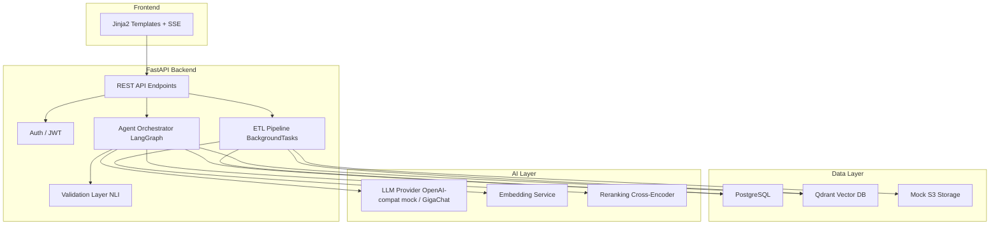
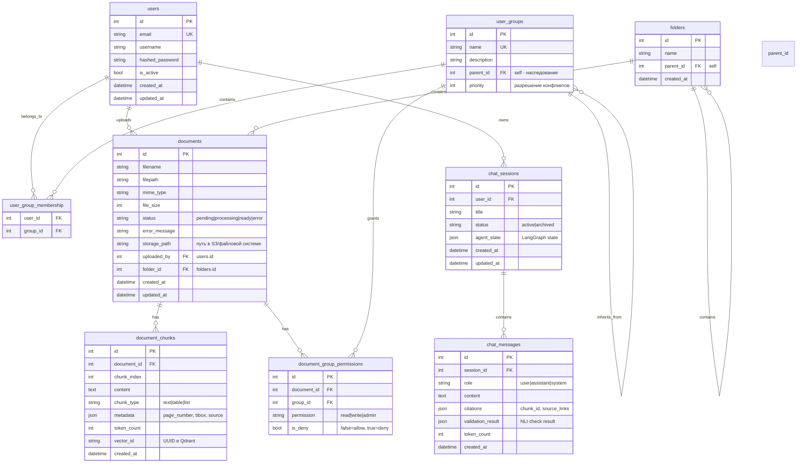

# План реализации MVP AI-агента для СберДиска

## Контекст

- **Базовый проект:** Существующий FastAPI проект (`app/`) с моделями User, auth, CRUD
- **Хранилище:** Мок-хранилище (S3-совместимое) для MVP, без реального API СберДиска
- **LLM:** OpenAI-совместимый мок-провайдер для разработки, GigaChat API на финальном этапе
- **Vector DB:** Qdrant (в Docker Compose)
- **Фронтенд:** FastAPI + Jinja2 шаблоны, SSE через sse-starlette
- **ETL:** Фоновые задачи FastAPI (BackgroundTasks) вместо Celery для MVP
- **Оркестрация:** LangGraph для мультиагентной системы

---

## Общая архитектура



---

## Структура БД

### Полная ER-диаграмма



### Детальное описание таблиц

#### 1. users — пользователи системы

| Поле | Тип | Описание |
|------|-----|----------|
| id | Integer PK | Первичный ключ |
| email | String UK | Email пользователя |
| username | String | Имя пользователя |
| hashed_password | String | Хэш пароля |
| is_active | Boolean | Активен ли пользователь |
| created_at | DateTime | Дата создания |
| updated_at | DateTime | Дата обновления |

#### 2. user_groups — группы доступа (с иерархией)

| Поле | Тип | Описание |
|------|-----|----------|
| id | Integer PK | Первичный ключ |
| name | String UK | Название группы (например, all_employees, managers, interns) |
| description | String | Описание группы |
| parent_id | Integer FK self | Родительская группа (наследование прав) |
| priority | Integer | Приоритет для разрешения конфликтов |

**Пример иерархии:**
```
all_employees (priority=0)
├── managers (priority=10)
│   └── senior_managers (priority=20)
└── interns (priority=5)
```

#### 3. user_group_membership — связь пользователей и групп

| Поле | Тип | Описание |
|------|-----|----------|
| user_id | Integer FK | ID пользователя |
| group_id | Integer FK | ID группы |

#### 4. folders — папки (иерархия документов)

| Поле | Тип | Описание |
|------|-----|----------|
| id | Integer PK | Первичный ключ |
| name | String | Название папки |
| parent_id | Integer FK self | Родительская папка |
| created_at | DateTime | Дата создания |

#### 5. documents — документы

| Поле | Тип | Описание |
|------|-----|----------|
| id | Integer PK | Первичный ключ |
| filename | String | Имя файла |
| filepath | String | Путь к файлу |
| mime_type | String | MIME-тип (application/pdf, text/plain и т.д.) |
| file_size | BigInteger | Размер файла в байтах |
| status | Enum | pending, processing, ready, error |
| error_message | String | Сообщение об ошибке обработки |
| storage_path | String | Путь в S3/файловой системе |
| uploaded_by | Integer FK users | Кто загрузил |
| folder_id | Integer FK folders | Папка |
| created_at | DateTime | Дата создания |
| updated_at | DateTime | Дата обновления |

#### 6. document_chunks — чанки документов

| Поле | Тип | Описание |
|------|-----|----------|
| id | Integer PK | Первичный ключ |
| document_id | Integer FK documents | Документ |
| chunk_index | Integer | Порядковый номер чанка |
| content | Text | Текст чанка |
| chunk_type | String | text, table, list |
| metadata | JSON | page_number, bbox, source |
| token_count | Integer | Количество токенов |
| vector_id | String | UUID вектора в Qdrant |
| created_at | DateTime | Дата создания |

#### 7. document_group_permissions — ACL (с deny-правилами)

| Поле | Тип | Описание |
|------|-----|----------|
| id | Integer PK | Первичный ключ |
| document_id | Integer FK documents | Документ |
| group_id | Integer FK user_groups | Группа |
| permission | String | read, write, admin |
| is_deny | Boolean | false=разрешение, true=запрет |

#### 8. chat_sessions — сессии чата

| Поле | Тип | Описание |
|------|-----|----------|
| id | Integer PK | Первичный ключ |
| user_id | Integer FK users | Пользователь |
| title | String | Название чата |
| status | Enum | active, archived |
| agent_state | JSON | LangGraph state |
| created_at | DateTime | Дата создания |
| updated_at | DateTime | Дата обновления |

#### 9. chat_messages — сообщения чата

| Поле | Тип | Описание |
|------|-----|----------|
| id | Integer PK | Первичный ключ |
| session_id | Integer FK chat_sessions | Сессия |
| role | String | user, assistant, system |
| content | Text | Текст сообщения |
| citations | JSON | chunk_id, source_links |
| validation_result | JSON | Результат NLI проверки |
| token_count | Integer | Количество токенов |
| created_at | DateTime | Дата создания |

---

## Модели SQLAlchemy

### app/models/__init__.py
```python
from app.models.user import User, UserGroup, user_group_membership
from app.models.document import Folder, Document, DocumentChunk, DocumentGroupPermission, DocumentStatus
from app.models.chat import ChatSession, ChatMessage, SessionStatus
```

### app/models/user.py
```python
from sqlalchemy import Column, Integer, String, Boolean, DateTime, Table, ForeignKey
from sqlalchemy.orm import relationship
from sqlalchemy.sql import func
from app.core.config import Base

user_group_membership = Table(
    "user_group_membership",
    Base.metadata,
    Column("user_id", Integer, ForeignKey("users.id"), primary_key=True),
    Column("group_id", Integer, ForeignKey("user_groups.id"), primary_key=True),
)

class User(Base):
    __tablename__ = "users"
    id = Column(Integer, primary_key=True, index=True)
    email = Column(String, unique=True, index=True, nullable=False)
    username = Column(String, nullable=False)
    hashed_password = Column(String, nullable=False)
    is_active = Column(Boolean, default=True)
    created_at = Column(DateTime(timezone=True), server_default=func.now())
    updated_at = Column(DateTime(timezone=True), onupdate=func.now())

    groups = relationship("UserGroup", secondary=user_group_membership, back_populates="users")
    chat_sessions = relationship("ChatSession", back_populates="user")

class UserGroup(Base):
    __tablename__ = "user_groups"
    id = Column(Integer, primary_key=True, index=True)
    name = Column(String, unique=True, nullable=False)
    description = Column(String, nullable=True)
    parent_id = Column(Integer, ForeignKey("user_groups.id"), nullable=True)
    priority = Column(Integer, default=0)

    parent = relationship("UserGroup", remote_side=[id], backref="children")
    users = relationship("User", secondary=user_group_membership, back_populates="groups")
    document_permissions = relationship("DocumentGroupPermission", back_populates="group")
```

### app/models/document.py
```python
from sqlalchemy import Column, Integer, String, Text, ForeignKey, DateTime, Enum, BigInteger, JSON, Boolean
from sqlalchemy.orm import relationship
from sqlalchemy.sql import func
from app.core.config import Base
import enum

class DocumentStatus(str, enum.Enum):
    PENDING = "pending"
    PROCESSING = "processing"
    READY = "ready"
    ERROR = "error"

class Folder(Base):
    __tablename__ = "folders"
    id = Column(Integer, primary_key=True, index=True)
    name = Column(String, nullable=False)
    parent_id = Column(Integer, ForeignKey("folders.id"), nullable=True)
    created_at = Column(DateTime(timezone=True), server_default=func.now())

    children = relationship("Folder", backref="parent", remote_side=[id])
    documents = relationship("Document", back_populates="folder")

class Document(Base):
    __tablename__ = "documents"
    id = Column(Integer, primary_key=True, index=True)
    filename = Column(String, nullable=False)
    filepath = Column(String, nullable=False)
    mime_type = Column(String, nullable=True)
    file_size = Column(BigInteger, nullable=True)
    status = Column(Enum(DocumentStatus), default=DocumentStatus.PENDING)
    error_message = Column(String, nullable=True)
    storage_path = Column(String, nullable=True)
    uploaded_by = Column(Integer, ForeignKey("users.id"), nullable=False)
    folder_id = Column(Integer, ForeignKey("folders.id"), nullable=True)
    created_at = Column(DateTime(timezone=True), server_default=func.now())
    updated_at = Column(DateTime(timezone=True), onupdate=func.now())

    folder = relationship("Folder", back_populates="documents")
    chunks = relationship("DocumentChunk", back_populates="document", cascade="all, delete-orphan")
    group_permissions = relationship("DocumentGroupPermission", back_populates="document", cascade="all, delete-orphan")

class DocumentChunk(Base):
    __tablename__ = "document_chunks"
    id = Column(Integer, primary_key=True, index=True)
    document_id = Column(Integer, ForeignKey("documents.id"), nullable=False)
    chunk_index = Column(Integer, nullable=False)
    content = Column(Text, nullable=False)
    chunk_type = Column(String, default="text")
    metadata = Column(JSON, default=dict)
    token_count = Column(Integer, default=0)
    vector_id = Column(String, nullable=True)
    created_at = Column(DateTime(timezone=True), server_default=func.now())

    document = relationship("Document", back_populates="chunks")

class DocumentGroupPermission(Base):
    __tablename__ = "document_group_permissions"
    id = Column(Integer, primary_key=True, index=True)
    document_id = Column(Integer, ForeignKey("documents.id"), nullable=False)
    group_id = Column(Integer, ForeignKey("user_groups.id"), nullable=False)
    permission = Column(String, default="read")
    is_deny = Column(Boolean, default=False)

    document = relationship("Document", back_populates="group_permissions")
    group = relationship("UserGroup", back_populates="document_permissions")
```

### app/models/chat.py
```python
from sqlalchemy import Column, Integer, String, Text, ForeignKey, DateTime, Enum, JSON
from sqlalchemy.orm import relationship
from sqlalchemy.sql import func
from app.core.config import Base
import enum

class SessionStatus(str, enum.Enum):
    ACTIVE = "active"
    ARCHIVED = "archived"

class ChatSession(Base):
    __tablename__ = "chat_sessions"
    id = Column(Integer, primary_key=True, index=True)
    user_id = Column(Integer, ForeignKey("users.id"), nullable=False)
    title = Column(String, default="Новый чат")
    status = Column(Enum(SessionStatus), default=SessionStatus.ACTIVE)
    agent_state = Column(JSON, nullable=True)
    created_at = Column(DateTime(timezone=True), server_default=func.now())
    updated_at = Column(DateTime(timezone=True), onupdate=func.now())

    user = relationship("User", back_populates="chat_sessions")
    messages = relationship("ChatMessage", back_populates="session", cascade="all, delete-orphan", order_by="ChatMessage.created_at")

class ChatMessage(Base):
    __tablename__ = "chat_messages"
    id = Column(Integer, primary_key=True, index=True)
    session_id = Column(Integer, ForeignKey("chat_sessions.id"), nullable=False)
    role = Column(String, nullable=False)
    content = Column(Text, nullable=False)
    citations = Column(JSON, nullable=True)
    validation_result = Column(JSON, nullable=True)
    token_count = Column(Integer, default=0)
    created_at = Column(DateTime(timezone=True), server_default=func.now())

    session = relationship("ChatSession", back_populates="messages")
```

---

## Логика ACL (проверка доступа)

```python
async def get_effective_groups(user_id: int, db: Session) -> list[int]:
    """Получить все группы пользователя с учётом наследования"""
    direct_groups = db.query(UserGroup).join(user_group_membership).filter(
        user_group_membership.c.user_id == user_id
    ).all()
    
    effective_groups = set()
    for group in direct_groups:
        # Добавляем саму группу и всех родителей
        current = group
        while current:
            effective_groups.add(current.id)
            current = current.parent
    return list(effective_groups)

async def check_access(
    user_id: int,
    document_id: int,
    db: Session,
    permission: str = "read"
) -> bool:
    """Проверить, имеет ли пользователь доступ к документу"""
    user_groups = await get_effective_groups(user_id, db)
    
    rules = db.query(DocumentGroupPermission).filter(
        DocumentGroupPermission.document_id == document_id
    ).all()
    
    # Deny-правила имеют высший приоритет
    for rule in rules:
        if rule.is_deny and rule.group_id in user_groups:
            return False
    
    # Allow-правила
    for rule in rules:
        if not rule.is_deny and rule.group_id in user_groups:
            return True
    
    # Default: запрет
    return False
```

---

## Pydantic схемы (для API)

### app/schemas/user.py
```python
from pydantic import BaseModel, EmailStr
from datetime import datetime
from typing import Optional

class UserBase(BaseModel):
    username: str
    email: str

class UserCreate(UserBase):
    password: str

class UserResponse(UserBase):
    id: int
    is_active: bool
    created_at: datetime

    class Config:
        from_attributes = True

class UserGroupResponse(BaseModel):
    id: int
    name: str
    description: Optional[str] = None

    class Config:
        from_attributes = True
```

### app/schemas/document.py
```python
from pydantic import BaseModel
from datetime import datetime
from typing import Optional

class DocumentResponse(BaseModel):
    id: int
    filename: str
    mime_type: Optional[str] = None
    file_size: Optional[int] = None
    status: str
    created_at: datetime

    class Config:
        from_attributes = True

class DocumentChunkResponse(BaseModel):
    id: int
    chunk_index: int
    content: str
    chunk_type: str
    token_count: int

    class Config:
        from_attributes = True
```

### app/schemas/chat.py
```python
from pydantic import BaseModel
from datetime import datetime
from typing import Optional

class ChatSessionResponse(BaseModel):
    id: int
    title: str
    status: str
    created_at: datetime

    class Config:
        from_attributes = True

class ChatMessageResponse(BaseModel):
    id: int
    role: str
    content: str
    citations: Optional[dict] = None
    created_at: datetime

    class Config:
        from_attributes = True

class ChatRequest(BaseModel):
    session_id: Optional[int] = None
    message: str
```

---

## Поэтапный план реализации

### Этап 1: Инфраструктура и базовый проект

**Цель:** Подготовить окружение, Docker Compose, настроить Qdrant и PostgreSQL.

| № | Задача | Описание | Файлы |
|---|--------|----------|-------|
| 1.1 | Обновить `requirements.txt` | Добавить зависимости: `qdrant-client`, `sse-starlette`, `sentence-transformers`, `python-multipart` | `requirements.txt` |
| 1.2 | Создать `docker-compose.yml` | Сервисы: PostgreSQL, Qdrant, MinIO (Mock S3) | `docker-compose.yml` |
| 1.3 | Обновить `app/core/config.py` | Добавить настройки: Qdrant URL, S3 endpoint, LLM API, ACL_DEFAULT_DENY | `app/core/config.py` |
| 1.4 | Создать `app/core/dependencies.py` | DI-зависимости: клиент Qdrant, S3-клиент, LLM-клиент | `app/core/dependencies.py` |

### Этап 2: Модели БД и миграции

**Цель:** Создать все SQLAlchemy модели и инициализировать БД.

| № | Задача | Описание | Файлы |
|---|--------|----------|-------|
| 2.1 | Создать `app/models/user.py` | SQLAlchemy модели User, UserGroup, user_group_membership | `app/models/user.py` |
| 2.2 | Создать `app/models/document.py` | SQLAlchemy модели Folder, Document, DocumentChunk, DocumentGroupPermission | `app/models/document.py` |
| 2.3 | Создать `app/models/chat.py` | SQLAlchemy модели ChatSession, ChatMessage | `app/models/chat.py` |
| 2.4 | Создать `app/models/__init__.py` | Импорт всех моделей | `app/models/__init__.py` |
| 2.5 | Создать `app/schemas/user.py` | Pydantic схемы UserResponse, UserGroupResponse | `app/schemas/user.py` |
| 2.6 | Создать `app/schemas/document.py` | Pydantic схемы DocumentResponse, DocumentChunkResponse | `app/schemas/document.py` |
| 2.7 | Создать `app/schemas/chat.py` | Pydantic схемы ChatSessionResponse, ChatMessageResponse, ChatRequest | `app/schemas/chat.py` |
| 2.8 | Обновить `app/main.py` | Добавить создание таблиц при старте | `app/main.py` |

### Этап 3: Мок-хранилище и CRUD документов

**Цель:** Создать мок S3-хранилище и сервис для работы с файлами.

| № | Задача | Описание | Файлы |
|---|--------|----------|-------|
| 3.1 | Создать `app/services/storage.py` | AbstractStorageProvider + MockStorageProvider (файловая система) | `app/services/storage.py` |
| 3.2 | Создать `app/crud/crud_document.py` | CRUD операции для документов, чанков, папок | `app/crud/crud_document.py` |
| 3.3 | Создать `app/api/v1/endpoints/documents.py` | Эндпоинты: список файлов, загрузка, удаление, статус | `app/api/v1/endpoints/documents.py` |
| 3.4 | Обновить `app/api/v1/api.py` | Подключить роутер documents | `app/api/v1/api.py` |

### Этап 4: ETL Pipeline (парсинг, чанкинг, эмбеддинги)

**Цель:** Реализовать пайплайн обработки документов через BackgroundTasks.

| № | Задача | Описание | Файлы |
|---|--------|----------|-------|
| 4.1 | Создать `app/services/parser.py` | Парсеры для PDF, DOCX, XLSX, TXT. XLSX → Markdown | `app/services/parser.py` |
| 4.2 | Создать `app/services/chunker.py` | Разбиение текста на чанки с метаданными | `app/services/chunker.py` |
| 4.3 | Создать `app/services/embedder.py` | Генерация эмбеддингов через sentence-transformers | `app/services/embedder.py` |
| 4.4 | Создать `app/services/etl_pipeline.py` | ETL: загрузка → парсинг → чанкинг → эмбеддинги → Qdrant + PG | `app/services/etl_pipeline.py` |
| 4.5 | Создать `app/services/deduplicator.py` | Детекция дубликатов через SimHash | `app/services/deduplicator.py` |
| 4.6 | Обновить `app/api/v1/endpoints/documents.py` | Триггер ETL через BackgroundTasks | `app/api/v1/endpoints/documents.py` |

### Этап 5: Безопасность и ACL

**Цель:** Реализовать динамический ACL с иерархией групп и deny-правилами.

| № | Задача | Описание | Файлы |
|---|--------|----------|-------|
| 5.1 | Создать `app/services/acl.py` | ACL-сервис: get_effective_groups, check_access, pre-filtering для Qdrant | `app/services/acl.py` |
| 5.2 | Обновить `app/api/deps.py` | Зависимости: get_current_user, get_current_user_groups | `app/api/deps.py` |
| 5.3 | Обновить `app/services/etl_pipeline.py` | При сохранении чанка в Qdrant добавлять allowed_groups в payload | `app/services/etl_pipeline.py` |

### Этап 6: Agentic RAG (ядро ИИ)

**Цель:** Реализовать мультиагентную систему на LangGraph.

| № | Задача | Описание | Файлы |
|---|--------|----------|-------|
| 6.1 | Создать `app/services/llm_provider.py` | Abstract LLMProvider + OpenAIClient (мок) + GigaChatClient | `app/services/llm_provider.py` |
| 6.2 | Создать `app/services/vector_store.py` | Qdrant: hybrid search + ACL filter + top-k | `app/services/vector_store.py` |
| 6.3 | Создать `app/services/reranker.py` | Cross-Encoder reranking | `app/services/reranker.py` |
| 6.4 | Создать `app/agents/router_agent.py` | Semantic Router | `app/agents/router_agent.py` |
| 6.5 | Создать `app/agents/search_rag_agent.py` | Search & RAG Agent | `app/agents/search_rag_agent.py` |
| 6.6 | Создать `app/agents/summarizer_agent.py` | Summarizer Agent | `app/agents/summarizer_agent.py` |
| 6.7 | Создать `app/agents/analytics_agent.py` | Analytics & Tagging Agent | `app/agents/analytics_agent.py` |
| 6.8 | Создать `app/agents/orchestrator.py` | LangGraph граф + State в PostgreSQL | `app/agents/orchestrator.py` |

### Этап 7: API, Валидация и Streaming

**Цель:** Реализовать REST API с валидацией, цитированием и SSE-стримингом.

| № | Задача | Описание | Файлы |
|---|--------|----------|-------|
| 7.1 | Создать `app/services/validation.py` | NLI факт-чекинг ответа LLM против чанков | `app/services/validation.py` |
| 7.2 | Создать `app/services/citation.py` | Формирование JSON с chunk_id / source_links | `app/services/citation.py` |
| 7.3 | Создать `app/api/v1/endpoints/chat.py` | POST /chat, GET /chat/stream SSE, GET /chat/history | `app/api/v1/endpoints/chat.py` |
| 7.4 | Обновить `app/api/v1/api.py` | Подключить роутер chat | `app/api/v1/api.py` |

### Этап 8: Фронтенд (Jinja2 + SSE)

**Цель:** Минимальный веб-интерфейс для демонстрации.

| № | Задача | Описание | Файлы |
|---|--------|----------|-------|
| 8.1 | Создать `app/templates/base.html` | Базовый шаблон с Tailwind CSS | `app/templates/base.html` |
| 8.2 | Создать `app/templates/chat.html` | Чат-интерфейс с SSE | `app/templates/chat.html` |
| 8.3 | Создать `app/templates/documents.html` | Файловый менеджер | `app/templates/documents.html` |
| 8.4 | Создать `app/templates/dashboard.html` | Дашборд с vis.js | `app/templates/dashboard.html` |
| 8.5 | Создать `app/routes.py` | HTML-роуты для Jinja2 | `app/routes.py` |
| 8.6 | Обновить `app/main.py` | Jinja2 templates, статика, SSE, routes | `app/main.py` |

### Этап 9: Интеграция GigaChat и финальная настройка

**Цель:** Подключить реальный GigaChat API, протестировать end-to-end.

| № | Задача | Описание | Файлы |
|---|--------|----------|-------|
| 9.1 | Создать `app/services/gigachat_provider.py` | GigaChatClient: OAuth, API, streaming | `app/services/gigachat_provider.py` |
| 9.2 | Обновить `app/core/config.py` | Настройки GigaChat | `app/core/config.py` |
| 9.3 | Обновить `app/services/llm_provider.py` | Переключение мок ↔ GigaChat | `app/services/llm_provider.py` |
| 9.4 | Обновить `Dockerfile` | Финальная сборка | `Dockerfile` |
| 9.5 | Обновить `docker-compose.yml` | Финальная конфигурация | `docker-compose.yml` |

---

## Итоговая структура проекта

```
d:/repos/project21/
├── app/
│   ├── main.py
│   ├── routes.py
│   ├── templates/
│   │   ├── base.html
│   │   ├── chat.html
│   │   ├── documents.html
│   │   └── dashboard.html
│   ├── static/
│   ├── agents/
│   │   ├── __init__.py
│   │   ├── router_agent.py
│   │   ├── search_rag_agent.py
│   │   ├── summarizer_agent.py
│   │   ├── analytics_agent.py
│   │   └── orchestrator.py
│   ├── api/
│   │   ├── deps.py
│   │   └── v1/
│   │       ├── api.py
│   │       └── endpoints/
│   │           ├── auth.py
│   │           ├── users.py
│   │           ├── documents.py
│   │           └── chat.py
│   ├── core/
│   │   ├── config.py
│   │   ├── security.py
│   │   └── dependencies.py
│   ├── crud/
│   │   ├── crud_user.py
│   │   └── crud_document.py
│   ├── models/
│   │   ├── __init__.py
│   │   ├── user.py
│   │   ├── document.py
│   │   └── chat.py
│   ├── schemas/
│   │   ├── user.py
│   │   ├── document.py
│   │   └── chat.py
│   └── services/
│       ├── user.py
│       ├── storage.py
│       ├── parser.py
│       ├── chunker.py
│       ├── embedder.py
│       ├── etl_pipeline.py
│       ├── deduplicator.py
│       ├── acl.py
│       ├── llm_provider.py
│       ├── gigachat_provider.py
│       ├── vector_store.py
│       ├── reranker.py
│       ├── validation.py
│       └── citation.py
├── docker-compose.yml
├── Dockerfile
├── requirements.txt
├── .env
└── tests/
```

---

## Ключевые архитектурные решения

### 1. ACL с иерархией групп и deny-правилами
- Группы могут наследовать права через `parent_id`
- Deny-правила имеют приоритет над allow-правилами
- Default: запрет доступа, если нет явного разрешения

### 2. LLM-абстракция
- OpenAIClient для разработки (мок)
- GigaChatClient для продакшена
- Переключение через конфиг

### 3. Hybrid Search + ACL Pre-filtering
- BM25 + Vector Search в Qdrant
- Фильтрация по `allowed_groups` в payload чанка
- Cross-Encoder Reranking

### 4. LangGraph State Management
- Состояние агента сохраняется в PostgreSQL
- Возможность прервать и возобновить сессию
- Chain-of-Thought логирование

### 5. SSE Streaming
- sse-starlette для потоковой передачи
- Структурированный JSON с цитатами

---

## Порядок реализации

1. **Этап 1** (Инфраструктура) —必须先
2. **Этап 2** (Модели БД) —必须先
3. **Этап 3** (Мок-хранилище + CRUD) — данные для ETL
4. **Этап 4** (ETL Pipeline) — данные для RAG
5. **Этап 5** (ACL) — можно параллельно с Этапом 6
6. **Этап 6** (Agentic RAG) —核心
7. **Этап 7** (API + Streaming) — после агентов
8. **Этап 8** (Фронтенд) — после API
9. **Этап 9** (GigaChat) — финальная интеграция