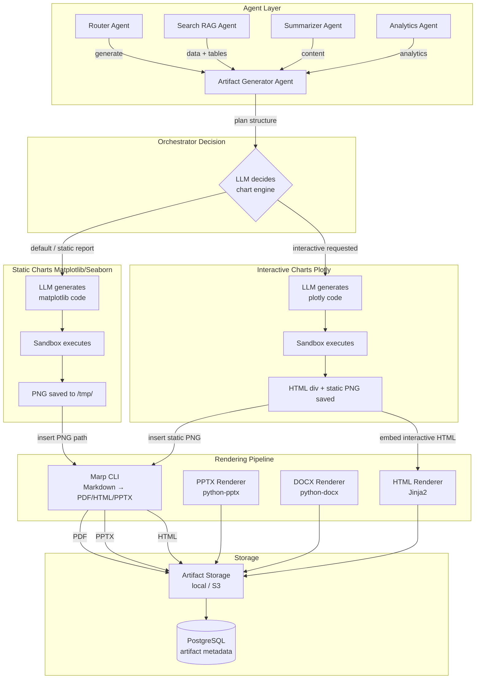
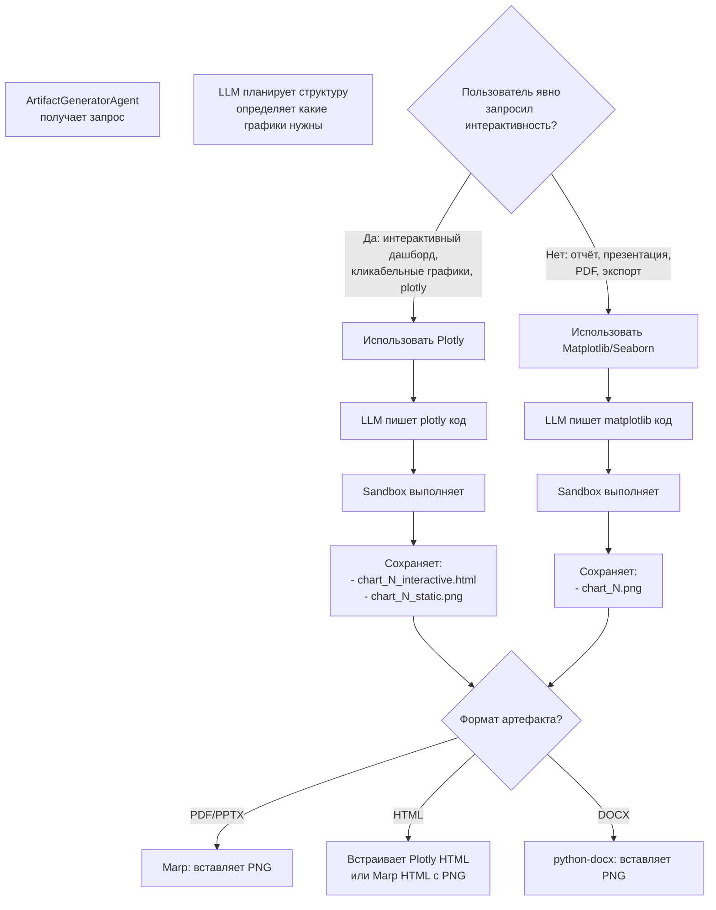
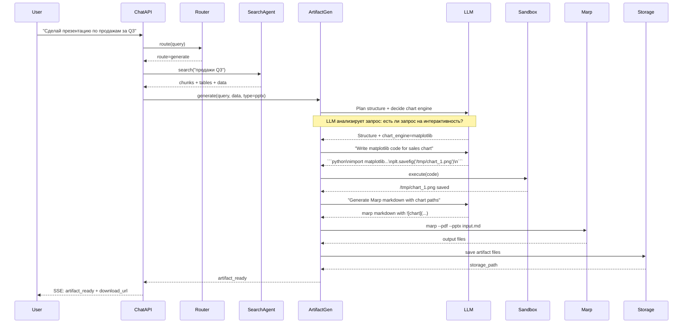

# План: Генерация артефактов (PDF, презентации, отчёты) v3

## 1. Контекст

Текущая система — CorpAI Intelligence, мультиагентный RAG-ассистент на FastAPI + LangGraph.
Задача: добавить возможность агенту генерировать артефакты (PDF, PPTX, DOCX, MD, HTML)
на основе информации из документов и ответов LLM.

**Ключевые решения v3:**
- **Оркестратор сам выбирает движок графиков** в зависимости от запроса пользователя:
  - Статический отчёт / презентация → **Matplotlib/Seaborn** (PNG → Marp)
  - Явно указана интерактивность → **Plotly** (HTML-фрагменты)
- **Marp** (Markdown Presentation Ecosystem) как основной движок для презентаций и PDF
- **Три уровня sandbox**: Subprocess (dev) → Docker (staging) → gVisor (production)

## 2. Общая архитектура



## 3. Логика выбора движка графиков



**Ключевой принцип:** LLM в фазе планирования анализирует запрос пользователя. Если в запросе есть слова "интерактивный", "дашборд", "plotly", "кликабельный" — выбирается Plotly. Во всех остальных случаях — Matplotlib/Seaborn.

## 4. Детальный поток генерации



## 5. Компоненты

### 5.1 ArtifactGeneratorAgent (`app/agents/artifact_generator.py`)

Агент-оркестратор генерации артефакта. Состоит из фаз:

**Фаза 1: Планирование + выбор движка**
- LLM получает: запрос пользователя + данные из RAG (текст, таблицы, аналитика)
- LLM анализирует: есть ли в запросе указание на интерактивность
- LLM возвращает: структуру артефакта + chart_engine (matplotlib | plotly)

Pydantic модель:
```python
class ArtifactPlan(BaseModel):
    title: str
    artifact_type: Literal["pdf", "pptx", "docx", "md", "html"]
    chart_engine: Literal["matplotlib", "plotly"] = "matplotlib"
    sections: list[SectionPlan]
    charts: list[ChartPlan]

class SectionPlan(BaseModel):
    title: str
    description: str
    requires_chart: Optional[int] = None

class ChartPlan(BaseModel):
    chart_type: Literal["line", "bar", "pie", "scatter", "table", "heatmap"]
    title: str
    data_source: str
```

**Фаза 2: Генерация графиков**

Для каждого `ChartPlan`:
1. LLM получает: данные таблицы + описание графика + выбранный движок
2. LLM возвращает: **чистый Python-код** внутри ```python
3. Код выполняется в **изолированном sandbox**
4. Результат:
   - Matplotlib: `/tmp/chart_N.png`
   - Plotly: `/tmp/chart_N_interactive.html` + `/tmp/chart_N_static.png`

**Системный промпт для Matplotlib:**
```
Ты — эксперт по визуализации данных. На основе предоставленных цифр
напиши код на Python с использованием Matplotlib/Seaborn.

Правила:
- График должен быть лаконичным, без лишней сетки
- Используй корпоративные цвета: основной синий #0052CC, акцентный серый #7A869A
- Шрифт: Arial, размер подписей 10pt
- Обязательно сохрани результат в /tmp/chart_N.png с dpi=300, bbox_inches='tight'
- Не используй кириллицу в коде — используй английские подписи
- Выдай ТОЛЬКО чистый код Python внутри тегов ```python ... ```
```

**Системный промпт для Plotly:**
```
Ты — эксперт по визуализации данных. На основе предоставленных цифр
напиши код на Python с использованием Plotly.

Правила:
- График должен быть информативным, с hover-подсказками
- Используй корпоративные цвета: основной синий #0052CC, акцентный серый #7A869A
- Сохрани ДВА файла:
  1. fig.write_html("/tmp/chart_N_interactive.html", include_plotlyjs="cdn")
  2. fig.write_image("/tmp/chart_N_static.png", width=800, height=500, scale=2)
- Не используй кириллицу в коде — используй английские подписи
- Выдай ТОЛЬКО чистый код Python внутри тегов ```python ... ```
```

**Фаза 3: Генерация Marp Markdown**
- LLM получает: структуру артефакта + пути к графикам
- LLM возвращает: Marp-совместимый Markdown с `` вставками

Пример Marp Markdown:
```markdown
---
marp: true
theme: corporate-dark
paginate: true
---

# Финансовые итоги года
## Динамика роста выручки по кварталам

<div class="columns">
<div>

- Рост в Q4 составил **+18%**
- Основной драйвер — b2b-сегмент
- Прогноз на Q1: +12%

</div>
<div>


</div>
</div>

---

# Ключевые метрики

| Показатель | Q2 | Q3 | Q4 |
|-----------|----|----|----|
| Выручка | 120M | 145M | 171M |
| Прибыль | 18M | 22M | 26M |


```

**Фаза 4: Рендеринг через Marp CLI**
- `marp --pdf input.md -o output.pdf`
- `marp --pptx input.md -o output.pptx`
- `marp --html input.md -o output.html`

**Фаза 5: Сохранение**
- Файл копируется из `/tmp/` в StorageProvider
- Метаданные сохраняются в PostgreSQL

### 5.2 Sandbox для выполнения кода графиков

#### Уровень 1: MVP — Subprocess с ограничениями

```python
import subprocess
import sys
import os
import tempfile
import signal

class SubprocessSandbox:
    """Изолированный subprocess с ограничениями ресурсов."""

    MAX_MEMORY_MB = 512
    MAX_CPU_TIME = 30
    MAX_FILESIZE_MB = 10
    FORBIDDEN_PATTERNS = [
        "import os", "import subprocess", "import sys",
        "import shutil", "import socket", "import requests",
        "__import__", "eval(", "exec(", "compile(",
        "open(", "file(", "BaseException", "ctypes",
    ]

    def execute(self, code: str, chart_index: int) -> SandboxResult:
        """Execute chart code in isolated subprocess."""
        self._validate_code(code)
        wrapped = self._wrap_code(code, chart_index)

        with tempfile.NamedTemporaryFile(mode="w", suffix=".py", delete=False, dir="/tmp") as f:
            f.write(wrapped)
            script_path = f.name

        try:
            result = subprocess.run(
                [sys.executable, "-I", script_path],
                capture_output=True, text=True,
                timeout=self.MAX_CPU_TIME,
                cwd="/tmp",
                env={"PATH": "/usr/bin:/bin", "HOME": "/tmp", "MPLBACKEND": "Agg"},
            )
            if result.returncode != 0:
                return SandboxResult(success=False, error=result.stderr[:1000])
            return self._collect_results(chart_index)
        except subprocess.TimeoutExpired:
            return SandboxResult(success=False, error="Timeout")
        finally:
            os.unlink(script_path)

    def _validate_code(self, code: str):
        for pattern in self.FORBIDDEN_PATTERNS:
            if pattern in code:
                raise SecurityError(f"Forbidden pattern: {pattern}")

    def _wrap_code(self, code: str, chart_index: int) -> str:
        return f"""
import matplotlib
matplotlib.use('Agg')
import matplotlib.pyplot as plt
import seaborn as sns
import plotly.express as px
import plotly.graph_objects as go
import plotly.io as pio
import numpy as np
import pandas as pd
import json, math, random
from collections import Counter, defaultdict

import resource
resource.setrlimit(resource.RLIMIT_AS, (512 * 1024 * 1024, 512 * 1024 * 1024))
resource.setrlimit(resource.RLIMIT_FSIZE, (10 * 1024 * 1024, 10 * 1024 * 1024))

CHART_INDEX = {chart_index}
OUTPUT_DIR = "/tmp"

# User code:
{code}

plt.close('all')
"""
```

#### Уровень 2: Docker-контейнер (Production)

```mermaid
graph TB
    subgraph "Host"
        API[FastAPI App]
        SAND[Sandbox Manager]
        TEMP[/tmp/charts/ mount]
    end

    subgraph "Docker Container"
        CHART_RUNNER[chart-runner image]
        CODE[script.py]
        OUT[output.png]
    end

    subgraph "Container Limits"
        MEM[Memory: 512MB]
        CPU[CPU: 1 core]
        TIME[Timeout: 30s]
        NET[Network: NONE]
        RO[Filesystem: READ-ONLY except /tmp]
    end

    API --> SAND
    SAND -->|docker run --rm| CHART_RUNNER
    CHART_RUNNER --> CODE --> OUT
    OUT -->|volume mount| TEMP
```

**Dockerfile для chart-runner:**
```dockerfile
FROM python:3.12-slim

RUN pip install --no-cache-dir \
    matplotlib seaborn plotly kaleido numpy pandas

RUN pip uninstall -y requests urllib3 httpx cryptography || true

WORKDIR /tmp
ENTRYPOINT ["python"]
```

**Sandbox Manager:**
```python
import docker
import os
import uuid

class DockerSandbox:
    IMAGE_NAME = "chart-runner:latest"
    MEMORY_LIMIT = "512m"
    CPU_LIMIT = 1.0
    TIMEOUT = 30

    def __init__(self):
        self.client = docker.from_env()

    def execute(self, code: str, chart_index: int) -> SandboxResult:
        self._validate_code(code)
        run_id = uuid.uuid4().hex[:8]
        output_dir = f"/tmp/charts/{run_id}"
        os.makedirs(output_dir, exist_ok=True)

        script_path = f"{output_dir}/script.py"
        wrapped = self._wrap_code(code, chart_index, output_dir)
        with open(script_path, "w") as f:
            f.write(wrapped)

        try:
            container = self.client.containers.run(
                image=self.IMAGE_NAME,
                command=f"python /tmp/script.py",
                volumes={output_dir: {"bind": "/tmp", "mode": "rw"}},
                mem_limit=self.MEMORY_LIMIT,
                nano_cpus=int(self.CPU_LIMIT * 1e9),
                network_disabled=True,
                read_only=True,
                tmpfs={"/tmp": "size=100m"},
                auto_remove=True,
                detach=True,
            )
            result = container.wait(timeout=self.TIMEOUT)
            if result["StatusCode"] != 0:
                logs = container.logs().decode()[-2000:]
                return SandboxResult(success=False, error=logs)
            return self._collect_results(output_dir, chart_index)
        except Exception as e:
            return SandboxResult(success=False, error=str(e))
        finally:
            import shutil
            shutil.rmtree(output_dir, ignore_errors=True)
```

### 5.3 Marp CLI интеграция

```python
import subprocess
import uuid
import os

class MarpRenderer:
    """Renderer using Marp CLI for Markdown → PDF/PPTX/HTML."""

    SUPPORTED_FORMATS = {"pdf": "--pdf", "pptx": "--pptx", "html": "--html"}

    def render(self, markdown_content: str, output_format: str) -> str:
        if output_format not in self.SUPPORTED_FORMATS:
            raise ValueError(f"Unsupported format: {output_format}")

        md_path = f"/tmp/artifact_{uuid.uuid4().hex}.md"
        with open(md_path, "w", encoding="utf-8") as f:
            f.write(markdown_content)

        output_path = md_path.replace(".md", f".{output_format}")

        try:
            result = subprocess.run(
                ["marp", self.SUPPORTED_FORMATS[output_format],
                 md_path, "-o", output_path, "--allow-local-files"],
                capture_output=True, text=True, timeout=60,
            )
            if result.returncode != 0:
                raise RuntimeError(f"Marp failed: {result.stderr}")
            return output_path
        finally:
            os.unlink(md_path)
```

### 5.4 Дополнительные рендереры

| Формат | Рендерер | Когда используется |
|---|---|---|
| **DOCX** | `python-docx` | Когда нужен .docx |
| **HTML** | Marp или Jinja2 | Marp для презентаций, Jinja2 для отчётов |
| **MD** | Прямая генерация | Всегда доступен как сырой формат |

## 6. Модели данных

### 6.1 Новая модель: Artifact

```python
class ArtifactStatus(str, enum.Enum):
    GENERATING = "generating"
    READY = "ready"
    ERROR = "error"

class Artifact(Base):
    """Сгенерированный артефакт."""
    __tablename__ = "artifacts"

    id = Column(Integer, primary_key=True, index=True)
    session_id = Column(Integer, ForeignKey("chat_sessions.id"), nullable=False)
    user_id = Column(Integer, ForeignKey("users.id"), nullable=False)
    artifact_type = Column(String, nullable=False)  # pdf, pptx, docx, md, html
    title = Column(String, nullable=False)
    status = Column(Enum(ArtifactStatus), default=ArtifactStatus.GENERATING)
    storage_path = Column(String, nullable=True)
    file_size = Column(BigInteger, nullable=True)
    source_message_id = Column(Integer, ForeignKey("chat_messages.id"), nullable=True)
    error_message = Column(String, nullable=True)
    created_at = Column(DateTime(timezone=True), server_default=func.now())
```

### 6.2 Обновление ChatMessage

```python
class ChatMessage(Base):
    # ... существующие поля ...
    artifacts = relationship("Artifact", backref="source_message")
```

## 7. SSE-события для артефактов

Новые события в [`chat_stream`](../app/api/v1/endpoints/chat.py:127):

| Событие | Данные | Когда |
|---|---|---|
| `artifact_planning` | `{type, title, sections, charts, chart_engine}` | После планирования структуры |
| `chart_generating` | `{chart_index, chart_title, total_charts, engine}` | Начало генерации графика |
| `chart_ready` | `{chart_index, chart_path}` | График сгенерирован |
| `artifact_progress` | `{percent, stage}` | Общий прогресс (0-100) |
| `artifact_ready` | `{id, type, url, filename, size}` | Артефакт готов к скачиванию |
| `artifact_error` | `{error}` | Ошибка генерации |

## 8. API endpoints

### 8.1 Новый роутер: `app/api/v1/endpoints/artifacts.py`

| Метод | Path | Описание |
|---|---|---|
| `GET` | `/artifacts?session_id=X` | Список артефактов сессии |
| `GET` | `/artifacts/{id}/download` | Скачать файл артефакта |
| `GET` | `/artifacts/{id}/status` | Статус генерации |
| `DELETE` | `/artifacts/{id}` | Удалить артефакт |

### 8.2 Обновление chat.py

В SSE-поток добавляются события артефактов (см. раздел 7).

## 9. Структура новых файлов

```
app/
├── agents/
│   └── artifact_generator.py          # NEW: агент генерации артефактов
├── models/
│   └── artifact.py                    # NEW: SQLAlchemy модель Artifact
├── schemas/
│   └── artifact.py                    # NEW: Pydantic схемы
├── services/
│   └── artifact/
│       ├── __init__.py                # NEW
│       ├── base.py                    # NEW: абстракции SandboxResult, ArtifactContent
│       ├── chart_executor.py          # NEW: sandbox для выполнения кода графиков
│       ├── marp_renderer.py           # NEW: Marp CLI интеграция
│       ├── docx_renderer.py           # NEW: DOCX через python-docx
│       ├── html_renderer.py           # NEW: HTML через Jinja2
│       └── templates/
│           ├── report.html            # NEW: шаблон отчёта
│           └── default.html           # NEW: универсальный шаблон
└── api/v1/
    └── endpoints/
        └── artifacts.py               # NEW: endpoints для артефактов
```

## 10. Изменяемые файлы

| Файл | Изменения |
|---|---|
| [`pyproject.toml`](../pyproject.toml) | +matplotlib, +seaborn, +plotly, +kaleido, +python-pptx, +python-docx |
| [`app/models/__init__.py`](../app/models/__init__.py) | +Artifact, +ArtifactStatus |
| [`app/models/chat.py`](../app/models/chat.py) | +relationship artifacts в ChatMessage |
| [`app/agents/router_agent.py`](../app/agents/router_agent.py) | +маршрут generate |
| [`app/agents/orchestrator.py`](../app/agents/orchestrator.py) | +узел generate_artifact, +поля в AgentState |
| [`app/api/v1/endpoints/chat.py`](../app/api/v1/endpoints/chat.py) | +SSE-события артефактов |
| [`app/api/v1/api.py`](../app/api/v1/api.py) | +роутер artifacts |
| [`app/templates/chat.html`](../app/templates/chat.html) | +UI для артефактов |

## 11. Поэтапный план реализации

### Этап 1: Зависимости и модели
1. Добавить зависимости в `pyproject.toml` (matplotlib, seaborn, plotly, kaleido, python-pptx, python-docx)
2. Создать `app/models/artifact.py`
3. Обновить `app/models/__init__.py`
4. Создать `app/schemas/artifact.py`
5. Обновить `app/models/chat.py`

### Этап 2: Chart Generation Pipeline
1. Создать `app/services/artifact/base.py` (абстракции: SandboxResult, ArtifactContent)
2. Создать `app/services/artifact/chart_executor.py` (SubprocessSandbox + статический анализ)
3. Написать системные промпты для Matplotlib и Plotly
4. Протестировать выполнение кода в subprocess

### Этап 3: Marp Renderer
1. Установить Marp CLI (npm install -g @marp-team/marp-cli)
2. Создать `app/services/artifact/marp_renderer.py`
3. Создать корпоративную Marp-тему (CSS)
4. Протестировать конвертацию .md → PDF/PPTX/HTML

### Этап 4: ArtifactGeneratorAgent
1. Создать `app/agents/artifact_generator.py`
2. Реализовать фазы: планирование → выбор движка → графики → Marp → сохранение
3. Написать системные промпты для каждой фазы

### Этап 5: Интеграция с оркестратором
1. Обновить `app/agents/router_agent.py` (маршрут generate)
2. Обновить `app/agents/orchestrator.py` (узел + состояние)

### Этап 6: API и SSE
1. Создать `app/api/v1/endpoints/artifacts.py`
2. Обновить `app/api/v1/endpoints/chat.py` (SSE-события)
3. Обновить `app/api/v1/api.py`

### Этап 7: Фронтенд
1. Обновить `app/templates/chat.html` (прогресс-бар, кнопки скачивания)
2. Обновить `app/static/` (CSS/JS для артефактов)

### Этап 8: Docker sandbox (Production)
1. Создать `Dockerfile.chart-runner`
2. Создать `app/services/artifact/docker_sandbox.py`
3. Обновить `docker-compose.yml`

## 12. Ключевые архитектурные решения

1. **Оркестратор выбирает движок графиков** — LLM в фазе планирования анализирует запрос. Если пользователь явно запросил интерактивность — Plotly, иначе Matplotlib/Seaborn.
2. **Marp как основной движок презентаций/PDF** — LLM генерирует Markdown, Marp конвертирует. Это радикально проще, чем генерация PPTX через python-pptx напрямую.
3. **Plotly всегда сохраняет dual-output** — интерактивный HTML + статический PNG. PNG идёт в PDF/PPTX, HTML — в веб-версию.
4. **Sandbox для кода графиков** — изолированный subprocess (MVP) или Docker (production) для безопасного выполнения кода.
5. **Локальные пути к графикам** — Marp с флагом `--allow-local-files` вставляет PNG/SVG из `/tmp/`.
6. **SSE-события для каждого этапа** — пользователь видит прогресс: планирование → графики → рендеринг → готово.