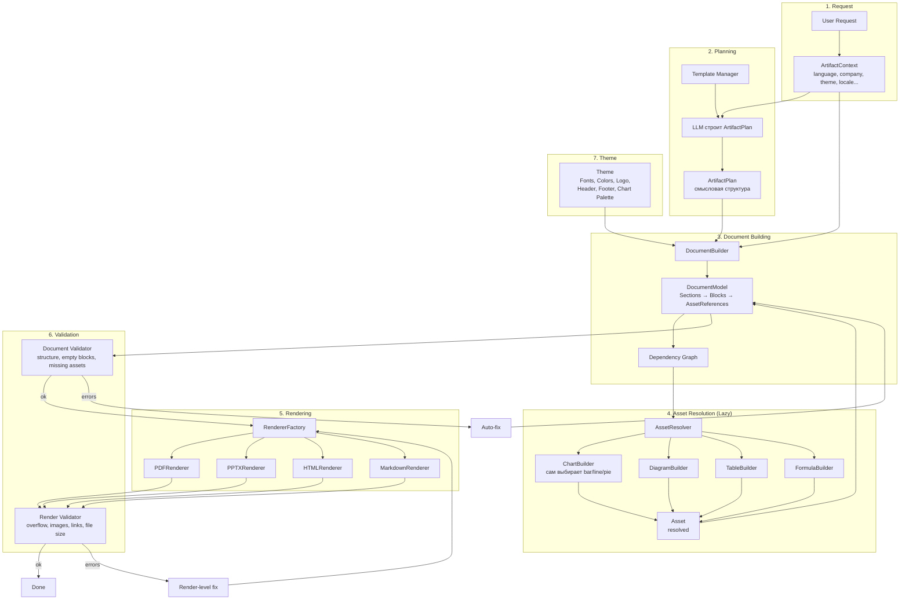
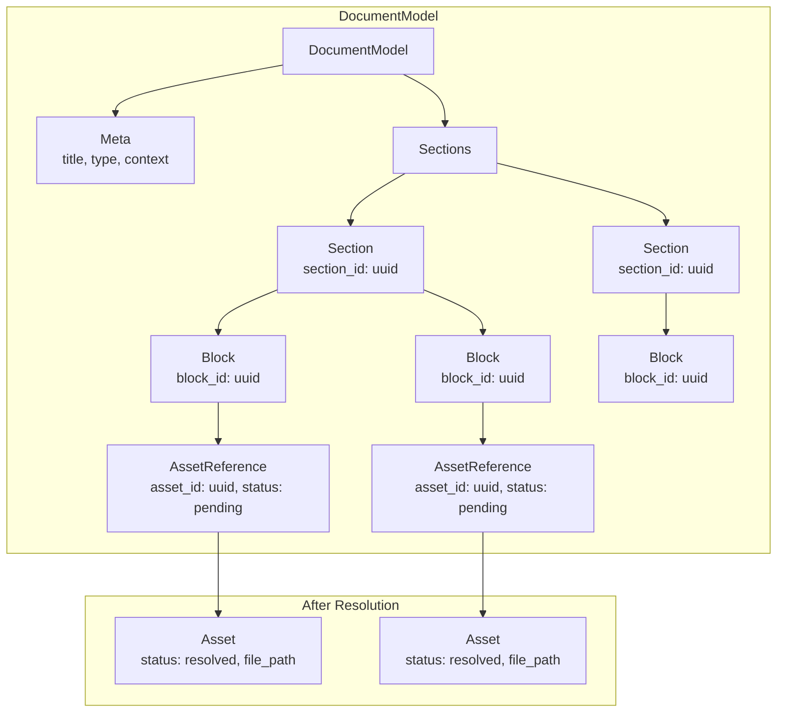
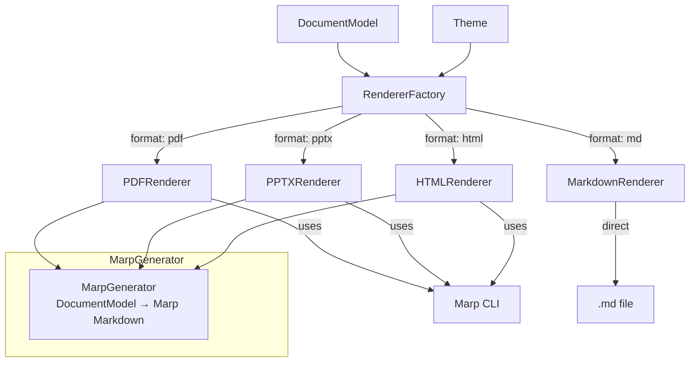
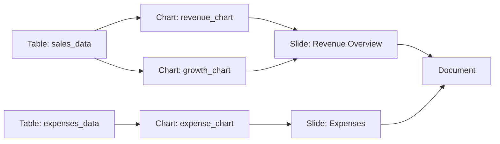
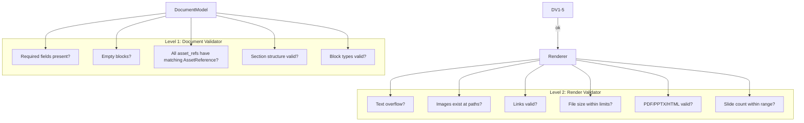
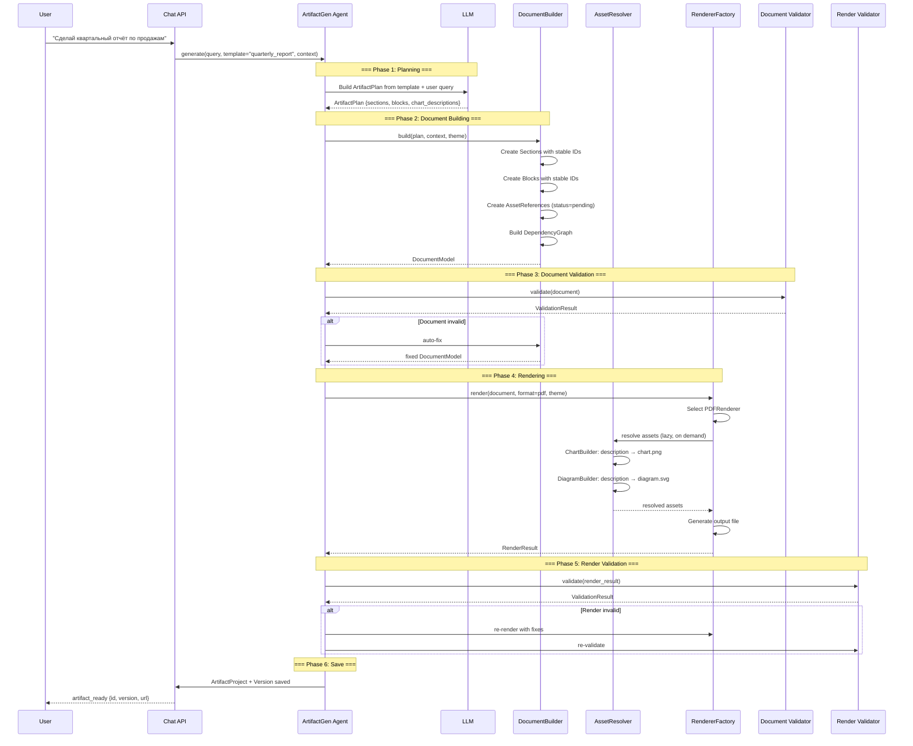

# План: Генерация артефактов v2 — Новая архитектура (revised)

## 0. Ключевые архитектурные решения (по итогам ревью)

| Решение | Описание |
|---------|----------|
| **DocumentModel — единый источник истины** | Нет PresentationSpec. Презентация — это просто рендеринг DocumentModel. Цепочка: LLM → ArtifactPlan → DocumentBuilder → DocumentModel → Renderers |
| **Planner не знает о ChartSpec** | LLM описывает **смысл** графика ("продажи по месяцам"), а ChartBuilder сам решает bar/line/stacked bar |
| **Lazy Asset** | Два состояния: AssetReference (pending) → Asset (resolved). Генерация только когда рендерер дошёл до блока |
| **RendererFactory** | DocumentModel → RendererFactory → PDFRenderer / PPTXRenderer / HTMLRenderer / MarkdownRenderer. Marp — одна из реализаций |
| **Theme System** | Fonts, Colors, Margins, Logo, Header, Footer, Chart Palette. ChartRenderer получает Theme, не знает о цветах |
| **Stable IDs** | block_id, asset_id, section_id — UUID. Регенерация по block-52, а не по индексу |
| **Dependency Graph** | Table → Chart → Summary → Slide. При изменении таблицы пересобирается только подграф |
| **Двухуровневый Validator** | Document Validator (структура) → Renderer → Render Validator (выходной файл) |
| **Execution Context** | ArtifactContext: language, company, timezone, currency, number_format, citation_style, theme, locale |

## 1. Проблемы текущей архитектуры (v1)

| Проблема | Описание |
|----------|----------|
| **LLM пишет слишком много кода** | LLM генерирует raw Python-код для matplotlib/plotly и raw Marp Markdown — нестабильно, сложно контролировать качество |
| **Один проход** | Нет версионирования, нельзя перегенерировать секцию, нельзя вернуться к предыдущей версии |
| **Нет шаблонов** | Каждый раз LLM генерирует с нуля, нет корпоративных шаблонов |
| **Нет этапа проверки** | Нет валидации перед финальным рендерингом |
| **Нет понятия Asset** | Всё сводится к chart.png → презентация |
| **Нет внутреннего представления документа** | Секции, блоки, ассеты не структурированы |

## 2. Новая архитектура: Общий поток



## 3. Ключевые концепции

### 3.1 DocumentModel — единый источник истины



**Нет PresentationSpec.** Презентация — это просто один из рендерингов DocumentModel.

### 3.2 Planner описывает смысл, а не визуализацию

LLM возвращает **смысловое описание** данных, а не указание типа графика:

```json
{
  "sections": [
    {
      "section_id": "sec-1",
      "title": "Revenue Overview",
      "blocks": [
        {
          "block_id": "blk-1",
          "type": "heading",
          "level": 1,
          "text": "Revenue Overview"
        },
        {
          "block_id": "blk-2",
          "type": "paragraph",
          "text": "Q3 показал рост 18% год к году..."
        },
        {
          "block_id": "blk-3",
          "type": "chart",
          "description": "Sales by month for current year",
          "data_source": "table_1",
          "columns": ["month", "sales"]
        }
      ]
    }
  ]
}
```

**ChartBuilder** сам решает, какой тип графика использовать (bar/line/stacked bar), основываясь на:
- Характере данных (категориальные/временные ряды/распределения)
- Theme (корпоративный стиль)
- Контексте (сравнение/тренд/структура)

### 3.3 Lazy Asset

```python
class AssetReference(BaseModel):
    """Ссылка на ассет — до генерации."""
    asset_id: str  # UUID
    asset_type: AssetType
    status: Literal["pending", "resolved", "error"] = "pending"
    source: str  # описание источника данных
    spec: dict  # специфичные для типа параметры
    resolved_asset: Optional[ArtifactAsset] = None  # заполняется после генерации

class ArtifactAsset(BaseModel):
    """Ассет — после генерации."""
    asset_id: str
    asset_type: AssetType
    name: str
    mime_type: str
    file_path: str
    metadata: dict
    size_bytes: int
```

**Принцип:** Asset генерируется **только когда рендерер доходит до блока**, который его использует. Если рендерится DOCX — не нужно генерировать SVG и HTML Preview.

### 3.4 RendererFactory



Каждый рендерер:
1. Получает DocumentModel + Theme
2. Резолвит нужные ассеты (lazy)
3. Генерирует выходной файл
4. Возвращает RenderResult

### 3.5 Theme System

```python
class Theme(BaseModel):
    """Тема оформления — корпоративный стиль."""
    name: str
    fonts: ThemeFonts
    colors: ThemeColors
    margins: ThemeMargins
    logo: Optional[AssetReference]
    header: Optional[str]  # HTML/Markdown для верхнего колонтитула
    footer: Optional[str]  # HTML/Markdown для нижнего колонтитула
    chart_palette: list[str]  # палитра цветов для графиков
    slide_layouts: dict[str, SlideLayout]  # кастомные layout'ы

class ThemeFonts(BaseModel):
    heading: str = "Arial"
    body: str = "Arial"
    size_heading: int = 28
    size_body: int = 14

class ThemeColors(BaseModel):
    primary: str = "#0052CC"
    secondary: str = "#7A869A"
    background: str = "#FFFFFF"
    text: str = "#172B4D"
    accent: str = "#00B8D9"
    success: str = "#36B37E"
    warning: str = "#FFAB00"
    error: str = "#FF5630"
```

**ChartRenderer не знает о цветах** — он получает Theme.chart_palette.

### 3.6 Stable IDs

```python
class Identified(BaseModel):
    """Базовый класс для всех элементов с ID."""
    id: str = Field(default_factory=lambda: uuid.uuid4().hex[:12])

class Section(Identified):
    section_id: str = Field(alias="id")
    title: str
    blocks: list[Block]

class Block(Identified):
    block_id: str = Field(alias="id")
    block_type: BlockType
    # ... специфичные поля
    asset_refs: list[str] = []  # asset_id ссылки
```

**Regenerate Section** работает по `section_id`:
```
POST /projects/{id}/versions/{vid}/regenerate-section/{section_id}
```

### 3.7 Dependency Graph



**При изменении `sales_data`:**
- Пересчитывается: `revenue_chart`, `growth_chart`, `Slide: Revenue Overview`
- **Не пересчитывается:** `expense_chart`, `Slide: Expenses`

```python
class DependencyGraph:
    """Граф зависимостей между блоками и ассетами."""

    def get_affected(self, changed_id: str) -> set[str]:
        """Вернуть все ID, которые нужно перегенерировать."""

    def add_edge(self, from_id: str, to_id: str):
        """Добавить зависимость: from → to."""
```

### 3.8 Двухуровневый Validator



### 3.9 Execution Context

```python
class ArtifactContext(BaseModel):
    """Контекст выполнения — влияет на весь pipeline."""
    language: str = "ru"           # язык документа
    company: str = ""              # название компании
    timezone: str = "Europe/Moscow"
    currency: str = "RUB"          # валюта для форматирования
    number_format: str = "#,##0.00"  # формат чисел
    citation_style: str = "gost"   # стиль цитирования
    theme_name: str = "corporate"  # тема оформления
    locale: str = "ru-RU"          # локаль
    date_format: str = "DD.MM.YYYY"
```

## 4. Полный поток генерации



## 5. Модели данных

### 5.1 ArtifactProject

```python
class ArtifactProject(Base):
    """Проект артефакта — контейнер для версий."""
    __tablename__ = "artifact_projects"

    id = Column(Integer, primary_key=True)
    user_id = Column(Integer, ForeignKey("users.id"))
    session_id = Column(Integer, ForeignKey("chat_sessions.id"))
    title = Column(String)
    template_name = Column(String, nullable=True)
    current_version = Column(Integer, default=1)
    context = Column(JSON, nullable=True)  # ArtifactContext
    created_at = Column(DateTime, server_default=func.now())
    updated_at = Column(DateTime, onupdate=func.now())

    versions = relationship("ArtifactVersion", backref="project")
```

### 5.2 ArtifactVersion

```python
class ArtifactVersion(Base):
    """Версия артефакта — полный слепок."""
    __tablename__ = "artifact_versions"

    id = Column(Integer, primary_key=True)
    project_id = Column(Integer, ForeignKey("artifact_projects.id"))
    version_number = Column(Integer)
    status = Column(Enum(ArtifactStatus))
    document_model = Column(JSON)  # DocumentModel — единый источник истины
    dependency_graph = Column(JSON, nullable=True)
    storage_path = Column(String)
    file_size = Column(BigInteger)
    artifact_type = Column(String)
    document_validation = Column(JSON, nullable=True)
    render_validation = Column(JSON, nullable=True)
    parent_version_id = Column(Integer, nullable=True)
    error_message = Column(Text, nullable=True)
    created_at = Column(DateTime, server_default=func.now())

    assets = relationship("ArtifactAsset", backref="version")
```

### 5.3 ArtifactAsset

```python
class ArtifactAsset(Base):
    """Ассет — изображение, график, диаграмма, таблица, логотип, формула."""
    __tablename__ = "artifact_assets"

    id = Column(Integer, primary_key=True)
    asset_id = Column(String, unique=True)  # UUID для ссылок из DocumentModel
    version_id = Column(Integer, ForeignKey("artifact_versions.id"))
    asset_type = Column(Enum(AssetType))
    name = Column(String)
    mime_type = Column(String)
    storage_path = Column(String)
    metadata = Column(JSON, default={})
    size_bytes = Column(BigInteger)
    created_at = Column(DateTime, server_default=func.now())
```

### 5.4 ArtifactTemplate

```python
class ArtifactTemplate(Base):
    """Шаблон артефакта — предопределённая структура."""
    __tablename__ = "artifact_templates"

    id = Column(Integer, primary_key=True)
    name = Column(String, unique=True)
    display_name = Column(String)
    description = Column(Text)
    schema = Column(JSON)  # JSON Schema для ArtifactPlan
    default_blocks = Column(JSON)
    is_system = Column(Boolean, default=False)
    created_at = Column(DateTime, server_default=func.now())
```

### 5.5 Theme

```python
class Theme(Base):
    """Тема оформления."""
    __tablename__ = "themes"

    id = Column(Integer, primary_key=True)
    name = Column(String, unique=True)
    display_name = Column(String)
    is_system = Column(Boolean, default=False)
    config = Column(JSON)  # полная конфигурация Theme
    user_id = Column(Integer, ForeignKey("users.id"), nullable=True)
    created_at = Column(DateTime, server_default=func.now())
```

## 6. Внутреннее представление документа (DocumentModel)

```python
class DocumentModel(BaseModel):
    """Единственный источник истины для артефакта."""
    title: str
    artifact_type: str
    context: ArtifactContext
    theme: Theme
    sections: list[Section]
    dependency_graph: DependencyGraph

class Section(Identified):
    section_id: str
    title: str
    blocks: list[Block]

class Block(Identified):
    block_id: str
    block_type: BlockType
    # одно из следующих:
    heading: Optional[HeadingBlock] = None
    paragraph: Optional[ParagraphBlock] = None
    table: Optional[TableBlock] = None
    chart: Optional[ChartBlock] = None
    diagram: Optional[DiagramBlock] = None
    formula: Optional[FormulaBlock] = None
    code: Optional[CodeBlock] = None
    quote: Optional[QuoteBlock] = None
    image: Optional[ImageBlock] = None
    bullet_list: Optional[BulletListBlock] = None
    columns: Optional[ColumnsBlock] = None
    callout: Optional[CalloutBlock] = None
```

**Block Types:**

| Block | Поля |
|-------|------|
| **HeadingBlock** | level: 1-6, text: str |
| **ParagraphBlock** | text: str |
| **TableBlock** | headers: list[str], rows: list[list[str]], asset_ref: AssetReference |
| **ChartBlock** | description: str, data_source: str, columns: list[str], asset_ref: AssetReference |
| **DiagramBlock** | engine: mermaid/drawio/plantuml, code: str, asset_ref: AssetReference |
| **FormulaBlock** | latex: str, asset_ref: AssetReference |
| **CodeBlock** | language: str, code: str |
| **QuoteBlock** | text: str, source: Optional[str] |
| **ImageBlock** | src: str, alt: str, width: Optional[int] |
| **BulletListBlock** | items: list[str] |
| **ColumnsBlock** | columns: list[Column], each Column has blocks: list[Block] |
| **CalloutBlock** | style: info/warning/error/success, text: str |

## 7. Компоненты системы

### 7.1 Пакет `app/services/artifact/` — новая структура

```
app/services/artifact/
├── __init__.py
├── base.py                          # Базовые модели (было)
├── models.py                        # НОВЫЕ: DocumentModel, Block, AssetReference, ArtifactContext
├── planner.py                       # НОВЫЙ: ArtifactPlanner — LLM → ArtifactPlan (смысловая структура)
├── document_builder.py              # НОВЫЙ: DocumentBuilder — ArtifactPlan → DocumentModel
├── dependency_graph.py              # НОВЫЙ: DependencyGraph
├── asset_manager.py                 # НОВЫЙ: AssetManager — CRUD, хранение, кэширование
├── asset_resolver.py                # НОВЫЙ: AssetResolver — lazy resolution AssetReference → Asset
├── chart_builder.py                 # НОВЫЙ: ChartBuilder — description → chart.png (сам выбирает тип)
├── diagram_builder.py               # НОВЫЙ: MermaidBuilder, DrawIOBuilder, PlantUMLBuilder
├── formula_builder.py               # НОВЫЙ: LaTeX → SVG/PNG
├── table_builder.py                 # НОВЫЙ: TableBlock → красивая таблица
├── chart_executor.py                # Существующий: SubprocessSandbox, DockerSandbox
├── marp_generator.py                # НОВЫЙ: DocumentModel → Marp Markdown (без LLM)
├── marp_renderer.py                 # Существующий: Marp CLI wrapper
├── renderer_factory.py              # НОВЫЙ: RendererFactory — выбор рендерера по формату
├── pdf_renderer.py                  # НОВЫЙ: PDFRenderer (через Marp)
├── pptx_renderer.py                 # НОВЫЙ: PPTXRenderer (через Marp)
├── html_renderer.py                 # НОВЫЙ: HTMLRenderer (через Marp)
├── markdown_renderer.py             # НОВЫЙ: MarkdownRenderer (прямой экспорт)
├── template_manager.py              # НОВЫЙ: управление шаблонами
├── theme_manager.py                 # НОВЫЙ: управление темами
├── validator.py                     # НОВЫЙ: DocumentValidator + RenderValidator
└── context.py                       # НОВЫЙ: ArtifactContext
```

### 7.2 ArtifactPlanner

```python
class ArtifactPlanner:
    """LLM → ArtifactPlan. Описывает СМЫСЛ, а не визуализацию."""

    async def plan(
        self,
        query: str,
        context: str,
        template_name: Optional[str] = None,
        ctx: Optional[ArtifactContext] = None,
    ) -> ArtifactPlan:
        """Построить план артефакта.

        LLM возвращает:
        - sections с блоками
        - chart blocks содержат ТОЛЬКО description + data_source
        - НЕТ указания типа графика (bar/line/pie)
        """
```

### 7.3 ChartBuilder (без LLM, сам выбирает тип)

```python
class ChartBuilder:
    """ChartBlock description → chart.png.
    Без LLM. Сам выбирает тип графика по характеру данных."""

    def choose_chart_type(self, data: pd.DataFrame, columns: list[str]) -> str:
        """Выбрать тип графика на основе данных."""
        if len(columns) == 2:
            # временной ряд → line
            # категории → bar
            # распределение → histogram
        # ...

    def build(self, block: ChartBlock, data: pd.DataFrame, theme: Theme) -> ArtifactAsset:
        """Построить график."""
        chart_type = self.choose_chart_type(data, block.columns)
        renderer = self.RENDERERS[chart_type]
        fig = renderer(data, block.columns, theme.chart_palette)
        path = self._save(fig)
        return ArtifactAsset(asset_id=block.asset_ref.asset_id, ...)
```

### 7.4 AssetResolver (Lazy)

```python
class AssetResolver:
    """Lazy resolution: AssetReference → Asset.
    Генерирует ассет ТОЛЬКО когда он реально нужен."""

    async def resolve(
        self,
        ref: AssetReference,
        data: dict[str, pd.DataFrame],
        theme: Theme,
    ) -> ArtifactAsset:
        """Разрешить ассет. Генерирует только если status=pending."""
        if ref.status == "resolved":
            return ref.resolved_asset

        builder = self._get_builder(ref.asset_type)
        asset = await builder.build(ref.spec, data, theme)
        ref.status = "resolved"
        ref.resolved_asset = asset
        return asset
```

### 7.5 RendererFactory

```python
class RendererFactory:
    """Фабрика рендереров. Выбирает по формату."""

    RENDERERS = {
        "pdf": PDFRenderer,
        "pptx": PPTXRenderer,
        "html": HTMLRenderer,
        "md": MarkdownRenderer,
    }

    def get_renderer(self, format: str) -> BaseRenderer:
        cls = self.RENDERERS.get(format)
        if not cls:
            raise ValueError(f"Unsupported format: {format}")
        return cls()
```

### 7.6 Validator (двухуровневый)

```python
class DocumentValidator:
    """Уровень 1: проверка структуры документа."""

    CHECKS = [
        ("required_fields", check_required_fields),
        ("empty_blocks", check_empty_blocks),
        ("asset_refs", check_asset_references),
        ("section_structure", check_section_structure),
        ("block_types", check_block_types),
    ]

    async def validate(self, document: DocumentModel) -> ValidationResult: ...

class RenderValidator:
    """Уровень 2: проверка выходного файла."""

    CHECKS = [
        ("text_overflow", check_text_overflow),
        ("images_exist", check_images_exist),
        ("links_valid", check_links_valid),
        ("file_size", check_file_size),
        ("file_valid", check_file_valid),
        ("slide_count", check_slide_count),
    ]

    async def validate(self, render_result: RenderResult) -> ValidationResult: ...
```

## 8. План реализации

### Фаза 1: Базовые модели и инфраструктура

1. **Создать Pydantic модели:**
   - `DocumentModel`, `Section`, `Block`, все `*Block` типы
   - `AssetReference`, `ArtifactAsset`
   - `ArtifactContext`
   - `Theme`, `ThemeFonts`, `ThemeColors`
   - `DependencyGraph`
   - `ArtifactPlan` (смысловая структура, без ChartSpec)

2. **Создать SQLAlchemy модели:**
   - `ArtifactProject`
   - `ArtifactVersion`
   - `ArtifactAsset`
   - `ArtifactTemplate`
   - `Theme`

3. **Создать DB migration SQL**

### Фаза 2: Document Building

4. **Создать DocumentBuilder:**
   - ArtifactPlan → DocumentModel
   - Генерация stable IDs (section_id, block_id, asset_id)
   - Создание AssetReference (status=pending)
   - Построение DependencyGraph

5. **Создать DependencyGraph:**
   - Добавление/удаление рёбер
   - `get_affected(changed_id)` — какие ноды перегенерировать

### Фаза 3: Asset System (Lazy)

6. **Создать AssetManager:**
   - CRUD для ассетов
   - Хранение и кэширование

7. **Создать AssetResolver:**
   - Lazy resolution
   - Вызов нужного Builder по типу

8. **Создать ChartBuilder:**
   - Автоматический выбор типа графика
   - 9 типов (bar, line, pie, scatter, heatmap, area, stacked_bar, horizontal_bar, donut)
   - Получает Theme.chart_palette

9. **Создать DiagramBuilder:**
   - Mermaid → SVG

10. **Создать FormulaBuilder:**
    - LaTeX → SVG/PNG

### Фаза 4: Rendering Pipeline

11. **Создать RendererFactory**

12. **Создать MarpGenerator:**
    - DocumentModel → Marp Markdown (без LLM)
    - Поддержка всех block types
    - Lazy asset resolution

13. **Создать рендереры:**
    - PDFRenderer (через Marp)
    - PPTXRenderer (через Marp)
    - HTMLRenderer (через Marp)
    - MarkdownRenderer (прямой экспорт)

### Фаза 5: Validation

14. **Создать DocumentValidator:**
    - 5 проверок структуры

15. **Создать RenderValidator:**
    - 6 проверок выходного файла

16. **Создать auto-fix:**
    - Для простых ошибок (пустые блоки, битые ссылки)

### Фаза 6: Templates & Themes

17. **Создать TemplateManager:**
    - 7 системных шаблонов
    - CRUD для пользовательских шаблонов

18. **Создать ThemeManager:**
    - Системные темы (corporate, dark, minimal)
    - CRUD для пользовательских тем

### Фаза 7: Versioning

19. **Создать ArtifactProject API:**
    - CRUD endpoints

20. **Создать ArtifactVersion API:**
    - CRUD endpoints
    - Regenerate Section endpoint
    - Version Diff endpoint

### Фаза 8: Интеграция

21. **Обновить ArtifactGeneratorAgent:**
    - Новый pipeline (Planner → DocumentBuilder → AssetResolver → RendererFactory → Validator)
    - Заменить LLM-генерацию кода на ChartBuilder
    - Заменить LLM-генерацию Markdown на MarpGenerator
    - Добавить двухуровневый Validator

22. **Обновить RouterAgent:**
    - Поддержка template selection

23. **Обновить Orchestrator:**
    - Передача ArtifactContext

24. **Обновить API endpoints:**
    - Новые endpoints для проектов, версий, шаблонов, тем
    - Обновить SSE events

## 9. API Endpoints (новые)

```
# Projects
GET    /api/v1/artifact-projects/              — список проектов
POST   /api/v1/artifact-projects/              — создать проект
GET    /api/v1/artifact-projects/{id}          — получить проект
DELETE /api/v1/artifact-projects/{id}          — удалить проект

# Versions
GET    /api/v1/artifact-projects/{id}/versions — список версий
POST   /api/v1/artifact-projects/{id}/versions — создать новую версию
GET    /api/v1/artifact-projects/{id}/versions/{vid} — получить версию
GET    /api/v1/artifact-projects/{id}/versions/{vid}/diff?against={vid2} — diff
POST   /api/v1/artifact-projects/{id}/versions/{vid}/regenerate-section/{section_id} — регенерация

# Templates
GET    /api/v1/templates/                      — список шаблонов
GET    /api/v1/templates/{name}                — получить шаблон
POST   /api/v1/templates/                      — создать пользовательский шаблон
PUT    /api/v1/templates/{id}                  — обновить
DELETE /api/v1/templates/{id}                  — удалить

# Themes
GET    /api/v1/themes/                         — список тем
GET    /api/v1/themes/{name}                   — получить тему
POST   /api/v1/themes/                         — создать пользовательскую тему
PUT    /api/v1/themes/{id}                     — обновить
DELETE /api/v1/themes/{id}                     — удалить
```

## 10. Приоритеты реализации

| Приоритет | Задача | Зависимости | Сложность |
|-----------|--------|-------------|-----------|
| P0 | Pydantic модели (DocumentModel, Block, AssetReference, ArtifactContext, Theme) | — | Средняя |
| P0 | SQLAlchemy модели (Project, Version, Asset, Template, Theme) | Pydantic модели | Средняя |
| P0 | DocumentBuilder (Plan → DocumentModel) | Pydantic модели | Средняя |
| P0 | ChartBuilder (без LLM, сам выбирает тип) | DocumentModel, Theme | Высокая |
| P0 | MarpGenerator (DocumentModel → Markdown, без LLM) | DocumentModel, AssetResolver | Средняя |
| P1 | AssetResolver (lazy) | AssetManager | Средняя |
| P1 | RendererFactory + рендереры | MarpGenerator | Средняя |
| P1 | TemplateManager + 7 шаблонов | DocumentModel | Средняя |
| P1 | DocumentValidator | DocumentModel | Средняя |
| P1 | RenderValidator | — | Средняя |
| P2 | ThemeManager + системные темы | Theme модель | Низкая |
| P2 | DependencyGraph | DocumentModel | Средняя |
| P2 | DiagramBuilder (Mermaid) | AssetResolver | Средняя |
| P2 | FormulaBuilder (LaTeX) | AssetResolver | Низкая |
| P2 | Версионирование (Project/Version API) | SQLAlchemy модели | Высокая |
| P2 | Regenerate Section | DependencyGraph, Versioning | Высокая |
| P3 | Diff между версиями | Versioning | Средняя |
| P3 | Auto-fix для Validator | Validator | Средняя |
| P3 | DiagramBuilder (DrawIO, PlantUML) | AssetResolver | Средняя |