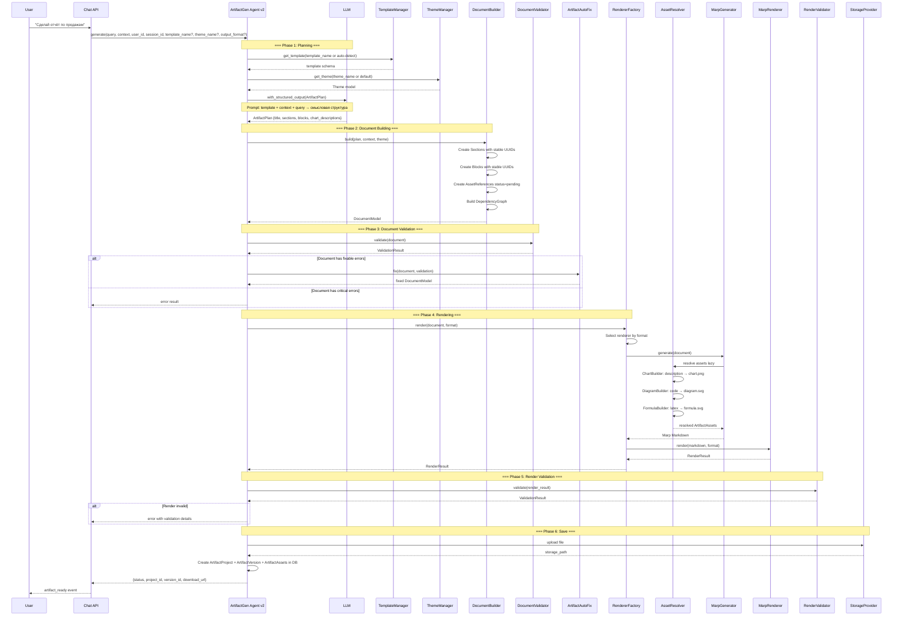
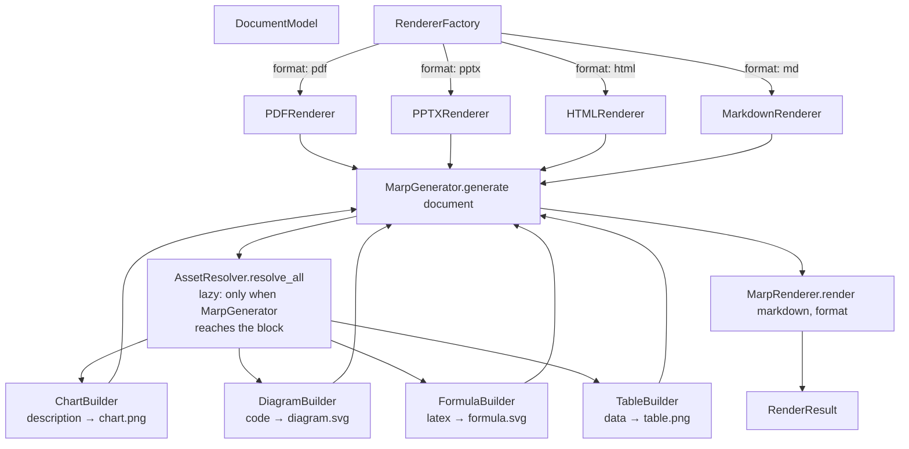
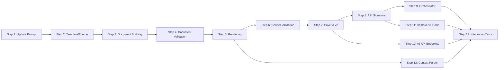
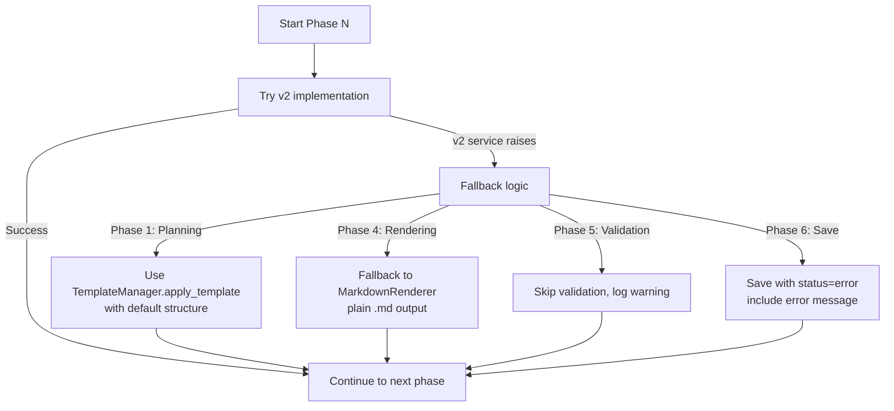

# План интеграции v2 архитектуры генерации артефактов в `artifact_generator.py`

> **Статус:** Черновик  
> **Версия:** 1.0  
> **Дата:** 2026-07-22  
> **Автор:** Architect Agent

---

## Содержание

1. [Новая архитектура агента](#1-новая-архитектура-агента)
2. [Детальный дизайн каждой фазы](#2-детальный-дизайн-каждой-фазы)
3. [Изменения в API сигнатуре](#3-изменения-в-api-сигнатуре)
4. [Изменения в оркестраторе](#4-изменения-в-оркестраторе)
5. [Изменения в API endpoints](#5-изменения-в-api-endpoints)
6. [Миграция данных](#6-миграция-данных)
7. [Пошаговый план реализации](#7-пошаговый-план-реализации)
8. [Риски и компромиссы](#8-риски-и-компромиссы)
9. [Критерии готовности](#9-критерии-готовности)

---

## 1. Новая архитектура агента

### 1.1 Сравнение v1 vs v2

```mermaid
graph TB
    subgraph "v1 Current 5-phase pipeline"
        V1_1[Phase 1: Planning<br/>LLM → LLMArtifactPlan<br/>3 LLM calls total]
        V1_2[Phase 2: Chart Code<br/>LLM → LLMChartCode<br/>→ SubprocessSandbox]
        V1_3[Phase 3: Marp Markdown<br/>LLM → LLMMarkdownContent]
        V1_4[Phase 4: Rendering<br/>MarpRenderer]
        V1_5[Phase 5: Save<br/>StorageProvider → artifacts table]
        V1_1 --> V1_2 --> V1_3 --> V1_4 --> V1_5
    end

    subgraph "v2 New 6-phase pipeline"
        V2_1[Phase 1: Planning<br/>LLM → ArtifactPlan<br/>1 LLM call total]
        V2_2[Phase 2: Document Building<br/>DocumentBuilder.build<br/>→ DocumentModel]
        V2_3[Phase 3: Document Validation<br/>DocumentValidator.validate<br/>→ Auto-fix if needed]
        V2_4[Phase 4: Rendering<br/>RendererFactory.render<br/>→ MarpGenerator → AssetResolver → MarpRenderer]
        V2_5[Phase 5: Render Validation<br/>RenderValidator.validate]
        V2_6[Phase 6: Save<br/>StorageProvider → artifact_projects<br/>artifact_versions, artifact_assets]
        V2_1 --> V2_2 --> V2_3 --> V2_4 --> V2_5 --> V2_6
    end
```



### 1.2 Ключевые изменения

| Аспект | v1 | v2 |
|--------|----|----|
| **LLM-вызовов** | 3 (Planning + Chart Code + Marp Markdown) | 1 (только Planning) |
| **Графики** | LLM пишет Python-код → SubprocessSandbox | `ChartBuilder` сам выбирает тип по данным |
| **Markdown** | LLM пишет Marp Markdown | `MarpGenerator` конвертирует `DocumentModel` |
| **Валидация** | Нет | Двухуровневая (Document + Render) |
| **Шаблоны/темы** | Нет | `TemplateManager` (7 шаблонов) + `ThemeManager` (3 темы) |
| **Версионирование** | Нет | `ArtifactProject` → `ArtifactVersion` |
| **Граф зависимостей** | Нет | `DependencyGraph` с BFS |
| **Хранение** | Таблица `artifacts` | Таблицы `artifact_projects`, `artifact_versions`, `artifact_assets` |

### 1.3 Полный поток v2



### 1.4 Структура нового `ArtifactGeneratorAgent` (v2)

```python
class ArtifactGeneratorAgent:
    """v2: 6-фазный пайплайн генерации артефактов без LLM для графиков и Markdown."""

    def __init__(
        self,
        storage: Optional[StorageProvider] = None,
        template_manager: Optional[TemplateManager] = None,
        theme_manager: Optional[ThemeManager] = None,
        document_builder: Optional[DocumentBuilder] = None,
        document_validator: Optional[DocumentValidator] = None,
        auto_fix: Optional[ArtifactAutoFix] = None,
        renderer_factory: Optional[RendererFactory] = None,
        render_validator: Optional[RenderValidator] = None,
        db: Optional[Session] = None,
    ):
        # v2 сервисы
        self.storage = storage or MockStorageProvider()
        self.template_manager = template_manager or TemplateManager(db=db)
        self.theme_manager = theme_manager or ThemeManager(db=db)
        self.document_builder = document_builder or DocumentBuilder()
        self.document_validator = document_validator or DocumentValidator()
        self.auto_fix = auto_fix or ArtifactAutoFix()
        self.renderer_factory = renderer_factory or RendererFactory()
        self.render_validator = render_validator or RenderValidator()
        self.db = db

        # LLM (только для Planning)
        self.llm = self._init_llm()
        self.planning_chain = self.llm.with_structured_output(ArtifactPlan) if self.llm else None
```

### 1.5 Какие v2 сервисы импортируются

| Сервис | Откуда | Назначение |
|--------|--------|------------|
| `ArtifactPlan` | `app/services/artifact/models.py` | Модель вывода LLM (только смысловая структура) |
| `ArtifactContext` | `app/services/artifact/models.py` | Контекст выполнения (язык, компания, таймзона) |
| `DocumentModel` | `app/services/artifact/models.py` | Единый источник истины |
| `Theme` | `app/services/artifact/models.py` | Тема оформления |
| `ValidationResult` | `app/services/artifact/models.py` | Результат валидации |
| `RenderResult` | `app/services/artifact/models.py` | Результат рендеринга |
| `DocumentBuilder` | `app/services/artifact/document_builder.py` | ArtifactPlan → DocumentModel |
| `DocumentValidator` | `app/services/artifact/validator.py` | Валидация документа |
| `ArtifactAutoFix` | `app/services/artifact/validator.py` | Auto-fix ошибок |
| `RendererFactory` | `app/services/artifact/renderer_factory.py` | Выбор рендерера по формату |
| `RenderValidator` | `app/services/artifact/validator.py` | Валидация результата рендеринга |
| `TemplateManager` | `app/services/artifact/template_manager.py` | Управление шаблонами |
| `ThemeManager` | `app/services/artifact/theme_manager.py` | Управление темами |
| `ArtifactProject` | `app/models/artifact_v2.py` | SQLAlchemy модель проекта |
| `ArtifactVersion` | `app/models/artifact_v2.py` | SQLAlchemy модель версии |
| `ArtifactAsset` | `app/models/artifact_v2.py` | SQLAlchemy модель ассета |

### 1.6 Какие LLM-вызовы убираются

| v1 вызов | Модель | Замена в v2 |
|----------|--------|-------------|
| `planning_chain.ainvoke(...)` → `LLMArtifactPlan` | ОСТАЁТСЯ, но модель меняется на `ArtifactPlan` | `planning_chain.ainvoke(...)` → `ArtifactPlan` |
| `chart_code_chain.ainvoke(...)` → `LLMChartCode` | **УБИРАЕТСЯ** | `ChartBuilder.build(ref, data, theme)` |
| `marp_chain.ainvoke(...)` → `LLMMarkdownContent` | **УБИРАЕТСЯ** | `MarpGenerator.generate(document)` |

---

## 2. Детальный дизайн каждой фазы

### Phase 1: Planning

**Цель:** Получить от LLM смысловую структуру артефакта без указания типов графиков.

**Вход:** `query: str`, `context: str`, `template_name: Optional[str]`, `theme_name: Optional[str]`

**Выход:** `ArtifactPlan` (из `app/services/artifact/models.py`)

#### Промпт для LLM

```python
PLANNING_SYSTEM_PROMPT = """Ты — планировщик структуры документов и презентаций.
На основе запроса пользователя и контекста из документов создай структуру артефакта.

ВАЖНО: Ты описываешь СМЫСЛ, а не визуализацию.
- Для графиков укажи только описание данных (например, "продажи по месяцам")
- НЕ указывай тип графика (bar/line/pie) — это выберет система
- НЕ пиши код — только структуру

Доступные типы блоков:
- heading: заголовок (level 1-6)
- paragraph: текстовый абзац
- table: таблица с данными
- chart: график (опиши данные, но НЕ тип графика)
- diagram: диаграмма (mermaid/plantuml/drawio)
- formula: математическая формула (LaTeX)
- code: блок кода
- quote: цитата
- image: изображение
- bullet_list: маркированный список
- columns: колонки
- callout: выделенный блок (info/warning/error/success)

Шаблон: {template_name}
Тема: {theme_name}
Контекст: {language}, {company}, {timezone}, {currency}
"""
```

#### Модель вывода

```python
class ArtifactPlan(BaseModel):
    """План артефакта от LLM — ТОЛЬКО смысловая структура."""
    title: str
    artifact_type: str = "pdf"  # pdf, pptx, docx, md, html
    sections: list[dict] = Field(
        description="Список секций. Каждая: {title, blocks: [{type, text, description, data_source, ...}]}"
    )
    reasoning: str = ""
```

#### Выбор шаблона

```python
async def _select_template(self, query: str, template_name: Optional[str] = None) -> Optional[dict]:
    """Выбрать шаблон. Если template_name указан — используем его.
    Иначе пытаемся определить по запросу."""
    if template_name:
        template = self.template_manager.get_template(template_name)
        if template:
            return template
    # Auto-detect: можно передать в LLM как подсказку
    return None
```

#### Выбор темы

```python
async def _select_theme(self, theme_name: Optional[str] = None) -> Theme:
    """Выбрать тему. Если theme_name указан — используем его.
    Иначе — тема по умолчанию (corporate)."""
    if theme_name:
        theme = self.theme_manager.get_theme(theme_name)
        if theme:
            return theme
    return self.theme_manager.get_default_theme()
```

#### Передача контекста

```python
context = ArtifactContext(
    language="ru",
    company=extracted_company or "",
    timezone="Europe/Moscow",
    currency="RUB",
    theme_name=theme_name or "corporate",
)
```

### Phase 2: Document Building

**Цель:** Преобразовать `ArtifactPlan` в `DocumentModel` с stable UUID, `AssetReference` (pending) и `DependencyGraph`.

**Вход:** `plan: ArtifactPlan`, `context: ArtifactContext`, `theme: Theme`

**Выход:** `DocumentModel`

#### Вызов

```python
document = self.document_builder.build(
    plan=plan,
    context=context,
    theme=theme,
)
```

#### Что происходит внутри `DocumentBuilder.build()`:

1. Создаётся `DocumentModel` с `title`, `artifact_type`, `context`, `theme`
2. Для каждой секции из `plan.sections`:
   - Создаётся `Section` со stable UUID (`section_id`)
   - Для каждого блока:
     - Создаётся `Block` со stable UUID (`block_id`)
     - Если блок типа `chart` → создаётся `ChartBlock` + `AssetReference(asset_type=CHART, status="pending")`
     - Если блок типа `diagram` → создаётся `DiagramBlock` + `AssetReference(asset_type=DIAGRAM, status="pending")`
     - Если блок типа `formula` → создаётся `FormulaBlock` + `AssetReference(asset_type=FORMULA, status="pending")`
     - Если блок типа `table` с данными → создаётся `TableBlock` + `AssetReference(asset_type=TABLE, status="pending")`
3. Строится `DependencyGraph`:
   - `block.id → section.id` (блок зависит от секции)
   - `asset_id → block.id` (ассет зависит от блока)

#### Пример `DocumentModel` после сборки

```json
{
  "title": "Quarterly Sales Report",
  "artifact_type": "pdf",
  "context": {"language": "ru", "company": "ACME Corp", ...},
  "theme": {"name": "corporate", ...},
  "sections": [
    {
      "id": "a1b2c3d4e5f6",
      "title": "Revenue Overview",
      "blocks": [
        {
          "id": "b1c2d3e4f5a6",
          "block_type": "heading",
          "heading": {"level": 1, "text": "Revenue Overview"}
        },
        {
          "id": "c3d4e5f6a7b8",
          "block_type": "chart",
          "chart": {
            "description": "Monthly revenue for Q3",
            "data_source": "revenue_data",
            "columns": ["month", "revenue"],
            "asset_ref": {
              "asset_id": "d4e5f6a7b8c9",
              "asset_type": "chart",
              "status": "pending",
              "source": "revenue_data",
              "spec": {"description": "Monthly revenue for Q3", "columns": ["month", "revenue"]}
            }
          }
        }
      ]
    }
  ],
  "dependency_graph": {
    "edges": [
      ["b1c2d3e4f5a6", "a1b2c3d4e5f6"],
      ["c3d4e5f6a7b8", "a1b2c3d4e5f6"],
      ["d4e5f6a7b8c9", "c3d4e5f6a7b8"]
    ]
  }
}
```

### Phase 3: Document Validation

**Цель:** Проверить структуру документа до рендеринга.

**Вход:** `document: DocumentModel`

**Выход:** `ValidationResult`

#### Вызов

```python
validation = await self.document_validator.validate(document)

if not validation.passed:
    # Пытаемся auto-fix
    fixable_errors = [e for e in validation.errors
                      if e.check_name in ("empty_blocks", "section_structure")]
    critical_errors = [e for e in validation.errors
                       if e.check_name not in ("empty_blocks", "section_structure")]

    if critical_errors:
        raise ValueError(f"Document validation failed: {[e.message for e in critical_errors]}")

    if fixable_errors:
        document = await self.auto_fix.fix(document, validation)
        logger.info("Auto-fixed %d document errors", len(fixable_errors))
```

#### Проверки `DocumentValidator`

| Проверка | Что проверяет | Auto-fix? |
|----------|---------------|-----------|
| `required_fields` | title, artifact_type, sections не пустые | Нет (критическая) |
| `empty_blocks` | Нет блоков без контента | Да (удалить пустые) |
| `asset_refs` | Все asset_refs имеют matching AssetReference | Нет (критическая) |
| `section_structure` | Секции имеют title и blocks | Да (добавить placeholder) |
| `block_types` | Типы блоков соответствуют контенту | Нет (критическая) |

#### Обработка ошибок

```python
if not validation.passed:
    critical = [e for e in validation.errors
                if e.check_name in ("required_fields", "asset_refs", "block_types")]
    if critical:
        result["status"] = "error"
        result["error"] = f"Document validation failed: {[e.message for e in critical]}"
        return result
```

### Phase 4: Rendering

**Цель:** Сконвертировать `DocumentModel` в выходной файл (PDF/PPTX/HTML/MD).

**Вход:** `document: DocumentModel`, `output_format: str`

**Выход:** `RenderResult`

#### Выбор формата

```python
# Приоритет:
# 1. Из запроса пользователя (output_format параметр)
# 2. Из ArtifactPlan.artifact_type
# 3. По умолчанию "pdf"
output_format = output_format or plan.artifact_type or "pdf"
```

#### Вызов

```python
render_result = await self.renderer_factory.render(
    document=document,
    format=output_format,
)
```

#### Что происходит внутри `RendererFactory.render()`:



#### Данные для `AssetResolver`

`AssetResolver.resolve_all()` требует `data: dict[str, pd.DataFrame]` — словарь с DataFrame'ами по источникам данных.

```python
# Из контекста нужно извлечь табличные данные
# context — это строка с данными из SearchRAGAgent
# Нужно распарсить таблицы из контекста в DataFrame'ы
data_frames = self._parse_context_to_dataframes(context)
# → {"revenue_data": pd.DataFrame(...), "expenses_data": pd.DataFrame(...)}
```

**Проблема:** В v1 контекст передаётся как строка (результат RAG). Для v2 нужно либо:
1. Парсить таблицы из текста (риск: неструктурированные данные)
2. Передавать структурированные данные через API (рекомендуется)
3. Использовать sample data (fallback, как в `ChartBuilder._generate_sample_data`)

**Рекомендация:** Реализовать `_parse_context_to_dataframes()` как эвристический парсер + fallback на sample data.

### Phase 5: Render Validation

**Цель:** Проверить выходной файл после рендеринга.

**Вход:** `render_result: RenderResult`

**Выход:** `ValidationResult`

#### Вызов

```python
render_validation = await self.render_validator.validate(render_result)

if not render_validation.passed:
    logger.warning("Render validation failed: %s",
                   [e.message for e in render_validation.errors])
    # Не прерываем поток, но логируем
    # Можно добавить retry logic в будущем
```

#### Проверки `RenderValidator`

| Проверка | Что проверяет | Действие при ошибке |
|----------|---------------|---------------------|
| `file_exists` | Файл существует на диске | Прерывание (критическая) |
| `file_size` | Размер в пределах 50MB | Предупреждение |
| `images_exist` | Все изображения доступны | Предупреждение |
| `links_valid` | Ссылки синтаксически корректны | Предупреждение |
| `slide_count` | 1-50 слайдов | Предупреждение |
| `file_valid` | Файл не повреждён (PDF magic bytes) | Прерывание (критическая) |

### Phase 6: Save

**Цель:** Сохранить артефакт в v2 таблицы БД.

**Вход:** `render_result: RenderResult`, `document: DocumentModel`, `user_id`, `session_id`, `message_id`

**Выход:** `dict` с `project_id`, `version_id`, `download_url`

#### Создание ArtifactProject

```python
project = ArtifactProject(
    user_id=user_id,
    session_id=session_id,
    title=document.title,
    template_name=template_name,
    current_version=1,
    context=document.context.model_dump() if document.context else None,
)
self.db.add(project)
self.db.flush()  # получаем project.id
```

#### Создание ArtifactVersion

```python
version = ArtifactVersion(
    project_id=project.id,
    version_number=1,
    status=ArtifactStatus.READY,
    document_model=document.model_dump(),
    dependency_graph=document.dependency_graph.model_dump(),
    storage_path=storage_path,
    file_size=render_result.file_size,
    artifact_type=document.artifact_type,
    document_validation=document_validation.model_dump() if document_validation else None,
    render_validation=render_validation.model_dump() if render_validation else None,
)
self.db.add(version)
self.db.flush()  # получаем version.id
```

#### Создание ArtifactAsset (для каждого resolved ассета)

```python
for ref in document.get_all_asset_refs():
    if ref.status == "resolved" and ref.resolved_asset:
        asset = ref.resolved_asset
        db_asset = ArtifactAsset(
            asset_id=asset.asset_id,
            version_id=version.id,
            asset_type=asset.asset_type,
            name=asset.name,
            mime_type=asset.mime_type,
            storage_path=asset.file_path,
            asset_metadata=asset.metadata,
            size_bytes=asset.size_bytes,
        )
        self.db.add(db_asset)

self.db.commit()
```

#### Сохранение файла через StorageProvider

```python
with open(render_result.file_path, "rb") as f:
    storage_path = await self.storage.upload(
        file_path=f"artifacts/v2/{user_id}/{project.id}/{version.id}/{filename}",
        content=f,
    )
```

#### Формат ответа

```python
{
    "status": "ready",
    "project_id": project.id,
    "version_id": version.id,
    "artifact_id": version.id,  # для обратной совместимости
    "title": document.title,
    "artifact_type": document.artifact_type,
    "download_url": f"/api/v1/artifact-projects/{project.id}/versions/{version.id}/download",
    "file_size": render_result.file_size,
}
```

---

## 3. Изменения в API сигнатуре

### 3.1 Новый метод `generate()`

```python
async def generate(
    self,
    query: str,
    context: str,
    user_id: int,
    session_id: int,
    message_id: Optional[int] = None,
    # НОВЫЕ параметры v2:
    template_name: Optional[str] = None,  # шаблон (corporate_report, quarterly_report, ...)
    theme_name: Optional[str] = None,     # тема (corporate, dark, minimal)
    output_format: Optional[str] = None,  # pdf, pptx, html, md
    # НОВЫЕ: структурированные данные для графиков
    data_frames: Optional[dict[str, Any]] = None,  # {"source_name": DataFrame or list[dict]}
) -> dict:
```

### 3.2 Какие параметры остаются

| Параметр | Тип | Назначение |
|----------|-----|------------|
| `query` | `str` | Запрос пользователя |
| `context` | `str` | Контекст из документов (результат SearchRAGAgent) |
| `user_id` | `int` | ID пользователя |
| `session_id` | `int` | ID сессии чата |
| `message_id` | `Optional[int]` | ID сообщения-источника |

### 3.3 Какие параметры добавляются

| Параметр | Тип | Дефолт | Назначение |
|----------|-----|--------|------------|
| `template_name` | `Optional[str]` | `None` (auto-detect) | Имя шаблона из TemplateManager |
| `theme_name` | `Optional[str]` | `None` (corporate) | Имя темы из ThemeManager |
| `output_format` | `Optional[str]` | `None` (из плана) | Целевой формат: pdf, pptx, html, md |
| `data_frames` | `Optional[dict]` | `None` | Структурированные данные для графиков |

### 3.4 Формат ответа

```python
{
    "status": "ready" | "error" | "generating",
    "project_id": Optional[int],
    "version_id": Optional[int],
    "artifact_id": Optional[int],  # для обратной совместимости
    "title": Optional[str],
    "artifact_type": Optional[str],
    "download_url": Optional[str],
    "file_size": Optional[int],
    "error": Optional[str],
    "events": [
        {"event": "phase_start", "data": {"phase": "planning"}},
        {"event": "phase_complete", "data": {"phase": "planning"}},
        {"event": "phase_start", "data": {"phase": "document_building"}},
        ...
        {"event": "artifact_ready", "data": {
            "project_id": 1,
            "version_id": 1,
            "type": "pdf",
            "url": "/api/v1/artifact-projects/1/versions/1/download",
            "filename": "report.pdf",
            "size": 123456,
        }},
    ],
}
```

---

## 4. Изменения в оркестраторе

### 4.1 Текущий вызов в `orchestrator.py`

```python
# Строка 233-238 в orchestrator.py
result = await self.artifact_gen.generate(
    query=state["query"],
    context=context,
    user_id=state["user_id"],
    session_id=0,  # будет передан из API
)
```

### 4.2 Новый вызов

```python
# Определяем параметры из запроса (можно через LLM или из state)
template_name = self._detect_template(state["query"])
theme_name = state.get("theme_name", "corporate")
output_format = self._detect_format(state["query"])

result = await self.artifact_gen.generate(
    query=state["query"],
    context=context,
    user_id=state["user_id"],
    session_id=session_id,  # передавать из API
    message_id=state.get("message_id"),
    template_name=template_name,
    theme_name=theme_name,
    output_format=output_format,
    data_frames=None,  # будет передаваться из API в будущем
)
```

### 4.3 Новые методы в `AgentOrchestrator`

```python
def _detect_template(self, query: str) -> Optional[str]:
    """Определить шаблон по запросу (keyword matching)."""
    lowered = query.lower()
    if any(w in lowered for w in ["квартальн", "quarterly"]):
        return "quarterly_report"
    if any(w in lowered for w in ["инвест", "investor", "питч"]):
        return "investor_deck"
    if any(w in lowered for w in ["executive", "summary", "резюме"]):
        return "executive_summary"
    if any(w in lowered for w in ["техническ", "technical", "proposal"]):
        return "technical_proposal"
    if any(w in lowered for w in ["архитектур", "architecture", "review"]):
        return "architecture_review"
    if any(w in lowered for w in ["инцидент", "incident"]):
        return "incident_report"
    return None  # auto-detect через LLM

def _detect_format(self, query: str) -> Optional[str]:
    """Определить формат по запросу."""
    lowered = query.lower()
    if any(w in lowered for w in ["презентаци", "pptx", "слайд"]):
        return "pptx"
    if any(w in lowered for w in ["html", "web", "страниц"]):
        return "html"
    if any(w in lowered for w in ["markdown", "md"]):
        return "md"
    return None  # pdf по умолчанию
```

### 4.4 Обработка ошибок валидации

```python
# В _finalize():
elif route == "generate" and state.get("artifact_result"):
    artifact = state["artifact_result"]
    if artifact.get("status") == "ready":
        state["final_answer"] = (
            f"✅ **Артефакт сгенерирован!**\n\n"
            f"**{artifact.get('title', 'Артефакт')}** "
            f"({artifact.get('artifact_type', '').upper()})\n\n"
            f"[Скачать]({artifact.get('download_url', '#')})"
        )
    elif artifact.get("status") == "error":
        state["final_answer"] = (
            f"❌ **Ошибка генерации артефакта:**\n"
            f"{artifact.get('error', 'Неизвестная ошибка')}"
        )
```

### 4.5 Изменения в `AgentState`

```python
class AgentState(TypedDict):
    # ... существующие поля ...
    artifact_result: Optional[dict]
    # НОВЫЕ:
    template_name: Optional[str]
    theme_name: Optional[str]
    output_format: Optional[str]
    data_frames: Optional[dict]  # структурированные данные
```

---

## 5. Изменения в API endpoints

### 5.1 Текущие endpoints (v1, остаются для обратной совместимости)

| Метод | Path | Назначение |
|-------|------|------------|
| GET | `/api/v1/artifacts/` | Список артефактов (v1) |
| GET | `/api/v1/artifacts/{id}` | Получить артефакт (v1) |
| GET | `/api/v1/artifacts/{id}/download` | Скачать файл (v1) |
| DELETE | `/api/v1/artifacts/{id}` | Удалить артефакт (v1) |

### 5.2 Новые endpoints (v2)

#### Projects

| Метод | Path | Назначение |
|-------|------|------------|
| GET | `/api/v1/artifact-projects/` | Список проектов пользователя |
| POST | `/api/v1/artifact-projects/` | Создать проект (ручное создание) |
| GET | `/api/v1/artifact-projects/{id}` | Получить проект |
| DELETE | `/api/v1/artifact-projects/{id}` | Удалить проект |

#### Versions

| Метод | Path | Назначение |
|-------|------|------------|
| GET | `/api/v1/artifact-projects/{id}/versions` | Список версий |
| POST | `/api/v1/artifact-projects/{id}/versions` | Создать новую версию (перегенерация) |
| GET | `/api/v1/artifact-projects/{id}/versions/{vid}` | Получить версию |
| GET | `/api/v1/artifact-projects/{id}/versions/{vid}/download` | Скачать файл версии |
| POST | `/api/v1/artifact-projects/{id}/versions/{vid}/regenerate-section/{section_id}` | Регенерация секции |

#### Templates

| Метод | Path | Назначение |
|-------|------|------------|
| GET | `/api/v1/templates/` | Список шаблонов |
| GET | `/api/v1/templates/{name}` | Получить шаблон |
| POST | `/api/v1/templates/` | Создать пользовательский шаблон |
| PUT | `/api/v1/templates/{id}` | Обновить шаблон |
| DELETE | `/api/v1/templates/{id}` | Удалить шаблон |

#### Themes

| Метод | Path | Назначение |
|-------|------|------------|
| GET | `/api/v1/themes/` | Список тем |
| GET | `/api/v1/themes/{name}` | Получить тему |
| POST | `/api/v1/themes/` | Создать пользовательскую тему |
| PUT | `/api/v1/themes/{id}` | Обновить тему |
| DELETE | `/api/v1/themes/{id}` | Удалить тему |

### 5.3 Новый файл: `app/api/v1/endpoints/artifact_projects.py`

Новый роутер для v2 endpoints. Подключается в `app/api/v1/api.py`:

```python
from app.api.v1.endpoints import artifact_projects, artifact_templates, artifact_themes

api_router.include_router(artifact_projects.router)
api_router.include_router(artifact_templates.router)
api_router.include_router(artifact_themes.router)
```

### 5.4 Новые схемы: `app/schemas/artifact_v2.py`

```python
class ArtifactProjectResponse(BaseModel):
    id: int
    user_id: int
    session_id: int
    title: str
    template_name: Optional[str]
    current_version: int
    created_at: datetime
    updated_at: Optional[datetime]

class ArtifactVersionResponse(BaseModel):
    id: int
    project_id: int
    version_number: int
    status: str
    artifact_type: str
    file_size: Optional[int]
    created_at: datetime

class ArtifactTemplateResponse(BaseModel):
    id: int
    name: str
    display_name: str
    description: Optional[str]
    is_system: bool

class ThemeResponse(BaseModel):
    id: int
    name: str
    display_name: str
    is_system: bool
```

---

## 6. Миграция данных

### 6.1 Текущая таблица `artifacts` (v1)

```sql
CREATE TABLE artifacts (
    id SERIAL PRIMARY KEY,
    user_id INTEGER REFERENCES users(id),
    session_id INTEGER REFERENCES chat_sessions(id),
    message_id INTEGER REFERENCES messages(id),
    artifact_type VARCHAR(20) NOT NULL,
    title VARCHAR(255) NOT NULL,
    status VARCHAR(20) DEFAULT 'generating',
    storage_path VARCHAR(500),
    file_size BIGINT,
    error_message TEXT,
    created_at TIMESTAMP DEFAULT NOW()
);
```

### 6.2 Стратегия миграции

**Решение: старые артефакты остаются read-only.**

1. Таблица `artifacts` (v1) остаётся без изменений
2. Старые endpoints `/api/v1/artifacts/*` продолжают работать для чтения
3. Новые артефакты сохраняются только в v2 таблицы
4. Миграция данных не требуется — старые артефакты доступны только для чтения

### 6.3 Если миграция всё же нужна

```python
# Скрипт миграции: v1 artifacts → v2 projects
for old_artifact in db.query(Artifact).all():
    project = ArtifactProject(
        user_id=old_artifact.user_id,
        session_id=old_artifact.session_id,
        title=old_artifact.title,
        current_version=1,
    )
    db.add(project)
    db.flush()

    version = ArtifactVersion(
        project_id=project.id,
        version_number=1,
        status=old_artifact.status,
        storage_path=old_artifact.storage_path,
        file_size=old_artifact.file_size,
        artifact_type=old_artifact.artifact_type,
        error_message=old_artifact.error_message,
    )
    db.add(version)

db.commit()
```

**Рекомендация:** Не делать миграцию на первом этапе. Добавить скрипт как опцию.

---

## 7. Пошаговый план реализации

### Шаг 1: Обновить промпт планирования (S)

**Файлы:**
- `app/agents/artifact_generator.py` — новый промпт для `ArtifactPlan`

**Что сделать:**
- Заменить `LLMArtifactPlan` на `ArtifactPlan` из `app/services/artifact/models.py`
- Обновить системный промпт: убрать указание типов графиков, добавить описание блоков
- Убрать `chart_engine` из промпта

**Тесты:**
- Проверить, что LLM возвращает `ArtifactPlan` с корректной структурой
- Проверить, что chart blocks содержат только `description` + `data_source`, без `chart_type`

**Зависимости:** Нет

---

### Шаг 2: Добавить TemplateManager и ThemeManager в агента (S)

**Файлы:**
- `app/agents/artifact_generator.py` — инициализация и вызов `_select_template()`, `_select_theme()`

**Что сделать:**
- Добавить `template_manager` и `theme_manager` в `__init__`
- Реализовать `_select_template(query, template_name)` — выбор шаблона
- Реализовать `_select_theme(theme_name)` — выбор темы
- Передавать template schema в промпт LLM

**Тесты:**
- Проверить выбор шаблона по имени
- Проверить auto-detect шаблона по ключевым словам
- Проверить fallback на дефолтную тему

**Зависимости:** Шаг 1

---

### Шаг 3: Реализовать Phase 2 — Document Building (M)

**Файлы:**
- `app/agents/artifact_generator.py` — вызов `DocumentBuilder.build()`

**Что сделать:**
- Импортировать `DocumentBuilder` из `app/services/artifact/document_builder.py`
- Импортировать `ArtifactContext` из `app/services/artifact/models.py`
- Создать `ArtifactContext` из параметров (язык, компания, таймзона, валюта)
- Вызвать `document_builder.build(plan, context, theme)` → `DocumentModel`
- Убрать старый код Phase 2 (генерация графиков через LLM)

**Тесты:**
- Проверить, что `DocumentModel` содержит stable UUIDs
- Проверить, что `AssetReference` созданы со статусом `pending`
- Проверить, что `DependencyGraph` построен корректно

**Зависимости:** Шаг 2

---

### Шаг 4: Реализовать Phase 3 — Document Validation (M)

**Файлы:**
- `app/agents/artifact_generator.py` — вызов `DocumentValidator.validate()` + `ArtifactAutoFix.fix()`

**Что сделать:**
- Импортировать `DocumentValidator` и `ArtifactAutoFix` из `app/services/artifact/validator.py`
- Вызвать `document_validator.validate(document)` → `ValidationResult`
- Разделить ошибки на fixable и critical
- Для fixable: вызвать `auto_fix.fix(document, validation)`
- Для critical: прервать с ошибкой

**Тесты:**
- Проверить, что валидный документ проходит проверку
- Проверить, что auto-fix удаляет пустые блоки
- Проверить, что critical ошибки прерывают поток

**Зависимости:** Шаг 3

---

### Шаг 5: Реализовать Phase 4 — Rendering (M)

**Файлы:**
- `app/agents/artifact_generator.py` — вызов `RendererFactory.render()`

**Что сделать:**
- Импортировать `RendererFactory` из `app/services/artifact/renderer_factory.py`
- Определить `output_format` (из параметра → из плана → "pdf")
- Вызвать `renderer_factory.render(document, format)` → `RenderResult`
- Убрать старый код Phase 3 (LLM-генерация Markdown) и Phase 4 (MarpRenderer.render)

**Тесты:**
- Проверить рендеринг в PDF
- Проверить рендеринг в PPTX
- Проверить рендеринг в HTML
- Проверить рендеринг в MD
- Проверить, что графики генерируются (lazy resolution)

**Зависимости:** Шаг 4

---

### Шаг 6: Реализовать Phase 5 — Render Validation (S)

**Файлы:**
- `app/agents/artifact_generator.py` — вызов `RenderValidator.validate()`

**Что сделать:**
- Импортировать `RenderValidator` из `app/services/artifact/validator.py`
- Вызвать `render_validator.validate(render_result)` → `ValidationResult`
- Логировать ошибки, но не прерывать поток (кроме critical: file_exists, file_valid)

**Тесты:**
- Проверить, что валидный файл проходит проверку
- Проверить, что отсутствующий файл вызывает ошибку

**Зависимости:** Шаг 5

---

### Шаг 7: Реализовать Phase 6 — Save to v2 tables (M)

**Файлы:**
- `app/agents/artifact_generator.py` — сохранение в `ArtifactProject`, `ArtifactVersion`, `ArtifactAsset`

**Что сделать:**
- Импортировать `ArtifactProject`, `ArtifactVersion`, `ArtifactAsset` из `app/models/artifact_v2.py`
- Создать `ArtifactProject` (user_id, session_id, title, template_name, context)
- Создать `ArtifactVersion` (project_id, document_model, dependency_graph, storage_path, ...)
- Создать `ArtifactAsset` для каждого resolved ассета
- Сохранить файл через `StorageProvider`
- Заменить старый код Phase 5 (сохранение в таблицу `artifacts`)

**Тесты:**
- Проверить создание проекта в БД
- Проверить создание версии
- Проверить создание ассетов
- Проверить сохранение файла

**Зависимости:** Шаг 6

---

### Шаг 8: Обновить API сигнатуру generate() (S)

**Файлы:**
- `app/agents/artifact_generator.py` — новый метод `generate()` с новыми параметрами

**Что сделать:**
- Добавить параметры: `template_name`, `theme_name`, `output_format`, `data_frames`
- Обновить формат ответа: добавить `project_id`, `version_id`
- Обновить SSE events

**Тесты:**
- Проверить, что старый вызов без новых параметров работает (backward compat)
- Проверить, что новые параметры применяются

**Зависимости:** Шаг 7

---

### Шаг 9: Обновить Orchestrator (M)

**Файлы:**
- `app/agents/orchestrator.py` — новый вызов `artifact_gen.generate()` с новыми параметрами

**Что сделать:**
- Добавить `_detect_template(query)` и `_detect_format(query)` методы
- Обновить `_generate_artifact()` — передавать template_name, theme_name, output_format
- Обновить `AgentState` — добавить новые поля
- Обновить `_finalize()` — показывать download_url

**Тесты:**
- Проверить, что оркестратор передаёт template_name
- Проверить, что ошибки валидации корректно обрабатываются

**Зависимости:** Шаг 8

---

### Шаг 10: Создать v2 API endpoints (XL)

**Файлы:**
- `app/api/v1/endpoints/artifact_projects.py` — новый файл
- `app/api/v1/endpoints/artifact_templates.py` — новый файл
- `app/api/v1/endpoints/artifact_themes.py` — новый файл
- `app/schemas/artifact_v2.py` — новый файл
- `app/api/v1/api.py` — подключить новые роутеры

**Что сделать:**
- CRUD для проектов (list, get, create, delete)
- CRUD для версий (list, get, create, download)
- CRUD для шаблонов (list, get, create, update, delete)
- CRUD для тем (list, get, create, update, delete)
- Endpoint для регенерации секции (опционально, P2)

**Тесты:**
- Полный integration test для каждого endpoint
- Проверить access control (только свои проекты)
- Проверить скачивание файла

**Зависимости:** Шаг 7

---

### Шаг 11: Удалить старый код v1 (S)

**Файлы:**
- `app/agents/artifact_generator.py` — удалить `LLMArtifactPlan`, `LLMChartCode`, `LLMMarkdownContent`
- Удалить `_generate_chart()`, `_generate_markdown()`
- Удалить `SubprocessSandbox` импорт (если не используется в v2)

**Что сделать:**
- Удалить неиспользуемые Pydantic модели
- Удалить неиспользуемые методы
- Убедиться, что `SubprocessSandbox` больше не нужен (ChartBuilder не использует sandbox)

**Тесты:**
- Проверить, что всё работает без старого кода
- Проверить импорты

**Зависимости:** Шаг 10

---

### Шаг 12: Добавить парсинг контекста в DataFrame (L)

**Файлы:**
- `app/agents/artifact_generator.py` — новый метод `_parse_context_to_dataframes()`

**Что сделать:**
- Реализовать эвристический парсер текста в pandas DataFrame
- Поддержка: CSV-блоки, markdown-таблицы, JSON-массивы
- Fallback на `ChartBuilder._generate_sample_data()` если парсинг не удался

**Тесты:**
- Проверить парсинг markdown-таблицы
- Проверить парсинг CSV
- Проверить fallback на sample data

**Зависимости:** Шаг 5 (нужно для AssetResolver)

---

### Шаг 13: Написать интеграционные тесты (L)

**Файлы:**
- `tests/test_artifact_generator_v2.py` — новый файл

**Что сделать:**
- Test full pipeline: query → artifact (mock LLM)
- Test each phase independently
- Test error handling (validation failures, render failures)
- Test template selection
- Test theme selection
- Test backward compatibility

**Тесты:** Это и есть тесты

**Зависимости:** Шаг 11

---

### Диаграмма зависимостей шагов



---

## 8. Риски и компромиссы

### 8.1 Риски

| Риск | Вероятность | Влияние | Митигация |
|------|-------------|---------|-----------|
| **LLM не возвращает корректный ArtifactPlan** | Средняя | Высокое | Добавить retry logic + fallback на TemplateManager.apply_template() |
| **ChartBuilder не может построить график из-за неструктурированных данных** | Высокая | Среднее | Использовать `_generate_sample_data()` как fallback + логировать предупреждение |
| **MarpGenerator не поддерживает все block types** | Низкая | Среднее | Добавить placeholder для неподдерживаемых типов |
| **Marp CLI падает при рендеринге** | Средняя | Высокое | Retry (1 раз) + fallback на MarkdownRenderer |
| **DocumentValidator даёт false positive** | Низкая | Среднее | Логировать и пропускать (не прерывать поток) |
| **RenderValidator даёт false positive для бинарных файлов** | Средняя | Низкое | Пропускать проверки, которые не могут быть выполнены |
| **Конфликт имён: ArtifactPlan в base.py и models.py** | Высокая | Среднее | Переименовать v1 `ArtifactPlan` в `ArtifactPlanV1` или удалить после миграции |
| **Конфликт имён: RenderResult в base.py и models.py** | Высокая | Среднее | В `renderer_factory.py` уже есть `_convert_render_result()` — использовать его |

### 8.2 Компромиссы

| Компромисс | Решение | Обоснование |
|------------|---------|-------------|
| **Старые артефакты не мигрируются** | Read-only доступ через v1 endpoints | Миграция не требуется для MVP, старые артефакты остаются доступными |
| **Context → DataFrame парсинг эвристический** | Использовать sample data при неудаче | Структурированные данные будут передаваться через API в будущем |
| **RenderValidator не прерывает поток** | Только логирование ошибок | Иначе пользователь не получит артефакт вообще |
| **SubprocessSandbox остаётся в коде** | Не удалять, но не использовать | Может понадобиться для кастомных графиков в будущем |
| **v1 endpoints остаются** | Параллельно с v2 | Обратная совместимость для старых артефактов |

### 8.3 Fallback стратегия



---

## 9. Критерии готовности

### 9.1 Функциональные критерии

- [ ] **P0:** Агент генерирует артефакт через v2 pipeline (6 фаз) без LLM для графиков и Markdown
- [ ] **P0:** 1 LLM-вызов на артефакт (только Planning)
- [ ] **P0:** Графики генерируются через `ChartBuilder` (без LLM-кода)
- [ ] **P0:** Markdown генерируется через `MarpGenerator` (без LLM)
- [ ] **P0:** Документ проходит `DocumentValidator` до рендеринга
- [ ] **P0:** Результат рендеринга проходит `RenderValidator`
- [ ] **P0:** Артефакт сохраняется в v2 таблицы (`artifact_projects`, `artifact_versions`, `artifact_assets`)
- [ ] **P0:** Поддержка шаблонов (7 системных)
- [ ] **P0:** Поддержка тем (3 системные)
- [ ] **P1:** Auto-fix для исправимых ошибок валидации
- [ ] **P1:** v2 API endpoints (проекты, версии, шаблоны, темы)
- [ ] **P1:** Обратная совместимость: старые v1 endpoints работают
- [ ] **P2:** Парсинг контекста в DataFrame для графиков
- [ ] **P2:** Регенерация секции по section_id

### 9.2 Тесты

- [ ] **Unit:** `DocumentBuilder.build()` — корректная структура с UUID
- [ ] **Unit:** `DocumentValidator.validate()` — все 5 проверок
- [ ] **Unit:** `RenderValidator.validate()` — все 6 проверок
- [ ] **Unit:** `ArtifactAutoFix.fix()` — исправление пустых блоков
- [ ] **Integration:** Полный pipeline: query → artifact (mock LLM)
- [ ] **Integration:** Каждая фаза по отдельности
- [ ] **Integration:** Обработка ошибок (validation failure, render failure)
- [ ] **Integration:** Выбор шаблона и темы
- [ ] **Integration:** v2 API endpoints CRUD
- [ ] **E2E:** Реальный запрос → PDF/PPTX/HTML/MD файл

### 9.3 Метрики для мониторинга

| Метрика | Ожидание | Как измерять |
|---------|----------|--------------|
| **LLM-вызовов на артефакт** | 1 (было 3) | Счётчик в логах |
| **Время генерации** | < 30 сек (PDF) | Timing в логах |
| **Успешность валидации** | > 95% | `validation.passed` |
| **Успешность рендеринга** | > 90% | `render_result.success` |
| **Успешность auto-fix** | > 80% fixable errors | `auto_fix.fix()` |
| **Средний размер файла** | < 10 MB | `file_size` |
| **Использование шаблонов** | > 50% артефактов | `template_name` не null |

### 9.4 Код-ревью критерии

- [ ] Нет dead code (v1 LLM-модели, методы)
- [ ] Все v2 сервисы импортируются из правильных модулей
- [ ] Нет конфликтов имён (ArtifactPlan, RenderResult)
- [ ] SSE events обновлены для v2 фаз
- [ ] Логирование на каждом этапе
- [ ] Error handling для каждой фазы
- [ ] Backward compatibility для старых вызовов

---

## Приложение A: Полный код нового `ArtifactGeneratorAgent` (v2)

```python
"""Artifact Generator Agent v2: 6-фазный пайплайн генерации артефактов.

v2 vs v1 ключевые изменения:
- 1 LLM-вызов вместо 3 (только Planning)
- ChartBuilder вместо LLM-кода для графиков
- MarpGenerator вместо LLM для Markdown
- Двухуровневая валидация (Document + Render)
- Версионирование (Project → Version → Assets)
- Шаблоны и темы
"""

import json
import logging
import os
from typing import Any, Optional

import pandas as pd

from sqlalchemy.orm import Session

from app.core import config
from app.services.artifact.models import (
    ArtifactContext,
    ArtifactPlan,
    DocumentModel,
    Theme,
    ValidationResult,
    RenderResult,
)
from app.services.artifact.document_builder import DocumentBuilder
from app.services.artifact.validator import (
    DocumentValidator,
    RenderValidator,
    ArtifactAutoFix,
)
from app.services.artifact.renderer_factory import RendererFactory
from app.services.artifact.template_manager import TemplateManager
from app.services.artifact.theme_manager import ThemeManager
from app.models.artifact_v2 import (
    ArtifactProject,
    ArtifactVersion,
    ArtifactAsset,
    ArtifactStatus,
)
from app.services.storage import MockStorageProvider, StorageProvider

logger = logging.getLogger(__name__)


PLANNING_SYSTEM_PROMPT = """Ты — планировщик структуры документов и презентаций.
На основе запроса пользователя и контекста из документов создай структуру артефакта.

ВАЖНО: Ты описываешь СМЫСЛ, а не визуализацию.
- Для графиков укажи только описание данных (например, "продажи по месяцам")
- НЕ указывай тип графика (bar/line/pie) — это выберет система
- НЕ пиши код — только структуру

Доступные типы блоков:
- heading: заголовок (level 1-6)
- paragraph: текстовый абзац
- table: таблица с данными
- chart: график (опиши данные, но НЕ тип графика)
- diagram: диаграмма (mermaid/plantuml/drawio)
- formula: математическая формула (LaTeX)
- code: блок кода
- quote: цитата
- image: изображение
- bullet_list: маркированный список
- columns: колонки
- callout: выделенный блок (info/warning/error/success)

Шаблон: {template_name}
Тема: {theme_name}
Контекст: {language}, {company}, {timezone}, {currency}
"""


class ArtifactGeneratorAgent:
    """v2: 6-фазный пайплайн генерации артефактов."""

    def __init__(
        self,
        storage: Optional[StorageProvider] = None,
        template_manager: Optional[TemplateManager] = None,
        theme_manager: Optional[ThemeManager] = None,
        document_builder: Optional[DocumentBuilder] = None,
        document_validator: Optional[DocumentValidator] = None,
        auto_fix: Optional[ArtifactAutoFix] = None,
        renderer_factory: Optional[RendererFactory] = None,
        render_validator: Optional[RenderValidator] = None,
        db: Optional[Session] = None,
    ):
        self.storage = storage or MockStorageProvider()
        self.template_manager = template_manager or TemplateManager(db=db)
        self.theme_manager = theme_manager or ThemeManager(db=db)
        self.document_builder = document_builder or DocumentBuilder()
        self.document_validator = document_validator or DocumentValidator()
        self.auto_fix = auto_fix or ArtifactAutoFix()
        self.renderer_factory = renderer_factory or RendererFactory()
        self.render_validator = render_validator or RenderValidator()
        self.db = db

        # LLM (только для Planning)
        self.llm = self._init_llm()
        self.planning_chain = self.llm.with_structured_output(ArtifactPlan) if self.llm else None

    def _init_llm(self):
        """Инициализировать LLM (GigaChat → OpenAI fallback)."""
        # ... существующая логика _init_gigachat + _init_openai ...
        pass

    async def generate(
        self,
        query: str,
        context: str,
        user_id: int,
        session_id: int,
        message_id: Optional[int] = None,
        template_name: Optional[str] = None,
        theme_name: Optional[str] = None,
        output_format: Optional[str] = None,
        data_frames: Optional[dict[str, Any]] = None,
    ) -> dict:
        """Полный цикл генерации артефакта (v2).

        6 фаз:
        1. Planning — LLM → ArtifactPlan
        2. Document Building — DocumentBuilder → DocumentModel
        3. Document Validation — DocumentValidator + AutoFix
        4. Rendering — RendererFactory → RenderResult
        5. Render Validation — RenderValidator
        6. Save — StorageProvider + v2 tables
        """
        result = {
            "status": "generating",
            "project_id": None,
            "version_id": None,
            "artifact_id": None,
            "title": None,
            "artifact_type": None,
            "download_url": None,
            "file_size": None,
            "error": None,
            "events": [],
        }

        if self.planning_chain is None:
            result["status"] = "error"
            result["error"] = "LLM provider is not available"
            return result

        try:
            # === Phase 1: Planning ===
            logger.info("Phase 1: Planning artifact structure")
            result["events"].append({"event": "phase_start", "data": {"phase": "planning"}})

            plan, theme = await self._plan_artifact(
                query=query,
                context=context,
                template_name=template_name,
                theme_name=theme_name,
            )
            result["title"] = plan.title
            result["artifact_type"] = plan.artifact_type

            result["events"].append({"event": "phase_complete", "data": {"phase": "planning"}})

            # === Phase 2: Document Building ===
            logger.info("Phase 2: Building document model")
            result["events"].append({"event": "phase_start", "data": {"phase": "document_building"}})

            artifact_context = ArtifactContext(
                language="ru",
                company="",
                timezone="Europe/Moscow",
                currency="RUB",
                theme_name=theme_name or "corporate",
            )

            document = self.document_builder.build(
                plan=plan,
                context=artifact_context,
                theme=theme,
            )

            result["events"].append({"event": "phase_complete", "data": {"phase": "document_building"}})

            # === Phase 3: Document Validation ===
            logger.info("Phase 3: Validating document")
            result["events"].append({"event": "phase_start", "data": {"phase": "document_validation"}})

            document, doc_validation = await self._validate_document(document)

            if doc_validation and not doc_validation.passed:
                critical = [e for e in doc_validation.errors
                            if e.check_name in ("required_fields", "asset_refs", "block_types")]
                if critical:
                    raise ValueError(
                        f"Document validation failed: {[e.message for e in critical]}"
                    )

            result["events"].append({"event": "phase_complete", "data": {"phase": "document_validation"}})

            # === Phase 4: Rendering ===
            fmt = output_format or plan.artifact_type or "pdf"
            logger.info(f"Phase 4: Rendering to {fmt}")
            result["events"].append({"event": "phase_start", "data": {"phase": "rendering"}})

            # Парсим контекст в DataFrame для AssetResolver
            dfs = data_frames or self._parse_context_to_dataframes(context)

            render_result = await self.renderer_factory.render(document, fmt)

            if not render_result.success:
                raise RuntimeError(f"Render failed: {render_result.error}")

            result["events"].append({"event": "phase_complete", "data": {"phase": "rendering"}})

            # === Phase 5: Render Validation ===
            logger.info("Phase 5: Validating render result")
            result["events"].append({"event": "phase_start", "data": {"phase": "render_validation"}})

            render_validation = await self.render_validator.validate(render_result)
            if not render_validation.passed:
                logger.warning(
                    "Render validation issues: %s",
                    [e.message for e in render_validation.errors],
                )

            result["events"].append({"event": "phase_complete", "data": {"phase": "render_validation"}})

            # === Phase 6: Save ===
            logger.info("Phase 6: Saving artifact")
            result["events"].append({"event": "phase_start", "data": {"phase": "saving"}})

            save_result = await self._save_artifact_v2(
                render_result=render_result,
                document=document,
                plan=plan,
                user_id=user_id,
                session_id=session_id,
                message_id=message_id,
                template_name=template_name,
                doc_validation=doc_validation,
                render_validation=render_validation,
            )

            result["status"] = "ready"
            result.update(save_result)

            result["events"].append({
                "event": "artifact_ready",
                "data": {
                    "project_id": save_result.get("project_id"),
                    "version_id": save_result.get("version_id"),
                    "type": plan.artifact_type,
                    "url": save_result.get("download_url"),
                    "filename": save_result.get("filename"),
                    "size": render_result.file_size,
                },
            })

            logger.info(
                "Artifact v2 generated: project=%d version=%s",
                save_result.get("project_id"),
                save_result.get("version_id"),
            )

        except Exception as e:
            logger.exception("Artifact generation v2 failed")
            result["status"] = "error"
            result["error"] = str(e)
            result["events"].append({"event": "artifact_error", "data": {"error": str(e)}})

        return result

    async def _plan_artifact(
        self,
        query: str,
        context: str,
        template_name: Optional[str] = None,
        theme_name: Optional[str] = None,
    ) -> tuple[ArtifactPlan, Theme]:
        """Phase 1: Planning — LLM → ArtifactPlan."""
        # Выбираем шаблон
        template = None
        if template_name:
            template = self.template_manager.get_template(template_name)

        # Выбираем тему
        theme = self.theme_manager.get_theme(theme_name) if theme_name else None
        if not theme:
            theme = self.theme_manager.get_default_theme()

        # Формируем промпт
        prompt = PLANNING_SYSTEM_PROMPT.format(
            template_name=template["display_name"] if template else "auto",
            theme_name=theme.display_name,
            language="ru",
            company="",
            timezone="Europe/Moscow",
            currency="RUB",
        )

        # LLM вызов
        llm_plan = await self.planning_chain.ainvoke({
            "query": query,
            "context": context[:50000] if context else "Нет контекста",
            "template": json.dumps(template, ensure_ascii=False) if template else "Нет шаблона",
        })

        plan_data = llm_plan if isinstance(llm_plan, dict) else llm_plan.model_dump()

        return ArtifactPlan(**plan_data), theme

    async def _validate_document(
        self,
        document: DocumentModel,
    ) -> tuple[DocumentModel, Optional[ValidationResult]]:
        """Phase 3: Document Validation + Auto-fix."""
        validation = await self.document_validator.validate(document)

        if not validation.passed:
            fixable = [e for e in validation.errors
                       if e.check_name in ("empty_blocks", "section_structure")]
            if fixable:
                document = await self.auto_fix.fix(document, validation)
                logger.info("Auto-fixed %d document errors", len(fixable))
                # Ревалидация после фикса
                validation = await self.document_validator.validate(document)

        return document, validation

    def _parse_context_to_dataframes(
        self,
        context: str,
    ) -> dict[str, pd.DataFrame]:
        """Парсить контекст в DataFrame для AssetResolver.

        Эвристический парсер. При неудаче возвращает пустой dict.
        """
        # TODO: реализовать парсинг markdown-таблиц, CSV, JSON
        return {}

    async def _save_artifact_v2(
        self,
        render_result: RenderResult,
        document: DocumentModel,
        plan: ArtifactPlan,
        user_id: int,
        session_id: int,
        message_id: Optional[int] = None,
        template_name: Optional[str] = None,
        doc_validation: Optional[ValidationResult] = None,
        render_validation: Optional[ValidationResult] = None,
    ) -> dict:
        """Phase 6: Save to v2 tables."""
        if not render_result.file_path or not os.path.exists(render_result.file_path):
            raise RuntimeError("Render result file not found")

        # Определяем имя файла
        safe_title = "".join(c if c.isalnum() or c in " _-" else "_" for c in plan.title)
        ext = plan.artifact_type
        filename = f"{safe_title[:50]}.{ext}"

        # Сохраняем файл через StorageProvider
        with open(render_result.file_path, "rb") as f:
            storage_path = await self.storage.upload(
                file_path=f"artifacts/v2/{user_id}/{filename}",
                content=f,
            )

        # Создаём Project + Version в БД
        if self.db:
            project = ArtifactProject(
                user_id=user_id,
                session_id=session_id,
                title=plan.title,
                template_name=template_name,
                current_version=1,
                context=document.context.model_dump() if document.context else None,
            )
            self.db.add(project)
            self.db.flush()

            version = ArtifactVersion(
                project_id=project.id,
                version_number=1,
                status=ArtifactStatus.READY,
                document_model=document.model_dump(),
                dependency_graph=document.dependency_graph.model_dump(),
                storage_path=storage_path,
                file_size=render_result.file_size,
                artifact_type=plan.artifact_type,
                document_validation=doc_validation.model_dump() if doc_validation else None,
                render_validation=render_validation.model_dump() if render_validation else None,
            )
            self.db.add(version)
            self.db.flush()

            # Сохраняем resolved ассеты
            for ref in document.get_all_asset_refs():
                if ref.status == "resolved" and ref.resolved_asset:
                    asset = ref.resolved_asset
                    db_asset = ArtifactAsset(
                        asset_id=asset.asset_id,
                        version_id=version.id,
                        asset_type=asset.asset_type,
                        name=asset.name,
                        mime_type=asset.mime_type,
                        storage_path=asset.file_path,
                        asset_metadata=asset.metadata,
                        size_bytes=asset.size_bytes,
                    )
                    self.db.add(db_asset)

            self.db.commit()

            project_id = project.id
            version_id = version.id
        else:
            project_id = None
            version_id = None

        # Очищаем временный файл
        os.unlink(render_result.file_path)

        return {
            "project_id": project_id,
            "version_id": version_id,
            "artifact_id": version_id,
            "filename": filename,
            "storage_path": storage_path,
            "download_url": (
                f"/api/v1/artifact-projects/{project_id}/versions/{version_id}/download"
                if project_id and version_id else
                f"/api/v1/artifacts/download/{filename}"
            ),
        }
```

---

## Приложение B: Изменения в файлах

| Файл | Изменения | Сложность |
|------|-----------|-----------|
| `app/agents/artifact_generator.py` | Полная переработка: v2 pipeline, новые импорты, новые параметры | XL |
| `app/agents/orchestrator.py` | Новые методы `_detect_template()`, `_detect_format()`, обновлён `_generate_artifact()` | M |
| `app/api/v1/endpoints/artifact_projects.py` | **Новый файл:** CRUD для проектов и версий | L |
| `app/api/v1/endpoints/artifact_templates.py` | **Новый файл:** CRUD для шаблонов | M |
| `app/api/v1/endpoints/artifact_themes.py` | **Новый файл:** CRUD для тем | M |
| `app/schemas/artifact_v2.py` | **Новый файл:** Pydantic схемы для v2 API | S |
| `app/api/v1/api.py` | Подключить новые роутеры | S |
| `tests/test_artifact_generator_v2.py` | **Новый файл:** интеграционные тесты | L |