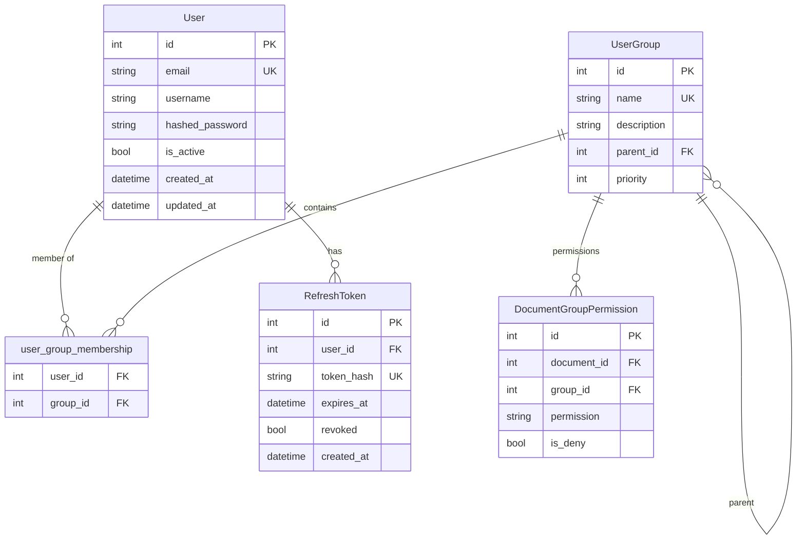
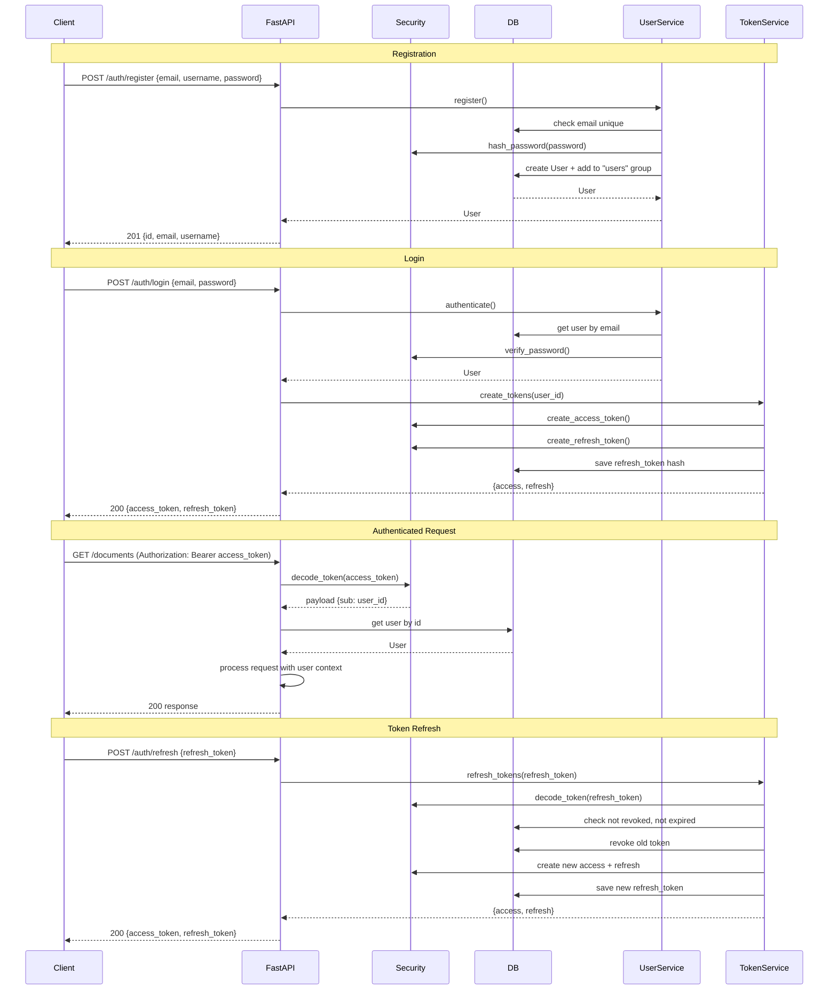

# План: Авторизация, Регистрация и Безопасность

## Принятые решения

| Решение | Выбор |
|---------|-------|
| Регистрация | Открытая self-registration, без подтверждения email |
| Ролевая модель | Через предопределённые группы UserGroup (admin/user) |
| JWT | Access + Refresh tokens |
| Refresh tokens | Хранить в БД (возможность отзыва) |
| IAM | Standalone auth, OAuth2 интеграция — потом |
| Email confirmation | Не требуется для MVP |

---

## 1. Модели БД — изменения

### 1.1. Новая модель: `RefreshToken`

```python
class RefreshToken(Base):
    __tablename__ = "refresh_tokens"

    id = Column(Integer, primary_key=True, index=True)
    user_id = Column(Integer, ForeignKey("users.id"), nullable=False, index=True)
    token_hash = Column(String, unique=True, nullable=False)  # SHA-256 хеш токена
    expires_at = Column(DateTime(timezone=True), nullable=False)
    revoked = Column(Boolean, default=False)
    created_at = Column(DateTime(timezone=True), server_default=func.now())

    # Связь
    user = relationship("User", backref="refresh_tokens")
```

### 1.2. Модель `User` — без изменений

Поле `role` не добавляем — роль определяется через membership в предопределённых группах.

### 1.3. Предопределённые группы (seed data)

При первом запуске (или миграции) создаются группы:
- `admins` — полный доступ ко всем документам, управление пользователями
- `users` — обычные пользователи с ACL на документах

---

## 2. Security utils (`app/core/security.py`) — реализовать

### 2.1. Хеширование паролей (bcrypt)

```python
from passlib.context import CryptContext

pwd_context = CryptContext(schemes=["bcrypt"], deprecated="auto")

def hash_password(password: str) -> str: ...
def verify_password(plain_password: str, hashed_password: str) -> bool: ...
```

**Зависимость:** добавить `passlib[bcrypt]` в `pyproject.toml`

### 2.2. JWT — генерация и верификация

```python
def create_access_token(data: dict, expires_delta: timedelta | None = None) -> str: ...
def create_refresh_token(data: dict) -> str: ...
def decode_token(token: str) -> dict: ...
```

- Access token: payload = `{"sub": user_id, "exp": ..., "type": "access"}`
- Refresh token: payload = `{"sub": user_id, "exp": ..., "type": "refresh", "jti": ...}`
- `jti` (JWT ID) — уникальный идентификатор для хранения в БД

### 2.3. Генерация `jti`

```python
import uuid
jti = str(uuid.uuid4())
```

---

## 3. Auth endpoints (`app/api/v1/endpoints/auth.py`) — реализовать

### 3.1. `POST /api/v1/auth/register`

- Body: `{"email": str, "username": str, "password": str}`
- Валидация: email уникален, password min length (8), username не пустой
- Хеширование пароля
- Создание User + добавление в группу "users" (по умолчанию)
- Возврат: `{"id": int, "email": str, "username": str}`

### 3.2. `POST /api/v1/auth/login`

- Body: `{"email": str, "password": str}`
- Проверка: пользователь существует, is_active, пароль верен
- Генерация access_token (30 min) + refresh_token (7 days)
- Сохранение refresh_token в БД (хеш + jti + expires_at)
- Возврат: `{"access_token": str, "refresh_token": str, "token_type": "bearer"}`

### 3.3. `POST /api/v1/auth/refresh`

- Body: `{"refresh_token": str}`
- Проверка: токен валиден, не revoked, не истёк
- Старый refresh_token помечается revoked = True (rotation)
- Генерация новой пары токенов
- Возврат: `{"access_token": str, "refresh_token": str}`

### 3.4. `POST /api/v1/auth/logout`

- Header: Authorization: Bearer <access_token>
- Body: `{"refresh_token": str}`
- Пометить refresh_token как revoked
- Возврат: `{"message": "Logged out"}`

### 3.5. `GET /api/v1/auth/me`

- Header: Authorization: Bearer <access_token>
- Возврат: `{"id": int, "email": str, "username": str, "is_active": bool, "groups": [...]}`

---

## 4. Dependencies (`app/api/deps.py`) — переписать

### 4.1. `get_current_user()` — реальная JWT проверка

```python
async def get_current_user(
    credentials: HTTPAuthorizationCredentials = Depends(security),
    db: Session = Depends(get_db),
) -> User:
    payload = decode_token(credentials.credentials)
    if payload.get("type") != "access":
        raise HTTPException(401, "Invalid token type")
    user_id = payload.get("sub")
    user = db.query(User).filter(User.id == user_id).first()
    if not user or not user.is_active:
        raise HTTPException(401, "User not found or inactive")
    return user
```

### 4.2. `get_current_admin_user()` — проверка роли admin

```python
async def get_current_admin_user(
    current_user: User = Depends(get_current_user),
    db: Session = Depends(get_db),
) -> User:
    groups = await get_effective_groups(current_user.id, db)
    admin_group = db.query(UserGroup).filter(UserGroup.name == "admins").first()
    if not admin_group or admin_group.id not in groups:
        raise HTTPException(403, "Admin privileges required")
    return current_user
```

---

## 5. CRUD и сервисы — реализовать

### 5.1. `app/crud/crud_user.py`

```python
def get_user_by_email(db: Session, email: str) -> User | None: ...
def get_user_by_id(db: Session, user_id: int) -> User | None: ...
def create_user(db: Session, email: str, username: str, hashed_password: str) -> User: ...
def get_users(db: Session, skip: int, limit: int) -> list[User]: ...
def update_user(db: Session, user_id: int, **kwargs) -> User: ...
def delete_user(db: Session, user_id: int) -> None: ...
```

### 5.2. `app/services/user.py`

```python
class UserService:
    def __init__(self, db: Session): ...
    async def register(self, email: str, username: str, password: str) -> User: ...
    async def authenticate(self, email: str, password: str) -> User | None: ...
    async def add_to_default_group(self, user: User) -> None: ...
```

### 5.3. `app/services/token.py` (новый файл)

```python
class TokenService:
    def __init__(self, db: Session): ...
    async def create_tokens(self, user_id: int) -> dict: ...
    async def refresh_tokens(self, refresh_token: str) -> dict: ...
    async def revoke_refresh_token(self, refresh_token: str) -> None: ...
    async def cleanup_expired_tokens(self) -> int: ...
```

---

## 6. Seed data — предопределённые группы

### 6.1. `app/core/seed.py` (новый файл)

```python
def seed_groups(db: Session) -> None:
    """Создать предопределённые группы при первом запуске."""
    if not db.query(UserGroup).filter(UserGroup.name == "admins").first():
        db.add(UserGroup(name="admins", description="Administrators", priority=100))
    if not db.query(UserGroup).filter(UserGroup.name == "users").first():
        db.add(UserGroup(name="users", description="Regular users", priority=0))
    db.commit()
```

Вызов в `main.py` в lifespan startup.

---

## 7. Frontend — минимальные изменения

### 7.1. Форма регистрации (`register.html`)

- Отправка POST на `/api/v1/auth/register`
- Поля: email, username, password, confirm_password
- Валидация на клиенте (password match, min length)
- После успеха — редирект на /login

### 7.2. Форма логина (`login.html`)

- Отправка POST на `/api/v1/auth/login`
- Сохранение access_token и refresh_token в localStorage
- Редирект на /chat

### 7.3. Шапка (`base.html`)

- Заменить хардкод "Пользователь" на реальное имя из `/api/v1/auth/me`
- Показывать кнопку "Войти" если не авторизован
- Кнопка "Выйти" — POST на `/api/v1/auth/logout`

---

## 8. Безопасность — дополнительные меры

### 8.1. Rate Limiting

- Добавить `slowapi` или middleware для ограничения запросов к `/auth/login` (5 попыток в минуту)
- `pyproject.toml`: добавить `slowapi`

### 8.2. CORS

- Настроить `CORSMiddleware` в `main.py` (разрешённые origins для фронтенда)

### 8.3. Password policy

- Минимальная длина: 8 символов
- Хотя бы одна цифра и одна буква (на уровне Pydantic схемы)

### 8.4. Security headers

- Добавить middleware для заголовков: `X-Content-Type-Options`, `X-Frame-Options`, `Strict-Transport-Security`

---

## 9. Схема данных (ERD)



---

## 10. Поток авторизации (Sequence)



---

## 11. Порядок реализации

| № | Задача | Файлы | Зависит от |
|---|--------|-------|------------|
| 1 | Добавить `passlib[bcrypt]` и `slowapi` в `pyproject.toml` | `pyproject.toml` | — |
| 2 | Реализовать `app/core/security.py` (hash, verify, JWT) | `app/core/security.py` | 1 |
| 3 | Создать модель `RefreshToken` | `app/models/user.py` | — |
| 4 | Создать `app/core/seed.py` (предопределённые группы) | `app/core/seed.py` | — |
| 5 | Реализовать `app/crud/crud_user.py` | `app/crud/crud_user.py` | — |
| 6 | Реализовать `app/services/user.py` (UserService) | `app/services/user.py` | 2, 5 |
| 7 | Создать `app/services/token.py` (TokenService) | `app/services/token.py` | 2, 3 |
| 8 | Переписать `app/api/deps.py` (реальная JWT проверка) | `app/api/deps.py` | 2 |
| 9 | Реализовать auth endpoints (register, login, refresh, logout, me) | `app/api/v1/endpoints/auth.py` | 6, 7, 8 |
| 10 | Добавить seed вызов в lifespan `main.py` | `main.py` | 4 |
| 11 | Настроить CORS и security headers в `main.py` | `main.py` | — |
| 12 | Обновить HTML-шаблоны (login, register, base) | `app/templates/*.html` | 9 |
| 13 | Добавить admin-эндпоинты для управления пользователями | `app/api/v1/endpoints/users.py` | 8 |

---

## 12. Новые/изменённые зависимости

```toml
dependencies = [
    ...
    "passlib[bcrypt]>=1.7.4",
    "slowapi>=0.1.9",
    "python-jose[cryptography]>=3.3.0",
]
```

> **Примечание:** `python-jose` для JWT, либо можно использовать `PyJWT`. `python-jose` предпочтительнее для асинхронных сценариев и лучшей совместимости с FastAPI.