# CJM — Customer Journey Map: CorpAI Intelligence

**Персона:** Корпоративный пользователь (аналитик / менеджер)
**Цель:** Быстрый поиск, анализ и визуализация корпоративных документов с помощью AI-ассистента

---

## Flowchart: Полный путь пользователя

```mermaid
flowchart TD
    %% Стили
    classDef stage fill:#1a1c1c,color:#fff,stroke:#006b1d,stroke-width:3px,font-size:16px
    classDef touchpoint fill:#e8f5e9,color:#1a1c1c,stroke:#006b1d,stroke-width:1px
    classDef action fill:#fff,color:#1a1c1c,stroke:#6e7b6a,stroke-width:1px
    classDef emotion fill:#fff3e0,color:#1a1c1c,stroke:#b85e00,stroke-width:1px
    classDef pain fill:#ffebee,color:#1a1c1c,stroke:#ba1a1a,stroke-width:1px
    classDef opportunity fill:#e0f2fe,color:#1a1c1c,stroke:#0062a2,stroke-width:1px
    classDef kpi fill:#f3e5f5,color:#1a1c1c,stroke:#7c3aed,stroke-width:1px

    %% ==========================================
    %% ЭТАП 1: ВХОД
    %% ==========================================
    subgraph Stage1[Этап 1: Осведомление и вход]
        S1_Start((Начало)) --> S1_Landing[Landing Page]
        S1_Landing --> S1_Login[Login Form / SSO]
        S1_Login --> S1_Auth[JWT Auth / SberID]
        S1_Auth --> S1_Success[Главная страница]

        S1_Touchpoints:::touchpoint
        S1_Touchpoints --> |Touchpoints| S1_Landing
        S1_Touchpoints --> |Touchpoints| S1_Login
        S1_Touchpoints --> |Touchpoints| S1_Auth

        S1_Actions:::action
        S1_Actions --> |Действия| S1_Open[Открывает сайт]
        S1_Actions --> |Действия| S1_Click[Нажимает Войти]
        S1_Actions --> |Действия| S1_Input[Вводит credentials]
        S1_Actions --> |Действия| S1_Redirect[Попадает на главную]

        S1_Emotions:::emotion
        S1_Emotions --> |Эмоции| S1_Emo1[Нейтрально]
        S1_Emotions --> |Эмоции| S1_Emo2[Ожидание загрузки SSO]

        S1_Pain:::pain
        S1_Pain --> |Pain Points| S1_PP1[Забыл пароль]
        S1_Pain --> |Pain Points| S1_PP2[Долгая загрузка SSO]
        S1_Pain --> |Pain Points| S1_PP3[Нет кнопки СберID]

        S1_Opp:::opportunity
        S1_Opp --> |Opportunities| S1_Op1[Анимация загрузки]
        S1_Opp --> |Opportunities| S1_Op2[Запоминание сессии]
        S1_Opp --> |Opportunities| S1_Op3[Быстрый SSO]
    end

    %% ==========================================
    %% ЭТАП 2: ДАШБОРД
    %% ==========================================
    subgraph Stage2[Этап 2: Знакомство с системой]
        S2_Dash[Dashboard / Main page]
        S2_Dash --> S2_Nav[Sidebar навигация]
        S2_Nav --> S2_Explore[Изучает разделы]

        S2_Touchpoints:::touchpoint
        S2_Touchpoints --> |Touchpoints| S2_Dash
        S2_Touchpoints --> |Touchpoints| S2_Nav
        S2_Touchpoints --> |Touchpoints| S2_Stats[Статистика]

        S2_Actions:::action
        S2_Actions --> |Действия| S2_View[Просматривает статистику]
        S2_Actions --> |Действия| S2_Recent[Смотрит недавние документы]
        S2_Actions --> |Действия| S2_Choose[Выбирает раздел]

        S2_Emotions:::emotion
        S2_Emotions --> |Эмоции| S2_Emo1[Позитивное удивление]
        S2_Emotions --> |Эмоции| S2_Emo2[Интерес к UI]

        S2_Pain:::pain
        S2_Pain --> |Pain Points| S2_PP1[Непонятно с чего начать]
        S2_Pain --> |Pain Points| S2_PP2[Пустой дашборд]
        S2_Pain --> |Pain Points| S2_PP3[Перегруженность]

        S2_Opp:::opportunity
        S2_Opp --> |Opportunities| S2_Op1[Onboarding-тултип]
        S2_Opp --> |Opportunities| S2_Op2[Быстрый старт с примером]
        S2_Opp --> |Opportunities| S2_Op3[Приветственное сообщение]
    end

    %% ==========================================
    %% ЭТАП 3: ЗАГРУЗКА ДОКУМЕНТОВ
    %% ==========================================
    subgraph Stage3[Этап 3: Загрузка и ETL]
        S3_Lib[Library / Documents page]
        S3_Lib --> S3_Upload[Upload form / Drag-and-drop]
        S3_Upload --> S3_ETL[ETL Pipeline]
        S3_ETL --> S3_Parse[Parser: PDF/DOCX/XLSX/TXT]
        S3_Parse --> S3_Chunk[Chunker: Smart Split + Overlap]
        S3_Chunk --> S3_Dedup[Deduplicator: SimHash]
        S3_Chunk --> S3_Embed[Embedder: sentence-transformers]
        S3_Embed --> S3_Qdrant[Qdrant: Vector Store]
        S3_Embed --> S3_PG[PostgreSQL: Metadata]
        S3_Qdrant --> S3_Ready[Статус: Готов]

        S3_Touchpoints:::touchpoint
        S3_Touchpoints --> |Touchpoints| S3_Lib
        S3_Touchpoints --> |Touchpoints| S3_Upload
        S3_Touchpoints --> |Touchpoints| S3_ETL
        S3_Touchpoints --> |Touchpoints| S3_Ready

        S3_Actions:::action
        S3_Actions --> |Действия| S3_Go[Переходит в Библиотеку]
        S3_Actions --> |Действия| S3_Select[Выбирает файл]
        S3_Actions --> |Действия| S3_Wait[Ждёт обработку]
        S3_Actions --> |Действия| S3_Check[Проверяет статус]

        S3_Emotions:::emotion
        S3_Emotions --> |Эмоции| S3_Emo1[Ожидание: сколько будет]
        S3_Emotions --> |Эмоции| S3_Emo2[Удовлетворение: Готов]

        S3_Pain:::pain
        S3_Pain --> |Pain Points| S3_PP1[Долгая обработка]
        S3_Pain --> |Pain Points| S3_PP2[Нет прогресс-бара]
        S3_Pain --> |Pain Points| S3_PP3[Ошибка формата]
        S3_Pain --> |Pain Points| S3_PP4[Дубликаты не видны]

        S3_Opp:::opportunity
        S3_Opp --> |Opportunities| S3_Op1[Прогресс ETL в реальном времени]
        S3_Opp --> |Opportunities| S3_Op2[Подсветка дубликатов]
        S3_Opp --> |Opportunities| S3_Op3[Batch-загрузка]
        S3_Opp --> |Opportunities| S3_Op4[Уведомление о готовности]
    end

    %% ==========================================
    %% ЭТАП 4: ЧАТ С AI
    %% ==========================================
    subgraph Stage4[Этап 4: Чат с AI-ассистентом]
        S4_Chat[Chat page]
        S4_Chat --> S4_Session[Создание сессии]
        S4_Session --> S4_Query[Запрос пользователя]
        S4_Query --> S4_Router[Router Agent: семантический роутинг]
        S4_Router --> S4_Search[Search RAG Agent]
        S4_Router --> S4_Summarize[Summarizer Agent]
        S4_Router --> S4_Analytics[Analytics Agent]
        S4_Router --> S4_General[General: прямой ответ]
        S4_Search --> S4_HyDE[HyDE: генерация гипотетического документа]
        S4_HyDE --> S4_Vector[Vector Search: Qdrant]
        S4_Vector --> S4_Rerank[Reranker: Cross-Encoder]
        S4_Rerank --> S4_LLM[LLM: GigaChat / OpenAI]
        S4_LLM --> S4_Citation[Citation Builder]
        S4_Citation --> S4_SSE[SSE Streaming ответа]
        S4_SSE --> S4_Answer[Финальный ответ с цитатами]

        S4_Touchpoints:::touchpoint
        S4_Touchpoints --> |Touchpoints| S4_Chat
        S4_Touchpoints --> |Touchpoints| S4_Session
        S4_Touchpoints --> |Touchpoints| S4_SSE
        S4_Touchpoints --> |Touchpoints| S4_Answer

        S4_Actions:::action
        S4_Actions --> |Действия| S4_Open[Открывает чат]
        S4_Actions --> |Действия| S4_New[Создаёт сессию]
        S4_Actions --> |Действия| S4_Ask[Задаёт вопрос]
        S4_Actions --> |Действия| S4_Read[Читает стриминг]
        S4_Actions --> |Действия| S4_Follow[Уточняет вопрос]

        S4_Emotions:::emotion
        S4_Emotions --> |Эмоции| S4_Emo1[Вовлечённость: AI находит!]
        S4_Emotions --> |Эмоции| S4_Emo2[Раздражение: нерелевантно]

        S4_Pain:::pain
        S4_Pain --> |Pain Points| S4_PP1[Медленный стриминг]
        S4_Pain --> |Pain Points| S4_PP2[Галлюцинации LLM]
        S4_Pain --> |Pain Points| S4_PP3[Не видны источники]
        S4_Pain --> |Pain Points| S4_PP4[Потеря контекста]

        S4_Opp:::opportunity
        S4_Opp --> |Opportunities| S4_Op1[Индикатор уверенности]
        S4_Opp --> |Opportunities| S4_Op2[Кликабельные цитаты]
        S4_Opp --> |Opportunities| S4_Op3[История сессий]
        S4_Opp --> |Opportunities| S4_Op4[Скорость стриминга]
    end

    %% ==========================================
    %% ЭТАП 5: ГЕНЕРАЦИЯ АРТЕФАКТОВ
    %% ==========================================
    subgraph Stage5[Этап 5: Генерация артефактов]
        S5_Request[Запрос: сделай отчёт]
        S5_Request --> S5_Route[Artifact Generator Agent]
        S5_Route --> S5_Type[Выбор типа артефакта]
        S5_Type --> S5_Doc[Document: PDF-отчёт]
        S5_Type --> S5_Pres[Presentation: PPTX]
        S5_Type --> S5_Diag[Diagram: Mermaid]
        S5_Type --> S5_Chart[Chart: график]
        S5_Doc --> S5_Blocks[DocumentModel: блоки]
        S5_Blocks --> S5_Assets[Asset Manager: изображения]
        S5_Assets --> S5_Marp[Marp Generator: Markdown]
        S5_Marp --> S5_Render[Marp Renderer: PDF/HTML]
        S5_Render --> S5_Preview[Preview в браузере]
        S5_Preview --> S5_Download[Download: PDF/PPTX]

        S5_Touchpoints:::touchpoint
        S5_Touchpoints --> |Touchpoints| S5_Request
        S5_Touchpoints --> |Touchpoints| S5_Type
        S5_Touchpoints --> |Touchpoints| S5_Preview
        S5_Touchpoints --> |Touchpoints| S5_Download

        S5_Actions:::action
        S5_Actions --> |Действия| S5_Ask[Просит создать артефакт]
        S5_Actions --> |Действия| S5_Choose[Выбирает тип]
        S5_Actions --> |Действия| S5_Wait[Ждёт генерацию]
        S5_Actions --> |Действия| S5_View[Просматривает]
        S5_Actions --> |Действия| S5_Save[Скачивает]

        S5_Emotions:::emotion
        S5_Emotions --> |Эмоции| S5_Emo1[Восторг: целый отчёт!]
        S5_Emotions --> |Эмоции| S5_Emo2[Разочарование: шаблон]

        S5_Pain:::pain
        S5_Pain --> |Pain Points| S5_PP1[Долгая генерация]
        S5_Pain --> |Pain Points| S5_PP2[Кривой экспорт]
        S5_Pain --> |Pain Points| S5_PP3[Нет кастомизации]
        S5_Pain --> |Pain Points| S5_PP4[Нет предпросмотра]

        S5_Opp:::opportunity
        S5_Opp --> |Opportunities| S5_Op1[Прогресс генерации]
        S5_Opp --> |Opportunities| S5_Op2[Выбор шаблона]
        S5_Opp --> |Opportunities| S5_Op3[Предпросмотр]
        S5_Opp --> |Opportunities| S5_Op4[Авто-сохранение]
        S5_Opp --> |Opportunities| S5_Op5[Экспорт PDF/PPTX/MD]
    end

    %% ==========================================
    %% ЭТАП 6: АНАЛИТИКА И ВОЗВРАТ
    %% ==========================================
    subgraph Stage6[Этап 6: Аналитика и повторное использование]
        S6_Return[Возврат в Dashboard]
        S6_Return --> S6_Stats[Обновлённая статистика]
        S6_Stats --> S6_Projects[Projects list]
        S6_Projects --> S6_History[История сессий]
        S6_History --> S6_Continue[Продолжение работы]

        S6_Touchpoints:::touchpoint
        S6_Touchpoints --> |Touchpoints| S6_Return
        S6_Touchpoints --> |Touchpoints| S6_Stats
        S6_Touchpoints --> |Touchpoints| S6_Projects
        S6_Touchpoints --> |Touchpoints| S6_History

        S6_Actions:::action
        S6_Actions --> |Действия| S6_Reopen[Возвращается]
        S6_Actions --> |Действия| S6_Review[Проверяет статистику]
        S6_Actions --> |Действия| S6_Open[Открывает проект]
        S6_Actions --> |Действия| S6_Work[Продолжает работу]

        S6_Emotions:::emotion
        S6_Emotions --> |Эмоции| S6_Emo1[Удовлетворение]
        S6_Emotions --> |Эмоции| S6_Emo2[Лояльность к системе]

        S6_Pain:::pain
        S6_Pain --> |Pain Points| S6_PP1[Нет уведомлений]
        S6_Pain --> |Pain Points| S6_PP2[Нет рекомендаций]
        S6_Pain --> |Pain Points| S6_PP3[Нет тегов]
        S6_Pain --> |Pain Points| S6_PP4[Нет глобального поиска]

        S6_Opp:::opportunity
        S6_Opp --> |Opportunities| S6_Op1[Push-уведомления]
        S6_Opp --> |Opportunities| S6_Op2[AI-рекомендации]
        S6_Opp --> |Opportunities| S6_Op3[Теги проектов]
        S6_Opp --> |Opportunities| S6_Op4[Глобальный поиск]
    end

    %% ==========================================
    %% СВЯЗИ МЕЖДУ ЭТАПАМИ
    %% ==========================================
    S1_Success --> S2_Dash
    S2_Choose --> S3_Lib
    S2_Choose --> S4_Chat
    S3_Ready --> S4_Chat
    S4_Answer --> S5_Request
    S5_Download --> S6_Return
    S6_Continue --> S4_Chat
    S6_Continue --> S3_Lib

    %% ==========================================
    %% KPI ПО ЭТАПАМ
    %% ==========================================
    subgraph KPIs[KPI по этапам]
        KPI1[Вход: конверсия >60%]
        KPI2[Дашборд: время до действия <30с]
        KPI3[ETL: обработка <10с]
        KPI4[Чат: первый ответ <2с]
        KPI5[Артефакты: генерация <30с]
        KPI6[Возврат: D7 >40%]
    end

    KPI1 -.-> Stage1
    KPI2 -.-> Stage2
    KPI3 -.-> Stage3
    KPI4 -.-> Stage4
    KPI5 -.-> Stage5
    KPI6 -.-> Stage6
```

---

## Легенда

| Цвет | Тип | Описание |
|------|-----|----------|
| 🟢 Зелёный | **Этап (Stage)** | Крупный этап пользовательского пути |
| 🌿 Светло-зелёный | **Touchpoint** | Точка взаимодействия пользователя с системой |
| ⚪ Белый | **Action** | Действие пользователя |
| 🟠 Оранжевый | **Emotion** | Эмоциональное состояние пользователя |
| 🔴 Красный | **Pain Point** | Болевая точка / проблема |
| 🔵 Голубой | **Opportunity** | Возможность для улучшения |
| 🟣 Фиолетовый | **KPI** | Ключевой показатель эффективности |

---

## Технические компоненты, отражённые в CJM

| Компонент | Где используется | Файл |
|-----------|-----------------|------|
| JWT Auth / SberID | Этап 1: Вход | `app/core/security.py` |
| Dashboard stats | Этап 2: Дашборд | `app/routes.py` |
| ETL Pipeline | Этап 3: Загрузка | `app/services/etl_pipeline.py` |
| Parser / Chunker | Этап 3: ETL | `app/services/parser.py`, `app/services/chunker.py` |
| Embedder | Этап 3: ETL | `app/services/embedder.py` |
| Deduplicator | Этап 3: ETL | `app/services/deduplicator.py` |
| Vector Store Qdrant | Этап 3,4 | `app/services/vector_store.py` |
| Router Agent | Этап 4: Чат | `app/agents/router_agent.py` |
| Search RAG Agent | Этап 4: Чат | `app/agents/search_rag_agent.py` |
| Summarizer Agent | Этап 4: Чат | `app/agents/summarizer_agent.py` |
| Analytics Agent | Этап 4: Чат | `app/agents/analytics_agent.py` |
| HyDE | Этап 4: Чат | `app/services/rag_service.py` |
| Reranker | Этап 4: Чат | `app/services/reranker.py` |
| Citation Builder | Этап 4: Чат | `app/services/citation.py` |
| SSE Streaming | Этап 4: Чат | `app/api/v1/endpoints/chat.py` |
| Artifact Generator | Этап 5: Артефакты | `app/agents/artifact_generator.py` |
| DocumentModel / Blocks | Этап 5: Артефакты | `app/services/artifact/models.py` |
| Asset Manager | Этап 5: Артефакты | `app/services/artifact/asset_manager.py` |
| Marp Generator | Этап 5: Артефакты | `app/services/artifact/marp_generator.py` |
| Marp Renderer | Этап 5: Артефакты | `app/services/artifact/marp_renderer.py` |
| Projects / History | Этап 6: Аналитика | `app/models/artifact_v2.py` |