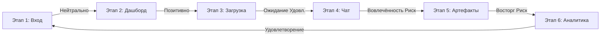

# CJM — Customer Journey Map: CorpAI Intelligence
## Персона: Корпоративный пользователь (аналитик / менеджер)
**Цель:** Быстрый поиск, анализ и визуализация корпоративных документов с помощью AI-ассистента.
---
## 6 этапов пользовательского пути
### Этап 1: Осведомление и вход (Awareness & Login)
| Метрика | Значение |
|---------|----------|
| **Каналы** | Корпоративный портал, прямая ссылка, SSO-виджет |
| **Touchpoints** | Landing page, Login form, SberID / JWT Auth |
| **Действия пользователя** | Открывает сайт → Видит лендинг → Нажимает «Войти» → Вводит credentials / SSO → Попадает на главную |
| **Эмоции** | Нейтрально — ожидание, что «очередная корпоративная система» |
| **Pain Points** | Забыл пароль, долгая загрузка SSO, нет кнопки «Войти через СберID» |
| **Opportunities** | Анимация загрузки, запоминание сессии, быстрый SSO |
### Этап 2: Знакомство с системой (First Impression / Dashboard)
| Метрика | Значение |
|---------|----------|
| **Touchpoints** | Dashboard, Main page, Навигация (sidebar) |
| **Действия пользователя** | Видит дашборд со статистикой → Просматривает недавние документы → Изучает навигацию (Чат, Библиотека, Проекты) |
| **Эмоции** | Позитивное удивление — современный UI, понятная статистика |
| **Pain Points** | Непонятно, с чего начать; пустой дашборд (нет документов); перегруженность информацией |
| **Opportunities** | Onboarding-тултип, «быстрый старт» с примером, приветственное сообщение |
### Этап 3: Загрузка и обработка документов (Document Upload & ETL)
| Метрика | Значение |
|---------|----------|
| **Touchpoints** | Library / Documents page, Upload form, Drag-and-drop zone |
| **Действия пользователя** | Переходит в «Библиотеку» → Нажимает «Загрузить» → Выбирает файл (PDF/DOCX/XLSX) → Видит прогресс → Документ появляется в списке со статусом |
| **Эмоции** | Ожидание — «сколько будет обрабатываться?» → Удовлетворение, когда статус «Готов» |
| **Pain Points** | Долгая обработка больших файлов; нет прогресс-бара; ошибка при неподдерживаемом формате; дубликаты не подсвечиваются |
| **Opportunities** | Асинхронная загрузка с уведомлением; прогресс ETL в реальном времени; подсветка дубликатов; поддержка batch-загрузки |
### Этап 4: Чат с AI-ассистентом (Chat & RAG Search)
| Метрика | Значение |
|---------|----------|
| **Touchpoints** | Chat page, SSE streaming, Citation panel |
| **Действия пользователя** | Открывает чат → Создаёт новую сессию → Задаёт вопрос → Видит стриминг ответа → Получает ответ с цитатами → Уточняет вопрос |
| **Эмоции** | Вовлечённость — «AI реально находит в моих документах!» → Раздражение, если ответ нерелевантен |
| **Pain Points** | Медленный стриминг; неточные ответы (галлюцинации); не видно источники цитирования; потеря контекста при длинном диалоге |
| **Opportunities** | Скорость стриминга; индикатор уверенности ответа; кликабельные цитаты с переходом к документу; сохранение истории сессий |
### Этап 5: Генерация артефактов (Artifact Generation)
| Метрика | Значение |
|---------|----------|
| **Touchpoints** | Artifact generator, Projects page, Preview / Download |
| **Действия пользователя** | В чате просит «сделай отчёт/презентацию» → Выбирает тип артефакта → Ждёт генерации → Просматривает результат → Скачивает PDF/PPTX |
| **Эмоции** | Восторг — «AI сделал целый отчёт!» → Разочарование, если шаблон сломан |
| **Pain Points** | Долгая генерация; некрасивый экспорт (кривые таблицы, шрифты); нельзя кастомизировать шаблон; нет предпросмотра до скачивания |
| **Opportunities** | Прогресс генерации; выбор шаблона; предпросмотр в браузере; авто-сохранение в проект; экспорт в PDF/PPTX/Markdown |
### Этап 6: Аналитика и повторное использование (Analytics & Retention)
| Метрика | Значение |
|---------|----------|
| **Touchpoints** | Dashboard, Projects list, History |
| **Действия пользователя** | Возвращается в дашборд → Видит обновлённую статистику → Открывает старый проект → Продолжает работу с документами |
| **Эмоции** | Удовлетворение — «система помнит мои проекты» |
| **Pain Points** | Нет уведомлений о новых документах; нет рекомендаций («возможно, вас заинтересует»); нет тегов и поиска по проектам |
| **Opportunities** | Push-уведомления; AI-рекомендации; тегирование проектов; глобальный поиск по всем артефактам |
---
## Сводная таблица эмоций по этапам

---
## Ключевые метрики (KPIs) для каждого этапа
| Этап | Метрика | Целевое значение |
|------|---------|-----------------|
| 1. Вход | Конверсия в регистрацию | > 60% |
| 1. Вход | Время входа (SSO) | < 3 сек |
| 2. Дашборд | Время до первого действия | < 30 сек |
| 3. Загрузка | Время обработки документа | < 10 сек для 10 стр. |
| 3. Загрузка | % успешных загрузок | > 95% |
| 4. Чат | Время первого ответа | < 2 сек |
| 4. Чат | Точность ответов (NLI) | > 85% |
| 5. Артефакты | Время генерации | < 30 сек |
| 5. Артефакты | % скачиваний после генерации | > 70% |
| 6. Аналитика | Возвращаемость (D7) | > 40% |