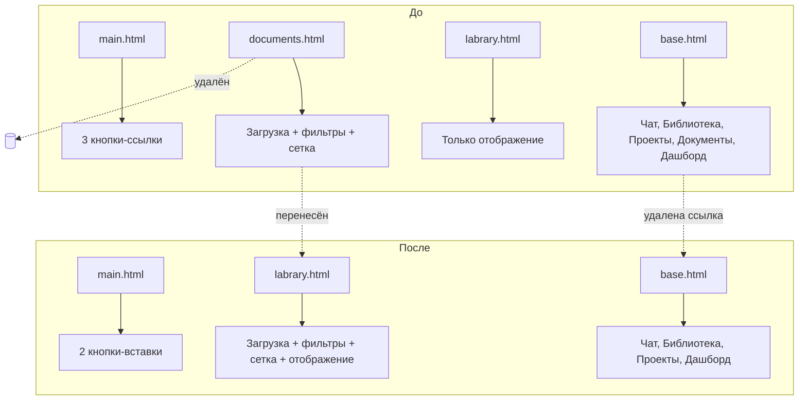

# План редизайна главной страницы CorpAI Intelligence

## Обзор изменений

1. **Консолидация страниц**: `documents.html` → `labrary.html` (весь функционал документов переносится в библиотеку)
2. **Упрощение кнопок на главной**: уменьшение высоты, изменение поведения (вставка текста вместо перехода)
3. **JS-логика на клиенте**: обработка кликов по кнопкам без изменений на бэкенде
4. **Обновление навигации**: удаление ссылки на "Документы" из `base.html`

---

## A. Консолидация страниц: documents.html → labrary.html

### A.1. Перенос функционала загрузки документов в labrary.html

**Файл**: [`app/templates/labrary.html`](app/templates/labrary.html)

**Что нужно сделать**: Добавить в `labrary.html` весь функционал загрузки документов из `documents.html`:
- Оверлей загрузки (upload overlay) с drag-and-drop
- Форма загрузки с отправкой на `/api/v1/documents/upload`
- Кнопка "Загрузить" в хедере
- Фильтры и поиск по документам
- Клиентская JS-логика для загрузки, поиска и фильтрации

**Конкретные изменения**:

1. **Добавить кнопку "Загрузить" в хедер** (рядом с существующей кнопкой "Пакетная загрузка"):

```html
<!-- В header, после кнопки "Пакетная загрузка" -->
<button class="flex items-center gap-3 px-6 py-3.5 bg-primary text-on-primary rounded-xl hover:shadow-lg transition-all active:scale-95 duration-150 group" id="upload-btn-main">
    <span class="material-symbols-outlined transition-transform group-hover:rotate-180">upload</span>
    <span class="font-bold uppercase tracking-wider">Загрузить</span>
</button>
```

2. **Добавить оверлей загрузки** (после header, перед фильтрами):

```html
<!-- Floating Upload Area (Hidden Initially) -->
<div class="hidden fixed inset-0 z-50 flex items-center justify-center p-6 upload-overlay" id="upload-overlay">
    <div class="deep-glass w-full max-w-2xl p-8 rounded-3xl shadow-lg animate-scale-in">
        <div class="flex justify-between items-center mb-6">
            <h2 class="text-headline-sm font-bold text-on-surface">Загрузка документов</h2>
            <button class="material-symbols-outlined p-2 hover:bg-surface-container rounded-full text-on-surface-variant" id="close-upload">close</button>
        </div>
        <form id="upload-form" enctype="multipart/form-data" class="space-y-6">
            <div class="border-2 border-dashed border-outline-variant/40 rounded-2xl p-12 text-center hover:border-primary transition-all group cursor-pointer" id="drop-zone">
                <div class="w-16 h-16 bg-primary-container/10 rounded-full flex items-center justify-center mx-auto mb-4 group-hover:bg-primary-container/20 transition-colors">
                    <span class="material-symbols-outlined text-primary text-3xl">cloud_upload</span>
                </div>
                <p class="text-body-lg font-medium text-on-surface">Перетащите файл или <span class="text-primary underline">выберите на компьютере</span></p>
                <p class="text-caption text-on-surface-variant mt-2">PDF, DOCX, XLSX, TXT (макс. 50 MB)</p>
                <input class="hidden" type="file" name="file" id="file-input" accept=".pdf,.docx,.xlsx,.txt"/>
            </div>
            <div class="flex items-center gap-4">
                <button type="submit" class="px-8 py-3.5 bg-primary text-on-primary rounded-xl font-bold hover:shadow-glow transition-all active:scale-95">
                    <span id="upload-btn-text">Запустить</span>
                    <span id="upload-btn-spinner" class="hidden">
                        <svg class="animate-spin h-5 w-5 inline" xmlns="http://www.w3.org/2000/svg" fill="none" viewBox="0 0 24 24">
                            <circle class="opacity-25" cx="12" cy="12" r="10" stroke="currentColor" stroke-width="4"></circle>
                            <path class="opacity-75" fill="currentColor" d="M4 12a8 8 0 018-8V0C5.373 0 0 5.373 0 12h4z"></path>
                        </svg>
                    </span>
                </button>
                <div id="upload-error" class="hidden text-error text-body-sm"></div>
            </div>
        </form>
    </div>
</div>
```

3. **Добавить фильтры и поиск** (между header и секцией "Последние документы"):

```html
<!-- Filters & Search Toolbar -->
<div class="flex flex-col sm:flex-row gap-4 mb-8 animate-fade-in-up" style="animation-delay: 0.1s">
    <div class="relative flex-1 group">
        <span class="material-symbols-outlined absolute left-4 top-1/2 -translate-y-1/2 text-on-surface-variant/60 group-focus-within:text-primary transition-colors">search</span>
        <input class="w-full pl-12 pr-4 py-3.5 rounded-2xl border border-outline-variant/20 bg-surface-container-lowest text-body-md focus:outline-none focus:ring-2 focus:ring-primary/20 focus:bg-surface transition-all shadow-sm" id="doc-search" placeholder="Поиск документов по названию или метаданным..." type="text"/>
    </div>
    <div class="flex gap-3">
        <select class="px-4 py-3.5 rounded-2xl border border-outline-variant/20 bg-surface-container-lowest text-body-sm font-medium focus:ring-2 focus:ring-primary/20 outline-none cursor-pointer" id="status-filter">
            <option value="">Все статусы</option>
            <option value="ready">Готово</option>
            <option value="processing">В обработке</option>
            <option value="error">Ошибка</option>
        </select>
        <button class="p-3.5 rounded-2xl bg-surface-container-lowest border border-outline-variant/20 text-on-surface-variant hover:text-primary hover:bg-primary/5 transition-all">
            <span class="material-symbols-outlined">filter_list</span>
        </button>
    </div>
</div>
```

4. **Добавить CSS для upload-overlay** в блок ``:

```css
.upload-overlay {
    background: rgba(0, 0, 0, 0.3);
    backdrop-filter: blur(8px);
}
```

5. **Добавить JS-логику** в блок `` (весь скрипт из `documents.html`, строки 168-322):

```javascript
// Toggle Upload Overlay
const uploadBtn = document.getElementById('upload-btn-main');
const uploadOverlay = document.getElementById('upload-overlay');
const closeUpload = document.getElementById('close-upload');
const uploadFromEmpty = document.getElementById('upload-from-empty');

function openUpload() {
    uploadOverlay.classList.remove('hidden');
    document.body.style.overflow = 'hidden';
}

function closeUploadFn() {
    uploadOverlay.classList.add('hidden');
    document.body.style.overflow = '';
}

uploadBtn?.addEventListener('click', openUpload);
closeUpload?.addEventListener('click', closeUploadFn);
uploadFromEmpty?.addEventListener('click', openUpload);

// Click outside overlay to close
uploadOverlay?.addEventListener('click', (e) => {
    if (e.target === uploadOverlay) closeUploadFn();
});

// Upload form elements
const uploadForm = document.getElementById('upload-form');
const fileInput = document.getElementById('file-input');
const uploadBtnText = document.getElementById('upload-btn-text');
const uploadBtnSpinner = document.getElementById('upload-btn-spinner');
const uploadError = document.getElementById('upload-error');

// Click drop zone to open file picker
const dropZone = document.getElementById('drop-zone');

dropZone?.addEventListener('click', () => {
    fileInput.click();
});

// Show selected filename in drop zone
fileInput?.addEventListener('change', () => {
    if (fileInput.files.length > 0) {
        const fileName = fileInput.files[0].name;
        const label = dropZone.querySelector('p.text-body-lg');
        if (label) {
            label.innerHTML = `<span class="text-primary">${fileName}</span>`;
        }
    }
});

// Drag and drop support
dropZone?.addEventListener('dragover', (e) => {
    e.preventDefault();
    dropZone.classList.add('border-primary', 'bg-primary/5');
});

dropZone?.addEventListener('dragleave', () => {
    dropZone.classList.remove('border-primary', 'bg-primary/5');
});

dropZone?.addEventListener('drop', (e) => {
    e.preventDefault();
    dropZone.classList.remove('border-primary', 'bg-primary/5');
    if (e.dataTransfer.files.length > 0) {
        fileInput.files = e.dataTransfer.files;
        const fileName = e.dataTransfer.files[0].name;
        const label = dropZone.querySelector('p.text-body-lg');
        if (label) {
            label.innerHTML = `<span class="text-primary">${fileName}</span>`;
        }
    }
});

uploadForm?.addEventListener('submit', async (e) => {
    e.preventDefault();
    uploadError.classList.add('hidden');

    const file = fileInput.files[0];
    if (!file) {
        uploadError.textContent = 'Выберите файл для загрузки';
        uploadError.classList.remove('hidden');
        return;
    }

    uploadBtnText.classList.add('hidden');
    uploadBtnSpinner.classList.remove('hidden');

    try {
        const formData = new FormData();
        formData.append('file', file);

        const token = localStorage.getItem('access_token');
        const headers = {};
        if (token) headers['Authorization'] = `Bearer ${token}`;

        const response = await fetch('/api/v1/documents/upload', {
            method: 'POST',
            headers: headers,
            body: formData,
        });

        if (response.ok) {
            closeUploadFn();
            window.location.reload();
        } else {
            const data = await response.json();
            uploadError.textContent = data.detail || 'Ошибка загрузки файла';
            uploadError.classList.remove('hidden');
        }
    } catch (err) {
        uploadError.textContent = 'Ошибка соединения с сервером';
        uploadError.classList.remove('hidden');
    } finally {
        uploadBtnText.classList.remove('hidden');
        uploadBtnSpinner.classList.add('hidden');
    }
});

// Search and Filter Logic
const searchInput = document.getElementById('doc-search');
const statusFilter = document.getElementById('status-filter');
const cards = document.querySelectorAll('.doc-card');
const noResults = document.getElementById('no-results');

function filterDocs() {
    const searchTerm = searchInput.value.toLowerCase();
    const filterValue = statusFilter.value.toLowerCase();
    let visibleCount = 0;

    cards.forEach(card => {
        const title = card.querySelector('h3').textContent.toLowerCase();
        const badge = card.querySelector('.status-badge').textContent.toLowerCase();

        const matchesSearch = title.includes(searchTerm);
        const matchesFilter = filterValue === "" || badge.includes(filterValue);

        if (matchesSearch && matchesFilter) {
            card.style.display = 'block';
            visibleCount++;
        } else {
            card.style.display = 'none';
        }
    });

    if (visibleCount === 0) {
        noResults?.classList.remove('hidden');
    } else {
        noResults?.classList.add('hidden');
    }
}

searchInput?.addEventListener('input', filterDocs);
statusFilter?.addEventListener('change', filterDocs);
```

6. **Обновить карточки документов** в секции "Последние документы" — добавить класс `doc-card` и статус-бейджи, чтобы фильтрация работала:

```html
<!-- Заменить существующий div в цикле for doc in documents -->
<div class="doc-card action-card p-6 rounded-[2.5rem] cursor-pointer group" style="animation-delay: {{ 0.3 + loop.index0 * 0.1 }}s"
     onclick="window.location.href='/documents/{{ doc.id }}'">
    <div class="w-full h-44 bg-surface-container-low/30 rounded-3xl mb-6 flex items-center justify-center relative overflow-hidden">
        <span class="material-symbols-outlined text-6xl text-primary/20 group-hover:scale-125 transition-transform duration-700 ease-out">
            picture_as_pdf
            description
            table_chart
            insert_drive_file
        </span>
        <div class="absolute inset-x-0 bottom-0 h-1.5 bg-primary/20 scale-x-0 group-hover:scale-x-100 transition-transform duration-500"></div>
    </div>
    <h4 class="font-headline font-bold text-on-surface mb-2 px-1 truncate">{{ doc.filename }}</h4>
    <div class="flex justify-between items-center px-1">
        <span class="text-[10px] text-on-surface-variant font-label font-bold uppercase tracking-tighter">{{ doc.mime_type or 'Документ' }}</span>
        <span class="text-[9px] text-outline font-label font-bold uppercase">{{ doc.created_at.strftime('%d.%m.%Y') if doc.created_at else '' }}</span>
    </div>
    <!-- Добавить статус-бейдж -->
    <div class="mt-2 px-1">
        
        
        <span class="status-badge bg-primary/10 text-primary text-[10px] uppercase tracking-widest font-extrabold px-2 py-0.5 rounded-md">READY</span>
        
        <span class="status-badge bg-tertiary-fixed text-on-tertiary-fixed-variant text-[10px] uppercase tracking-widest font-extrabold px-2 py-0.5 rounded-md flex items-center gap-1">
            PROCESSING
            <span class="w-2 h-2 rounded-full bg-primary animate-pulse inline-block"></span>
        </span>
        
        <span class="status-badge bg-error-container text-error text-[10px] uppercase tracking-widest font-extrabold px-2 py-0.5 rounded-md">ERROR</span>
        
        <span class="status-badge bg-surface-container-high text-on-surface-variant text-[10px] uppercase tracking-widest font-extrabold px-2 py-0.5 rounded-md">{{ status|upper }}</span>
        
    </div>
</div>
```

### A.2. Удаление documents.html

**Файл**: [`app/templates/documents.html`](app/templates/documents.html)

**Действие**: Удалить файл (весь функционал перенесён в `labrary.html`).

### A.3. Обновление навигации в base.html

**Файл**: [`app/templates/base.html`](app/templates/base.html)

**Что нужно сделать**: Удалить ссылку "Документы" из навигации (строка 425-428).

**Изменение**: Удалить блок:
```html
<a href="/documents" class="flex items-center gap-2 px-3 py-2 text-navigation rounded-lg bg-primary-container/20 text-primarytext-on-surface-variant hover:bg-surface-hover transition-all duration-150">
    <span class="material-symbols-outlined text-icon-sm" aria-hidden="true">description</span>
    Документы
</a>
```

### A.4. Обновление маршрутов в routes.py

**Файл**: [`app/routes.py`](app/routes.py)

**Что нужно сделать**:

1. **Удалить маршрут `/documents`** (строки 109-131) — страница больше не существует.

2. **Обновить маршрут `/library`** — теперь он должен отдавать `labrary.html` с контекстом, который включает `documents` и `total_count` (уже есть, строки 65-85). **Никаких изменений не требуется** — маршрут уже корректно передаёт `documents` и `total_count`.

3. **Маршрут `/documents/{doc_id}`** (строки 134-158) — **оставить без изменений**. Страница просмотра отдельного документа (`view_in_the_document.html`) остаётся доступной по прямому URL. Редирект при ненайденном документе (строка 145) нужно обновить: `/documents` → `/library`.

**Изменение в строке 145**:
```python
# Было:
return RedirectResponse(url="/documents")
# Стало:
return RedirectResponse(url="/library")
```

---

## B. Модификация кнопок в main.html

### B.1. Уменьшение высоты кнопок

**Файл**: [`app/templates/main.html`](app/templates/main.html)

**Текущий размер**: `p-5` (padding: 1.25rem = 20px) + `w-12 h-12` для иконок

**Новый размер**: 
- Уменьшить padding: `p-5` → `p-3` (12px)
- Уменьшить иконку: `w-12 h-12` → `w-9 h-9` (36px)
- Уменьшить размер текста: `text-sm` → `text-xs`
- Уменьшить gap: `gap-3` → `gap-1.5`

**Изменение для каждой кнопки** (строки 58-68 и 70-80):

```html
<!-- Было -->
<a href="/chat?q=Создай отчет по " class="block w-full p-5 deep-glass rounded-2xl action-card flex flex-col items-center gap-3 text-center border border-white/40 no-underline">
    <div class="w-12 h-12 rounded-xl bg-primary/10 flex items-center justify-center text-primary mb-1">
        <span class="material-symbols-outlined text-3xl">analytics</span>
    </div>
    <span class="text-sm font-bold text-on-surface">Создать отчет</span>
</a>

<!-- Стало -->
<button type="button" class="quick-action-btn block w-full p-3 deep-glass rounded-xl action-card flex flex-col items-center gap-1.5 text-center border border-white/40 no-underline cursor-pointer" data-prompt="Создай отчет по ">
    <div class="w-9 h-9 rounded-lg bg-primary/10 flex items-center justify-center text-primary">
        <span class="material-symbols-outlined text-xl">analytics</span>
    </div>
    <span class="text-xs font-bold text-on-surface">Создать отчет</span>
</button>
```

**Ключевые изменения**:
- `p-5` → `p-3` (уменьшение отступов)
- `w-12 h-12` → `w-9 h-9` (уменьшение контейнера иконки)
- `rounded-2xl` → `rounded-xl` (уменьшение скругления)
- `text-3xl` → `text-xl` (уменьшение иконки)
- `text-sm` → `text-xs` (уменьшение текста)
- `gap-3` → `gap-1.5` (уменьшение промежутка)
- `mb-1` удалён (больше не нужен)
- `<a>` → `<button type="button">` (изменение семантики)
- Добавлен класс `quick-action-btn` и атрибут `data-prompt` для JS-обработчика
- Удалён `href` (навигация теперь через JS)

### B.2. Какие кнопки оставить

**Оставить** (2 кнопки):
1. **"Создать отчет"** — `data-prompt="Создай отчет по "`
2. **"Поиск в базе"** — `data-prompt="Найди информацию о "`

**Убрать** (1 кнопка):
3. **"Настроить ИИ"** — уже закомментирована (строки 81-91), просто удалить закомментированный блок полностью.

**Итог**: сетка `grid-cols-1 sm:grid-cols-3` → `grid-cols-1 sm:grid-cols-2` (для 2 кнопок).

### B.3. Обновление тултипов

Тултипы (строки 64-67 и 76-79) нужно **оставить**, но уменьшить их размер соответственно:

```html
<div class="absolute bottom-full mb-2 left-1/2 -translate-x-1/2 w-56 p-3 deep-glass rounded-xl text-[11px] text-on-surface-variant opacity-0 group-hover:opacity-100 pointer-events-none transition-all duration-300 translate-y-4 group-hover:translate-y-0 z-50 shadow-2xl">
    <div class="font-bold text-primary mb-1">Аналитический модуль</div>
    Генерация структурированных отчетов на основе корпоративных данных с использованием нейросетевых моделей.
</div>
```

Изменения: `mb-4` → `mb-2`, `w-64` → `w-56`, `p-4` → `p-3`, `text-xs` → `text-[11px]`.

---

## C. JS-логика для кнопок

### C.1. Обработчик клика

**Файл**: [`app/templates/main.html`](app/templates/main.html)

**Добавить** в блок `` (после существующего скрипта, перед `</script>`):

```javascript
// Quick Action Buttons — insert text into search input instead of navigating
document.querySelectorAll('.quick-action-btn').forEach(btn => {
    btn.addEventListener('click', function(e) {
        e.preventDefault();
        const prompt = this.dataset.prompt || '';
        const input = document.querySelector('input[name="q"]');
        if (input) {
            input.value = prompt;
            input.focus();
            // Move cursor to end of input
            const len = input.value.length;
            input.setSelectionRange(len, len);
        }
    });
});
```

**Что делает этот код**:
1. Находит все элементы с классом `quick-action-btn`
2. При клике:
   - Предотвращает стандартное поведение (`e.preventDefault()`)
   - Читает текст из атрибута `data-prompt`
   - Вставляет этот текст в поле ввода (`input[name="q"]`)
   - Устанавливает фокус на поле ввода
   - Перемещает курсор в конец текста

### C.2. Изменение формы

Форма (`<form id="search-form" action="/chat" method="GET">`) **не требует изменений** — она остаётся рабочей:
- Пользователь может ввести текст вручную и нажать Enter
- Пользователь может нажать кнопку отправки (иконка send)
- Кнопки быстрых действий теперь только вставляют текст, не отправляют форму

---

## D. Изменения на бэкенде

### D.1. routes.py

**Файл**: [`app/routes.py`](app/routes.py)

| Изменение | Описание |
|-----------|----------|
| Удалить маршрут `GET /documents` (строки 109-131) | Страница документов больше не существует |
| Обновить редирект в `GET /documents/{doc_id}` (строка 145) | `/documents` → `/library` |

**Никаких других изменений на бэкенде не требуется.** API endpoints (`/api/v1/documents/upload` и др.) остаются без изменений.

### D.2. API endpoints

**Файлы**: [`app/api/v1/endpoints/documents.py`](app/api/v1/endpoints/documents.py)

**Изменения**: Не требуются. API для работы с документами остаётся полностью функциональным.

---

## E. Итоговый список файлов для изменения

| # | Файл | Действие | Описание |
|---|------|----------|----------|
| 1 | [`app/templates/labrary.html`](app/templates/labrary.html) | **Изменить** | Добавить upload overlay, фильтры, поиск, JS-логику, статус-бейджи, класс `doc-card` |
| 2 | [`app/templates/documents.html`](app/templates/documents.html) | **Удалить** | Весь функционал перенесён в `labrary.html` |
| 3 | [`app/templates/base.html`](app/templates/base.html) | **Изменить** | Удалить ссылку "Документы" из навигации |
| 4 | [`app/templates/main.html`](app/templates/main.html) | **Изменить** | Уменьшить кнопки, изменить `<a>` на `<button>`, добавить `data-prompt`, JS-обработчик, убрать закомментированную кнопку |
| 5 | [`app/routes.py`](app/routes.py) | **Изменить** | Удалить маршрут `/documents`, обновить редирект в `/documents/{doc_id}` |

---

## F. Диаграмма изменений



---

## G. Порядок выполнения (для Code mode)

1. **Сначала** изменить `labrary.html` — добавить весь функционал документов
2. **Затем** изменить `main.html` — уменьшить кнопки, добавить JS-логику
3. **Затем** изменить `base.html` — удалить ссылку "Документы"
4. **Затем** изменить `routes.py` — удалить маршрут `/documents`, обновить редирект
5. **В конце** удалить `documents.html`