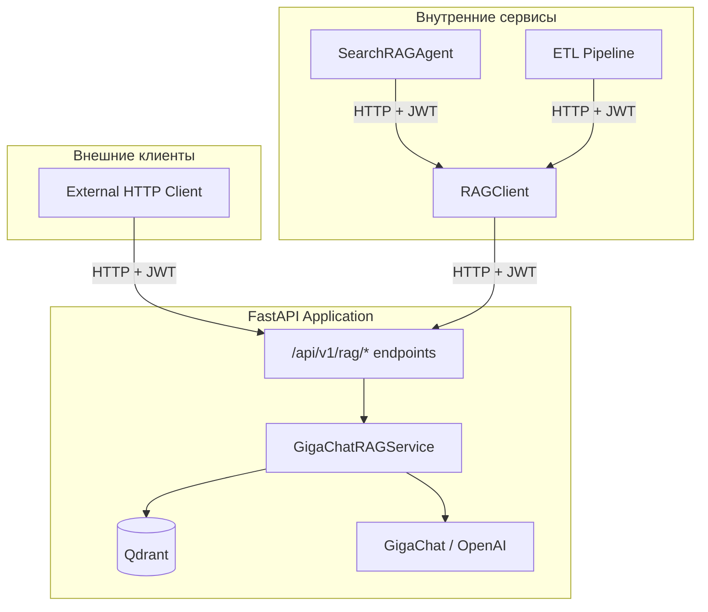

# План рефакторинга: вынос GigaChatRAGService в API endpoint

## Текущая проблема

`GigaChatRAGService` используется напрямую (хардкод) в:
- `app/agents/search_rag_agent.py` — создаёт инстанс в `__init__`, вызывает `search()` и `answer()`
- `app/services/etl_pipeline.py` — создаёт инстанс напрямую, вызывает `index_document()`

Файл `app/api/v1/endpoints/rag_processing.py` сейчас не содержит RAG-эндпоинтов — он только про CRUD документов.

## Решение

Создать REST API слой, чтобы RAG-операции были доступны через HTTP, а внутренние сервисы обращались к ним через HTTP-клиент с JWT-аутентификацией.

## Пошаговый план

### Шаг 1: Добавить `SELF_API_URL` в `app/core/config.py`

```python
SELF_API_URL = os.getenv("SELF_API_URL", "http://localhost:8000/api/v1")
```

### Шаг 2: Создать `app/schemas/rag.py` — Pydantic схемы

| Схема | Поля | Назначение |
|-------|------|-----------|
| `RAGSearchRequest` | `query: str`, `user_groups: list[int]`, `top_k: int = 20`, `history: Optional[list[dict]]` | Запрос на поиск |
| `RAGSearchResponse` | `chunks: list[dict]`, `total: int` | Результат поиска |
| `RAGAnswerRequest` | `query: str`, `user_groups: list[int]`, `top_k: int = 5`, `history: Optional[list[dict]]` | Запрос на ответ |
| `RAGAnswerResponse` | `answer: str`, `confidence: float`, `citations: list[dict]`, `chunks: list[dict]` | Ответ с контекстом |
| `RAGHydeRequest` | `query: str`, `history: Optional[list[dict]]`, `split_chunks: bool = True`, `max_chunks: int = 5` | Запрос HyDE |
| `RAGHydeResponse` | `chunks: list[str]` | Сгенерированные HyDE-чанки |
| `RAGIndexRequest` | `file_path: str`, `document_id: Optional[int]` | Запрос на индексацию |
| `RAGIndexResponse` | `status: str`, `points_count: int` | Результат индексации |

### Шаг 3: Обновить `app/api/v1/endpoints/rag_processing.py`

Добавить эндпоинты с префиксом `/rag`:

```python
router = APIRouter(prefix="/rag", tags=["rag"])

POST /rag/search  -> GigaChatRAGService.search()
POST /rag/answer  -> GigaChatRAGService.answer()
POST /rag/hyde    -> GigaChatRAGService.generate_hyde()
POST /rag/index   -> GigaChatRAGService.index_document()
```

Каждый эндпоинт:
- Принимает Pydantic-схему запроса
- Использует `Depends(get_current_user)` и `Depends(get_current_user_groups)` для JWT
- Создаёт `GigaChatRAGService` через Depends
- Возвращает Pydantic-схему ответа

### Шаг 4: Создать `app/services/rag_client.py` — HTTP-клиент

```python
class RAGClient:
    def __init__(self, base_url: str, token: str):
        self.base_url = base_url
        self.client = httpx.AsyncClient(timeout=120.0)
        self.headers = {"Authorization": f"Bearer {token}"}

    async def search(self, query, user_groups, ...) -> list[dict]
    async def answer(self, query, user_groups, ...) -> dict
    async def generate_hyde(self, query, ...) -> list[str]
    async def index_document(self, file_path, document_id) -> list[dict]
```

### Шаг 5: Обновить `app/agents/search_rag_agent.py`

- Заменить `GigaChatRAGService` на `RAGClient`
- `RAGClient` получает `base_url` из `config.SELF_API_URL`
- JWT-токен передаётся через Depends или из контекста запроса

### Шаг 6: Обновить `app/services/etl_pipeline.py`

- Заменить прямой вызов `GigaChatRAGService().index_document()` на `RAGClient.index_document()`
- Использовать сервисный/админский JWT-токен для аутентификации

### Шаг 7: Зарегистрировать роутер в `app/api/v1/api.py`

```python
from app.api.v1.endpoints.rag_processing import router as rag_router
api_router.include_router(rag_router)
```

## Диаграмма архитектуры



## Последовательность вызовов

```mermaid
sequenceDiagram
    participant Agent as SearchRAGAgent
    participant Client as RAGClient
    participant API as FastAPI /api/v1/rag/answer
    participant RAG as GigaChatRAGService
    participant Qdrant
    participant LLM

    Agent->>Client: answer(query, user_groups, token)
    Client->>API: POST /rag/answer {Authorization: Bearer token}
    API->>API: verify JWT -> get_current_user, get_current_user_groups
    API->>RAG: answer(query, user_groups)
    RAG->>RAG: search() -> dense + sparse + HyDE + RRF + rerank
    RAG->>Qdrant: vector search
    Qdrant-->>RAG: chunks
    RAG->>LLM: generate answer with context
    LLM-->>RAG: answer text
    RAG-->>API: {answer, citations, chunks}
    API-->>Client: JSON response
    Client-->>Agent: dict result