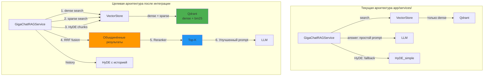

# План интеграции ключевых функций из RAG_Misha/ в app/services/

## Приоритеты интеграции

| Приоритет | Функция | Источник | Целевой файл | Эффект |
|-----------|---------|----------|--------------|--------|
| 🔴 P0 | BM25 sparse search | `RAG_Misha/bm25_search.py` | `app/services/vector_store.py` | Критически важно для поиска редких терминов |
| 🔴 P0 | RRF fusion | `RAG_Misha/find.py:72-98` | `app/services/rag_service.py` | Объединение dense + sparse результатов |
| 🟡 P1 | HyDE с разбиением на чанки | `RAG_Misha/find.py:100-140` | `app/services/rag_service.py` | Улучшение recall при HyDE |
| 🟡 P1 | Улучшенный system_prompt | `RAG_Misha/agent.py:20-44` | `app/services/rag_service.py` | Более точные ответы от LLM |
| 🟢 P2 | История диалога в HyDE | `RAG_Misha/find.py:36-43` | `app/services/rag_service.py` | Контекст для уточняющих вопросов |

---

## 1. 🔴 P0: Интеграция BM25 (sparse search) в VectorStore

### Текущее состояние

[`app/services/vector_store.py:69-85`](app/services/vector_store.py:69-85) — метод `hybrid_search()` объявлен, но вызывает обычный `search()` (только dense).

### Предлагаемое решение

**Вариант A (рекомендуемый): Sparse vectors в Qdrant**

Qdrant поддерживает sparse vectors начиная с v1.7. Это позволит хранить BM25-подобные векторы прямо в Qdrant и делать гибридный поиск через один запрос.

**Изменения:**

### 1.1 [`app/services/vector_store.py`](app/services/vector_store.py) — добавить sparse search

```python
from qdrant_client.http import models
import numpy as np
from collections import Counter

class VectorStore:
    def __init__(self, client: Optional[QdrantClient] = None):
        self.client = client or get_qdrant_client()
    
    def _text_to_sparse_vector(self, text: str) -> dict:
        """Преобразовать текст в sparse vector (term frequency).
        
        Использует BM25-подобную токенизацию из RAG_Misha/bm25_search.py.
        """
        import re
        tokens = re.findall(r'\w+', text.lower())
        term_freq = Counter(tokens)
        
        indices = []
        values = []
        # Используем хэш токена как индекс (для простоты)
        for term, freq in term_freq.items():
            idx = hash(term) % 10_000_000  # большой диапазон для sparse
            indices.append(abs(idx))
            values.append(float(freq))
        
        return {
            "indices": indices,
            "values": values,
        }
    
    async def hybrid_search(
        self,
        query_vector: list[float],
        user_groups: list[int],
        query_text: Optional[str] = None,
        top_k: int = 10,
    ) -> list[dict]:
        """Гибридный поиск: dense + sparse через Qdrant.
        
        Использует recommend API с двумя векторами.
        """
        acl_filter = build_qdrant_filter(user_groups)
        
        if query_text:
            sparse_vector = self._text_to_sparse_vector(query_text)
            search_result = self.client.query_points(
                collection_name=QDRANT_COLLECTION_NAME,
                query=query_vector,
                query_filter=models.Filter(**acl_filter),
                limit=top_k,
                with_payload=True,
                with_vector=False,
                # Qdrant поддерживает sparse vectors через prefetch
                prefetch=[
                    models.Prefetch(
                        query=sparse_vector,
                        limit=top_k * 2,
                    )
                ],
            )
        else:
            search_result = self.client.query_points(
                collection_name=QDRANT_COLLECTION_NAME,
                query=query_vector,
                query_filter=models.Filter(**acl_filter),
                limit=top_k,
            )
        
        # Форматируем результат
        results = []
        for point in search_result.points:
            results.append({
                "id": point.id,
                "score": point.score,
                "content": point.payload.get("content", ""),
                "document_id": point.payload.get("document_id"),
                "chunk_index": point.payload.get("chunk_index"),
                "chunk_type": point.payload.get("chunk_type", "text"),
                "metadata": point.payload.get("metadata", {}),
            })
        
        return results
```

### 1.2 [`app/services/vector_store.py`](app/services/vector_store.py) — обновить `_ensure_collection()` для поддержки sparse vectors

```python
def _ensure_collection(
    self,
    collection_name: Optional[str] = None,
    vector_size: Optional[int] = None,
) -> None:
    """Создать коллекцию с поддержкой dense + sparse vectors."""
    collection_name = collection_name or QDRANT_COLLECTION_NAME
    if vector_size is None:
        vector_size = 384

    try:
        self.client.get_collection(collection_name=collection_name)
    except UnexpectedStatusCode:
        self.client.create_collection(
            collection_name=collection_name,
            vectors_config=models.VectorParams(
                size=vector_size,
                distance=models.Distance.COSINE,
            ),
            sparse_vectors_config={
                "bm25": models.SparseVectorParams(
                    modifier=models.Modifier.IDF,  # BM25-like weighting
                )
            },
        )
```

### 1.3 [`app/services/vector_store.py`](app/services/vector_store.py) — обновить `upsert_points()` для сохранения sparse vectors

```python
def upsert_points(
    self,
    points: list[dict],
    collection_name: Optional[str] = None,
    vector_size: Optional[int] = None,
) -> None:
    """Добавить точки с dense + sparse векторами."""
    collection_name = collection_name or QDRANT_COLLECTION_NAME
    self._ensure_collection(collection_name=collection_name, vector_size=vector_size)

    qdrant_points = []
    for point in points:
        # Генерируем sparse vector из текста
        content = point["payload"].get("content", "")
        sparse_vector = self._text_to_sparse_vector(content)
        
        qdrant_points.append(
            models.PointStruct(
                id=point["id"],
                vector={
                    "": point["vector"],  # dense vector (default name)
                    "bm25": sparse_vector,  # sparse vector
                },
                payload=point["payload"],
            )
        )

    self.client.upsert(
        collection_name=collection_name,
        wait=True,
        points=qdrant_points,
    )
```

### 1.4 [`app/core/config.py`](app/core/config.py) — добавить настройки для sparse

```python
# === Sparse Search ===
SPARSE_SEARCH_ENABLED = os.getenv("SPARSE_SEARCH_ENABLED", "true").lower() == "true"
SPARSE_VECTOR_NAME = os.getenv("SPARSE_VECTOR_NAME", "bm25")
```

---

## 2. 🔴 P0: Интеграция RRF fusion в GigaChatRAGService.search()

### Текущее состояние

[`app/services/rag_service.py:67-101`](app/services/rag_service.py:67-101) — метод `search()` делает только dense search, HyDE как fallback.

### Предлагаемое решение

Добавить RRF fusion для объединения dense + sparse результатов, используя реализацию из [`RAG_Misha/find.py:72-98`](RAG_Misha/find.py:72-98).

### 2.1 [`app/services/rag_service.py`](app/services/rag_service.py) — добавить RRF fusion

```python
class GigaChatRAGService:
    # ... существующий код ...
    
    @staticmethod
    def _rrf_fusion(
        results_lists: list[list[dict]],
        limit: int = 10,
        k: int = 60,
    ) -> list[dict]:
        """Обобщённый RRF для любого числа списков результатов.
        
        Перенесено из RAG_Misha/find.py:72-98.
        Каждый список должен содержать словари с ключом 'id'.
        Ранг определяется позицией элемента в списке (начиная с 1).
        """
        rrf_scores: dict[str, float] = {}
        items_by_id: dict[str, dict] = {}

        for lst in results_lists:
            for rank, item in enumerate(lst, start=1):
                item_id = str(item["id"])
                if item_id not in items_by_id:
                    items_by_id[item_id] = item
                rrf_scores[item_id] = rrf_scores.get(item_id, 0) + 1.0 / (rank + k)

        sorted_ids = sorted(rrf_scores.keys(), key=lambda x: rrf_scores[x], reverse=True)
        result = []
        for idx in sorted_ids[:limit]:
            item = items_by_id[idx]
            item["rrf_score"] = rrf_scores[idx]
            result.append(item)
        return result
```

### 2.2 [`app/services/rag_service.py`](app/services/rag_service.py) — обновить `search()`

```python
def search(self, query: str, user_groups: list[int], top_k: int = 20) -> list[dict]:
    """Поиск релевантных чанков: dense + sparse + HyDE + RRF fusion."""
    import logging
    logger = logging.getLogger(__name__)
    import time
    t0 = time.time()

    query_vector = self.embedder.embed(query)
    logger.info("[TIMING] search() embed query took %.2fs", time.time() - t0)

    all_results_lists = []

    # 1. Dense search
    try:
        t1 = time.time()
        dense_results = self._search_with_vector_store(
            query_vector, user_groups, top_k=top_k
        )
        logger.info(
            "[TIMING] search() dense search took %.2fs (n=%d)",
            time.time() - t1, len(dense_results)
        )
        if dense_results:
            all_results_lists.append(dense_results)
    except Exception as e:
        logger.warning("Dense search failed: %s", e)

    # 2. Sparse search (BM25) через hybrid_search
    try:
        t2 = time.time()
        sparse_results = self._search_sparse(query, user_groups, top_k=top_k)
        logger.info(
            "[TIMING] search() sparse search took %.2fs (n=%d)",
            time.time() - t2, len(sparse_results)
        )
        if sparse_results:
            all_results_lists.append(sparse_results)
    except Exception as e:
        logger.warning("Sparse search failed: %s", e)

    # 3. HyDE search (если мало результатов)
    if len(all_results_lists) < 2 or not all_results_lists:
        logger.info("Few results, trying HyDE...")
        try:
            t3 = time.time()
            hyde_text = self.generate_hyde(query)
            logger.info("[TIMING] search() HyDE gen took %.2fs", time.time() - t3)
            
            # Разбиваем HyDE на чанки (как в RAG_Misha)
            hyde_chunks = self._split_hyde(hyde_text)
            
            for chunk in hyde_chunks:
                chunk_vector = self.embedder.embed(chunk)
                chunk_dense = self._search_with_vector_store(
                    chunk_vector, user_groups, top_k=top_k
                )
                if chunk_dense:
                    all_results_lists.append(chunk_dense)
                    
                chunk_sparse = self._search_sparse(chunk, user_groups, top_k=top_k)
                if chunk_sparse:
                    all_results_lists.append(chunk_sparse)
                    
        except Exception as e:
            logger.warning("HyDE search failed: %s", e)

    # 4. RRF fusion
    if all_results_lists:
        t4 = time.time()
        fused = self._rrf_fusion(all_results_lists, limit=top_k)
        logger.info("[TIMING] search() RRF fusion took %.2fs (n=%d)", time.time() - t4, len(fused))
    else:
        fused = []

    # 5. Reranking
    t5 = time.time()
    reranked = self.reranker.rerank(query, fused, top_k=5)
    logger.info(
        "[TIMING] search() TOTAL took %.2fs (final=%d)",
        time.time() - t0, len(reranked)
    )
    return reranked

def _search_sparse(self, query: str, user_groups: list[int], top_k: int = 20) -> list[dict]:
    """Sparse search через hybrid_search VectorStore."""
    import asyncio
    
    async def _do_sparse():
        return await self.vector_store.hybrid_search(
            query_vector=[],  # не используется для sparse
            user_groups=user_groups,
            query_text=query,
            top_k=top_k,
        )
    
    # Асинхронный вызов (как в _search_with_vector_store)
    try:
        loop = asyncio.get_running_loop()
        if loop.is_running():
            future = asyncio.run_coroutine_threadsafe(_do_sparse(), loop)
            return future.result(timeout=30.0)
    except RuntimeError:
        pass
    
    return asyncio.run(_do_sparse())

def _split_hyde(self, hyde_text: str, max_chunks: int = 5) -> list[str]:
    """Разбить HyDE-документ на чанки для множественного поиска.
    
    Перенесено из RAG_Misha/find.py:119-124.
    """
    if not hyde_text:
        return []
    
    # Простое разбиение по абзацам
    paragraphs = [p.strip() for p in hyde_text.split('\n\n') if p.strip()]
    if not paragraphs:
        return [hyde_text]
    
    return paragraphs[:max_chunks]
```

---

## 3. 🟡 P1: Улучшение HyDE (разбиение на чанки + множественный поиск)

### Текущее состояние

[`app/services/rag_service.py:53-65`](app/services/rag_service.py:53-65) — HyDE генерирует один документ, используется только как fallback.

### Предлагаемое решение

Использовать HyDE **всегда** (не только как fallback) и разбивать на чанки для множественного поиска, как в [`RAG_Misha/find.py:100-140`](RAG_Misha/find.py:100-140).

### 3.1 [`app/services/rag_service.py`](app/services/rag_service.py) — улучшить `generate_hyde()`

```python
def generate_hyde(
    self,
    query: str,
    history: Optional[list[dict]] = None,
    split_chunks: bool = True,
    max_chunks: int = 5,
) -> Union[str, list[str]]:
    """Генерация HyDE с опциональным разбиением на чанки.
    
    Args:
        query: Запрос пользователя.
        history: История диалога.
        split_chunks: Если True, возвращает список чанков.
        max_chunks: Максимальное число чанков.
    
    Returns:
        str или list[str] в зависимости от split_chunks.
    """
    import logging
    logger = logging.getLogger(__name__)
    import time
    t0 = time.time()

    if not self._use_gigachat:
        hyde_text = f"Гипотетический документ для запроса: {query}"
    else:
        prompt = self._build_hyde_prompt(query, history)
        hyde_text = self.llm.generate_sync(
            prompt=prompt,
            system_prompt="Ты генерируешь гипотетический документ для поиска."
        )
    
    logger.info("[TIMING] generate_hyde() took %.2fs", time.time() - t0)
    
    if split_chunks:
        return self._split_hyde(hyde_text, max_chunks=max_chunks)
    return hyde_text
```

### 3.2 Обновить `_build_hyde_prompt()` — добавить инструкцию про стиль документа

```python
def _build_hyde_prompt(self, query: str, history: Optional[list[dict]] = None) -> str:
    """Улучшенный HyDE prompt из RAG_Misha/find.py:47-60."""
    history_text = ""
    if history:
        history_text = "\n".join(
            f"{'Пользователь' if item.get('role') == 'user' else 'Ассистент'}: "
            f"{item.get('content', '')}" for item in history
        )

    return f"""Ты — генератор гипотетических документов для поиска (HyDE).
Твоя задача — по запросу пользователя создать короткий, связный текст, который выглядит как фрагмент реального документа, содержащего ответ на этот запрос.

История диалога (для контекста):
{history_text or 'История диалога пуста.'}

Текущий запрос пользователя: {query}

Учитывая историю, сгенерируй гипотетический документ, который отвечает на текущий запрос, но при этом учитывает предыдущие обсуждения.
Стиль текста должен быть максимально приближен к стилю документов в целевой коллекции (например, научная статья, техническая инструкция, энциклопедическая справка).
Фактическая точность не важна — главное — правдоподобие и релевантность теме.
Не добавляй вводных фраз, пояснений или мета-комментариев. Выведи только текст гипотетического документа.
Не учитывай в каком году ты был обучен, если пользователь просит найти документы из года, в котором ты не был ещё обучен, то просто создавай документ с учётом года пользователя.
Если запрос является уточнением, постарайся включить в документ информацию, связывающую его с предыдущим контекстом."""
```

---

## 4. 🟡 P1: Улучшение system_prompt для LLM (из agent.py)

### Текущее состояние

[`app/services/rag_service.py:325-329`](app/services/rag_service.py:325-329) — минимальный system_prompt.

### Предлагаемое решение

Использовать улучшенный system_prompt из [`RAG_Misha/agent.py:20-44`](RAG_Misha/agent.py:20-44).

### 4.1 [`app/services/rag_service.py`](app/services/rag_service.py) — добавить константу с system_prompt

```python
RAG_SYSTEM_PROMPT = """Ты — точный и полезный ассистент, который отвечает на вопросы, используя только информацию из предоставленного контекста.
Ты никогда не полагаешься на свои собственные знания или обучающие данные, если контекст явно их не подтверждает.

Инструкции:
- Внимательно читай контекст. Пользователь предоставляет набор извлечённых документов или фрагментов. Каждый фрагмент предваряется указанием источника (имя файла и номер страницы).
- Отвечай строго на основе этого контекста. Если ответ полностью подтверждается контекстом, дай чёткий и лаконичный ответ.
- Если в контексте недостаточно информации, скажи прямо: «Предоставленный контекст не содержит достаточно информации для ответа на этот вопрос.»
- Не додумывай, не спекулируй и не используй внешние знания.
- Если в контексте есть противоречивая информация, укажи на противоречие и перечисли конфликтующие источники.
- Сохраняй доброжелательный, вежливый и прямой тон.
- Если в контексте есть таблицы или числовые данные, извлеки из них нужные значения и используй их для ответа. Если можно вычислить ответ на основе данных (суммирование, сравнение), сделай это явно.
- Для уточняющих вопросов продолжай полагаться исключительно на последний предоставленный контекст, если новый не был специально передан.
- Попытайся по максимуму взять информации из чанков, которые тебе предоставляются. Если нет чёткой фразы, которой просит пользователь, то попробуй найти что-то похожее в контексте, который тебе передаётся на ответ.

Формат контекста:
[Начало контекста]
Источник: имя_файла (стр. X)
текст фрагмента
Источник: имя_файла2 (стр. Y)
текст фрагмента
...
[Конец контекста]

Вопрос: ...
Помни: твоя главная цель — точное следование контексту. Точность и прозрачность источников важнее полноты. Если сомневаешься — признай это."""
```

### 4.2 Обновить `answer()` — использовать улучшенный prompt

```python
def answer(self, query: str, user_groups: list[int], top_k: int = 5) -> dict:
    # ... существующий код ...
    
    # Форматируем контекст с источниками (как в RAG_Misha/agent.py)
    context_parts = []
    citations = []
    for chunk in chunks:
        filename = chunk.get("metadata", {}).get("filename", f"документ №{chunk.get('document_id')}")
        page = chunk.get("metadata", {}).get("page_number", "?")
        context_parts.append(
            f"Источник: {filename} (стр. {page})\n{chunk.get('content', '')}"
        )
        citations.append({
            "document_id": chunk.get("document_id"),
            "chunk_index": chunk.get("chunk_index"),
            "score": chunk.get("rerank_score", chunk.get("score", 0)),
        })

    context = "\n\n".join(context_parts)
    
    if not self._use_gigachat:
        answer = f"На основании найденного контекста: \n\n{context[:1500]}"
    else:
        answer = self.llm.generate_sync(
            prompt=f"[Начало контекста]\n{context}\n[Конец контекста]\n\nВопрос: {query}",
            system_prompt=RAG_SYSTEM_PROMPT,
        )
    
    # ... остальной код ...
```

---

## 5. 🟢 P2: История диалога в HyDE

### Текущее состояние

[`app/services/rag_service.py:35-51`](app/services/rag_service.py:35-51) — `_build_hyde_prompt()` принимает `history`, но он никогда не передаётся из [`app/agents/search_rag_agent.py`](app/agents/search_rag_agent.py).

### Предлагаемое решение

### 5.1 [`app/agents/search_rag_agent.py`](app/agents/search_rag_agent.py) — передавать историю

```python
class SearchRAGAgent:
    def __init__(self, ...):
        # ... существующий код ...
        self._history: list[dict] = []  # история для HyDE
    
    async def search(self, query: str, user_groups: list[int]) -> list[dict]:
        """Поиск релевантных чанков с историей."""
        return self.rag_service.search(
            query=query,
            user_groups=user_groups,
            history=self._history,  # передаём историю
            top_k=20,
        )
    
    async def answer(self, query: str, user_groups: list[int]) -> dict:
        """Ответить на вопрос с историей."""
        result = self.rag_service.answer(
            query=query,
            user_groups=user_groups,
            history=self._history,
            top_k=5,
        )
        # Обновляем историю (как в RAG_Misha/find.py:158-160)
        self._history.append({"role": "user", "content": query})
        self._history.append({"role": "assistant", "content": result.get("answer", "")})
        return result
```

---

## 6. Сводная диаграмма изменений



---

## 7. Порядок реализации

| Шаг | Что делать | Файлы | Зависимости |
|-----|-----------|-------|-------------|
| 1 | Добавить `_text_to_sparse_vector()` и обновить `_ensure_collection()` | `app/services/vector_store.py` | Qdrant v1.7+ |
| 2 | Обновить `upsert_points()` для sparse vectors | `app/services/vector_store.py` | Шаг 1 |
| 3 | Обновить `hybrid_search()` для реального sparse поиска | `app/services/vector_store.py` | Шаг 1 |
| 4 | Добавить `_rrf_fusion()` в `GigaChatRAGService` | `app/services/rag_service.py` | Нет |
| 5 | Обновить `search()`: dense + sparse + HyDE + RRF | `app/services/rag_service.py` | Шаги 3, 4 |
| 6 | Улучшить HyDE: разбиение на чанки, история | `app/services/rag_service.py` | Нет |
| 7 | Улучшить system_prompt для `answer()` | `app/services/rag_service.py` | Нет |
| 8 | Передавать историю из `SearchRAGAgent` | `app/agents/search_rag_agent.py` | Шаг 6 |
| 9 | Переиндексировать существующие документы | ETL pipeline | Шаги 1-3 |

---

## 8. Риски и компромиссы

| Риск | Описание | Митигация |
|------|----------|-----------|
| **Qdrant sparse vectors** | Требуется Qdrant v1.7+. Может не быть в текущей инфраструктуре. | Альтернатива: отдельный BM25 индекс через `rank_bm25` (как в `RAG_Misha`) |
| **Производительность** | Множественные поиски (dense + sparse + HyDE chunks) увеличат latency | Добавить параллельное выполнение через `asyncio.gather()` |
| **Размер индекса** | Sparse vectors увеличивают размер коллекции | Мониторить рост; при необходимости ограничить число sparse features |
| **Обратная совместимость** | Старые точки без sparse vectors не будут найдены sparse поиском | Переиндексация существующих документов после миграции |