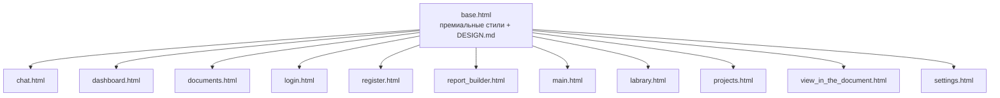

# План миграции шаблонов: Премиальные стили → base.html

## Концепция

**Премиальные стили из статических шаблонов (main, labrary, projects, view_in_the_document) переносятся в `base.html`**, чтобы все динамические шаблоны (chat, dashboard, documents, login, register, report_builder) автоматически их унаследовали.

После этого статические шаблоны переводятся на ``, избавляясь от дублирования.

---

## Шаг 1: Обогащение `base.html` премиальными стилями

### 1.1 Обновить tailwind.config в base.html

Взять полную конфигурацию из `DESIGN.md`:
- Все цвета (включая chart-*, ai-*, surface-*, fixed-* токены)
- Все шрифты (Google Sans, Murecho, SF Mono)
- Все borderRadius
- Все fontSize (display-hero, headline-xl, body-lg, caption, label-mono и т.д.)
- Все boxShadow (sm, md, lg, glow, focus)
- Все spacing (gutter, edge, section)

### 1.2 Добавить CSS-классы в `<style>` блок

Из `main.html`, `labrary.html`, `projects.html`, `view_in_the_document.html`:

```css
/* Glass surface — accent only */
.deep-glass {
    background: rgba(255, 255, 255, 0.6);
    backdrop-filter: blur(24px) saturate(180%);
    border: 1px solid rgba(255, 255, 255, 0.4);
    box-shadow: 0 8px 32px 0 rgba(0, 0, 0, 0.05);
}
.dark .deep-glass {
    background: rgba(26, 28, 28, 0.6);
    border: 1px solid rgba(255, 255, 255, 0.1);
}

/* Emerald glow for active elevation */
.emerald-protocol-glow {
    box-shadow: 0 0 30px rgba(0, 107, 29, 0.15);
    border: 1px solid rgba(0, 107, 29, 0.2) !important;
}

/* Action card with hover lift */
.action-card {
    transition: all 0.4s cubic-bezier(0.175, 0.885, 0.32, 1.275);
}
.action-card:hover {
    transform: translateY(-8px) scale(1.02);
    background: rgba(0, 107, 29, 0.05);
    border-color: rgba(0, 107, 29, 0.4);
}

/* Emerald glass card for projects */
.emerald-glass-card {
    background: rgba(255, 255, 255, 0.7);
    backdrop-filter: blur(16px);
    border: 1px solid rgba(255, 255, 255, 0.5);
    transition: all 0.4s cubic-bezier(0.175, 0.885, 0.32, 1.275);
}
.emerald-glass-card:hover {
    transform: translateY(-8px);
    background: rgba(255, 255, 255, 0.9);
    border-color: rgba(0, 107, 29, 0.3);
    box-shadow: 0 20px 40px -15px rgba(0, 107, 29, 0.15);
}

/* Status pulse for live indicators */
.status-pulse {
    box-shadow: 0 0 12px rgba(34, 197, 94, 0.4);
}

/* Glow line separator */
.glow-line {
    height: 1px;
    background: linear-gradient(90deg, transparent, rgba(0, 107, 29, 0.15), transparent);
}

/* Custom scrollbar */
.custom-scrollbar::-webkit-scrollbar { width: 4px; }
.custom-scrollbar::-webkit-scrollbar-track { background: transparent; }
.custom-scrollbar::-webkit-scrollbar-thumb { background: #bdcab8; border-radius: 10px; }
.custom-scrollbar::-webkit-scrollbar-thumb:hover { background: #006b1d; }
```

### 1.3 Добавить анимации

Из `main.html`:

```css
@keyframes fadeInUp {
    from { opacity: 0; transform: translateY(24px); }
    to { opacity: 1; transform: translateY(0); }
}
@keyframes floatOrb {
    0%, 100% { transform: translateY(0) scale(1); }
    50% { transform: translateY(-12px) scale(1.03); }
}
@keyframes barPulse {
    0%, 100% { height: 0.5rem; opacity: 0.4; }
    50% { height: 1.5rem; opacity: 0.9; }
}
@keyframes pulseGlow {
    0%, 100% { box-shadow: 0 0 20px rgba(0, 107, 29, 0.1); }
    50% { box-shadow: 0 0 40px rgba(0, 107, 29, 0.3); }
}
.animate-fade-in-up { animation: fadeInUp 1s cubic-bezier(0.16, 1, 0.3, 1) forwards; opacity: 0; }
.animate-float { animation: floatOrb 8s ease-in-out infinite; }
.pulse-bar { animation: barPulse 1.4s ease-in-out infinite; }
```

### 1.4 Добавить анимированный фон (опционально, через блок)

В `base.html` добавить блок для анимированного фона:

```html

<!-- По умолчанию пусто, страницы могут переопределить -->

```

Каждая страница сможет добавить свой `#background-canvas` с орбами.

---

## Шаг 2: Преобразование `main.html` → маршрут `/`

**Удалить из main.html:**
- `<head>` целиком (включая tailwind.config, Google Fonts, стили)
- Header/TopNavBar
- SideNavBar
- `<body>` тег
- Скрипт анимированного фона (перенести в ``)

**Добавить:**
- ``
- `Главная — CorpAI Intelligence`
- `` — обернуть основной контент
- `` — уникальные стили (если остались)
- `` — JS скрипты

**Маршрут `/` в routes.py:**
```python
@router.get("/", response_class=HTMLResponse, include_in_schema=False)
async def index_page(request: Request, db: Session = Depends(get_db)):
    """Main page with search and quick actions."""
    recent_sessions = db.query(ChatSession).filter(
        ChatSession.status == SessionStatus.ACTIVE
    ).order_by(ChatSession.updated_at.desc()).limit(5).all()
    tmpl = get_templates()
    return tmpl.TemplateResponse(
        request, "main.html",
        context={
            "request": request,
            "active_page": "main",
            "recent_sessions": recent_sessions,
        },
    )
```

---

## Шаг 3: Преобразование `labrary.html` → маршрут `/library`

**Удалить:** `<head>`, tailwind.config, стили, header, sidebar, body, скрипты фона

**Добавить:** ``, блоки

**Маршрут `/library`:**
```python
@router.get("/library", response_class=HTMLResponse, include_in_schema=False)
async def library_page(request: Request, db: Session = Depends(get_db)):
    documents = db.query(Document).order_by(Document.created_at.desc()).limit(50).all()
    total_count = db.query(func.count(Document.id)).scalar() or 0
    tmpl = get_templates()
    return tmpl.TemplateResponse(
        request, "labrary.html",
        context={
            "request": request,
            "active_page": "library",
            "documents": documents,
            "total_count": total_count,
        },
    )
```

---

## Шаг 4: Преобразование `projects.html` → маршрут `/projects`

**Удалить:** `<head>`, tailwind.config, стили, header, sidebar, body, скрипты фона

**Добавить:** ``, блоки

**Маршрут `/projects`:**
```python
@router.get("/projects", response_class=HTMLResponse, include_in_schema=False)
async def projects_page(request: Request, db: Session = Depends(get_db)):
    # Получаем артефакты/проекты
    from app.models.artifact_v2 import ArtifactV2
    projects = db.query(ArtifactV2).order_by(ArtifactV2.created_at.desc()).limit(50).all()
    tmpl = get_templates()
    return tmpl.TemplateResponse(
        request, "projects.html",
        context={
            "request": request,
            "active_page": "projects",
            "projects": projects,
        },
    )
```

---

## Шаг 5: Преобразование `view_in_the_document.html` → маршрут `/documents/{id}`

**Удалить:** `<head>`, tailwind.config, стили, header, sidebar, body

**Добавить:** ``, блоки

**Маршрут `/documents/{id}`:**
```python
@router.get("/documents/{doc_id}", response_class=HTMLResponse, include_in_schema=False)
async def document_view_page(
    request: Request,
    doc_id: int,
    db: Session = Depends(get_db),
):
    document = db.query(Document).filter(Document.id == doc_id).first()
    if not document:
        from fastapi.responses import RedirectResponse
        return RedirectResponse(url="/documents")
    chunks = document.chunks
    tmpl = get_templates()
    return tmpl.TemplateResponse(
        request, "view_in_the_document.html",
        context={
            "request": request,
            "active_page": "documents",
            "document": document,
            "chunks": chunks,
        },
    )
```

---

## Шаг 6: Создание `settings.html` → маршрут `/settings`

Новый шаблон с секциями:
- Профиль (имя, email)
- Безопасность (смена пароля)
- Уведомления
- Тема (светлая/тёмная)

---

## Шаг 7: Обновление навигации в `base.html`

Добавить в header:
```html
<a href="/library">Библиотека</a>
<a href="/projects">Проекты</a>
```

---

## Схема наследования после миграции



---

## Что получат динамические шаблоны после миграции

| Шаблон | Новые стили |
|--------|-------------|
| `chat.html` | deep-glass, action-card, анимированный фон, glow-line, кастомный scrollbar |
| `dashboard.html` | deep-glass, action-card, emerald-glow, анимации fadeInUp |
| `documents.html` | deep-glass, action-card, кастомный scrollbar, glow-line |
| `login.html` | deep-glass, emerald-protocol-glow на фокусе |
| `register.html` | deep-glass, emerald-protocol-glow на фокусе |
| `report_builder.html` | deep-glass, action-card, ai-scan, pulse-анимации |